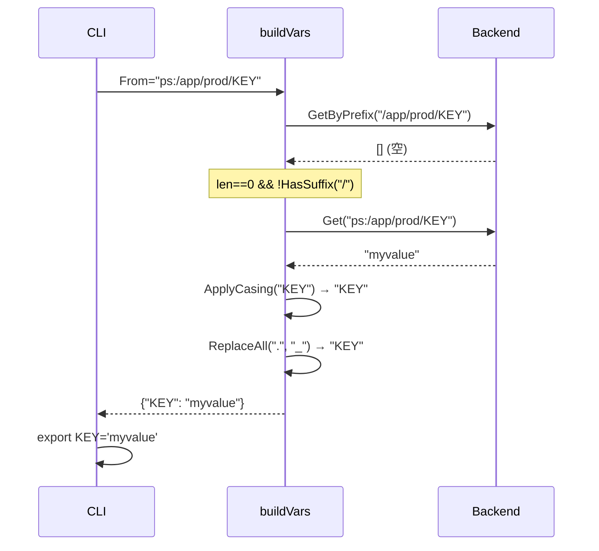

# bugfix: export 末端パラメータ対応 + キー名ドット正規化

## 問題

1. **末端パラメータ空出力**: `bundr export ps:/app/prod/KEY`（スラッシュなし末端パス）が空出力になる
2. **ドット区切り混在**: `export APIGATEWAY.URL='...'` のようにキー名に `.` が含まれ、bash 変数名として不正

根本原因:
- 問題1: `buildVars` が `GetByPrefix` のみを使用しており、空結果時のフォールバックがない
- 問題2: `flatten.ApplyCasing` は `-` → `_` 変換のみ。`.` はそのまま残る

## スコープ

### 実装範囲
- `cmd/export.go` の `buildVars()`: 末端パラメータフォールバック追加 + ドット正規化
- `cmd/export_test.go`: テストケース E-12〜E-16 追加

### スコープ外
- `exec` コマンドは `buildVars` を共用するため自動で修正される（追加対応不要）
- `flatten.ApplyCasing` は変更しない（最小スコープ維持）
- `jsonize` は v0.4.1 で修正済み（対象外）

## 修正方針

### 問題1: 末端パラメータフォールバック

jsonize.go の v0.4.1 修正（`cmd/jsonize.go:93-108`）と同一パターン。
`GetByPrefix` が 0件かつ `ref.Path` が `/` で終わらない場合 → `Get` でフォールバック。

```go
// buildVars 内、flatOpts 定義後・forループ前に挿入
if len(entries) == 0 && !strings.HasSuffix(ref.Path, "/") {
    val, err := b.Get(ctx, opts.From, backend.GetOptions{})
    if err != nil {
        return nil, err
    }
    keyName := path.Base(ref.Path)
    normalizedKey := flatten.ApplyCasing(keyName, flatOpts)
    normalizedKey = strings.ReplaceAll(normalizedKey, ".", opts.FlattenDelim)
    vars[normalizedKey] = val
    return vars, nil
}
```

- `path.Base(ref.Path)` でリーフ名を取得（例: `/app/prod/MY_KEY` → `MY_KEY`）
- StoreMode は不明なため JSON フラット化はしない（raw 扱い）
- ドット正規化も同時適用

### 問題2: ドット正規化

`buildVars` の for ループ内で、`vars` に格納する前にドットを `FlattenDelim`（デフォルト `_`）に置換。

JSON flatten 後のキー（`APIGATEWAY.URL` 等）:
```go
for k, v := range kvs {
    k = strings.ReplaceAll(k, ".", opts.FlattenDelim)
    vars[k] = v
}
```

raw 値のキー（SSM パスにドットがある場合）:
```go
normalizedKey := flatten.ApplyCasing(keyPrefix, flatOpts)
normalizedKey = strings.ReplaceAll(normalizedKey, ".", opts.FlattenDelim)
vars[normalizedKey] = entry.Value
```

## テスト設計（TDD: Red → Green → Refactor）

### Red フェーズ（先にテスト追加）

`cmd/export_test.go` の `TestExportCmd` に追加:

| ID | 入力 | セットアップ | 期待出力 |
|----|------|------------|--------|
| E-12 | `ps:/app/prod/MY_KEY` (末端) | `MY_KEY = "myvalue"` (raw) | `export MY_KEY='myvalue'` |
| E-13 | `ps:/app/prod/MY_KEY` (末端) | 同上、Upper=false | `export my_key='myvalue'` |
| E-14 | `ps:/app/prod/MISSING` (末端) | データなし | error containing `"key not found"` |
| E-15 | `ps:/app/prod/` (プレフィックス) | key=`ps:/app/prod/api.url`, value=`"http://x"` (raw) | `export API_URL='http://x'` |
| E-16 | `ps:/app/prod/` (プレフィックス) | key=`ps:/app/prod/CFG`, value=`{"api.url":"http://x"}` (json) | `export CFG_API_URL='http://x'` |

**E-14 は TestExportCmd の `wantErr` フィールドで検証**（既存の仕組みを流用）

### Green フェーズ（実装）

Step 1: `cmd/export.go`
1. import に `"path"` を追加
2. `buildVars` の `flatOpts` 定義後・for ループ前に末端フォールバックブロック挿入
3. for ループ内の JSON flatten 結果格納時にドット正規化追加
4. for ループ内の raw 値格納時にドット正規化追加

### Refactor フェーズ

- コードが既存スタイルと一貫しているか確認
- コメントを jsonize.go に合わせて記述

## 実装手順

### Step 1: テスト追加 (Red)

`cmd/export_test.go` の `TestExportCmd.tests` スライスに E-12〜E-16 を追加する。
テストは現時点で失敗することを確認。

### Step 2: export.go 修正 (Green)

変更箇所（`cmd/export.go`）:

**import 追加**: `"path"` を追加

**`buildVars()` 関数**:
```
// 現在（line 43-46）:
entries, err := b.GetByPrefix(ctx, ref.Path, backend.GetByPrefixOptions{Recursive: true})
if err != nil {
    return nil, err
}

// flatOpts 定義（line 48-54）: そのまま

// vars 初期化（line 56）: そのまま

// ★ 追加: 末端パラメータフォールバック（line 57 付近に挿入）
if len(entries) == 0 && !strings.HasSuffix(ref.Path, "/") {
    val, err := b.Get(ctx, opts.From, backend.GetOptions{})
    if err != nil {
        return nil, err
    }
    keyName := path.Base(ref.Path)
    normalizedKey := flatten.ApplyCasing(keyName, flatOpts)
    normalizedKey = strings.ReplaceAll(normalizedKey, ".", opts.FlattenDelim)
    vars[normalizedKey] = val
    return vars, nil
}

// for ループ（line 58-73）:
for _, entry := range entries {
    keyPrefix := pathToKey(entry.Path, ref.Path, opts.FlattenDelim)

    if entry.StoreMode == tags.StoreModeJSON && !opts.NoFlatten {
        kvs, err := flatten.Flatten(keyPrefix, entry.Value, flatOpts)
        if err != nil {
            return nil, fmt.Errorf("flatten %s: %w", entry.Path, err)
        }
        for k, v := range kvs {
            k = strings.ReplaceAll(k, ".", opts.FlattenDelim)  // ★ ドット正規化
            vars[k] = v
        }
    } else {
        normalizedKey := flatten.ApplyCasing(keyPrefix, flatOpts)
        normalizedKey = strings.ReplaceAll(normalizedKey, ".", opts.FlattenDelim)  // ★ ドット正規化
        vars[normalizedKey] = entry.Value
    }
}
```

### Step 3: テスト実行・確認 (Green)

```bash
go test ./cmd/... -v -run TestExportCmd
```

全テスト（E-01〜E-16）が PASS することを確認。

### Step 4: 全テスト実行 (Refactor)

```bash
go test ./...
```

リグレッションがないことを確認。

## アーキテクチャ整合性

| 観点 | 確認 |
|------|------|
| jsonize の末端フォールバックパターン踏襲 | ✅ `cmd/jsonize.go:93-108` と同パターン |
| buildVars は export + exec の両方に効く | ✅ 追加対応不要 |
| flatten パッケージ不変 | ✅ `ApplyCasing` は変更しない |
| Mock 対応 | ✅ `MockBackend.Get` がキー未存在時 `"key not found"` エラー返却（isNotFound ヘルパー対応済み） |

## リスク評価

| リスク | 重大度 | 対策 |
|--------|--------|------|
| ドット正規化による既存ユーザーへの影響 | 低 | bash では `.` 入り変数名は不正のため実害なし。むしろ修正が正しい |
| JSON リーフパラメータの StoreMode 不明 | 低 | `Get()` は decoded value を返す。フラット化なしで raw 出力は許容範囲 |
| exec コマンドへの影響 | 低 | `buildVars` 共用のため自動修正。既存 exec テストが通れば問題なし |

## シーケンス図



## チェックリスト

- [x] 観点1: 実装実現可能性 — 手順明確、jsonize と同パターン、変更ファイル2件
- [x] 観点2: TDD設計 — E-12〜E-16 の Red テスト先行
- [x] 観点3: アーキテクチャ整合性 — jsonize/exec と一貫、flatten パッケージ不変
- [x] 観点4: リスク評価 — 低リスク、既存テストへの影響最小
- [x] 観点5: シーケンス図 — 末端パラメータフォールバックの流れを記載
