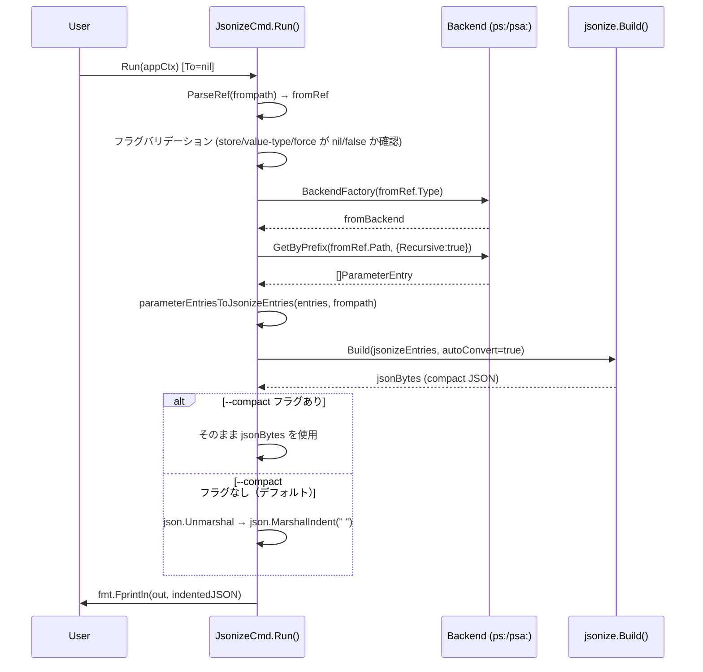
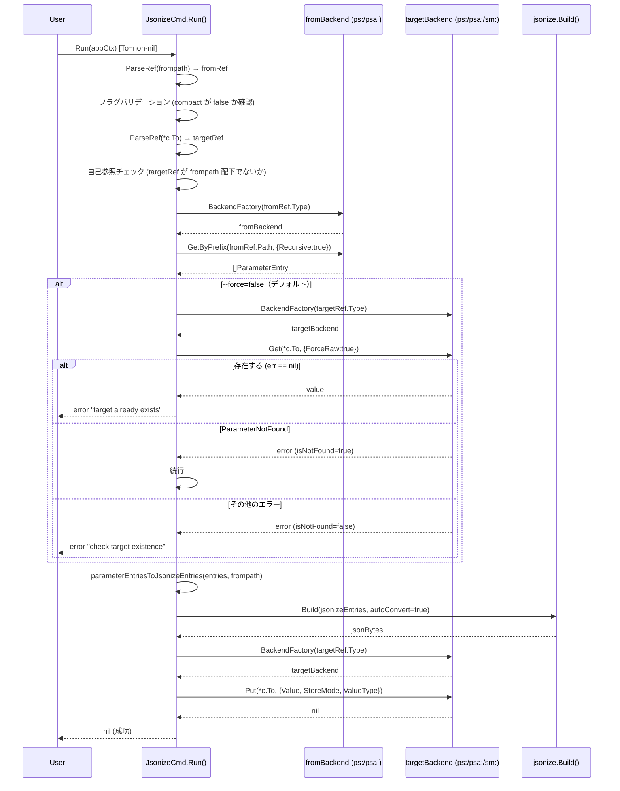

# jsonize stdout 出力モード追加 + --version フラグ追加

## 1. 概要

2つの変更を v0.4.0 としてまとめてリリースする。

### 変更1: jsonize stdout 出力モード

`bundr jsonize` コマンドに stdout 出力モードを追加する Breaking Change。

現行: `bundr jsonize <target-ref> --frompath <prefix>` — 必ず target-ref に JSON を書き込む
変更後:
- `--to` フラグなし → JSON を stdout に出力（インデント付き、デフォルト）
- `--to <ref>` あり → 指定した ref に JSON を保存（従来の動作に相当）
- `--compact` フラグで stdout 出力をコンパクト JSON に切り替え可能
- `Target` 位置引数を完全削除（Breaking Change）

ユーザーはまずパイプで JSON を確認し、問題なければ `--to` を付けて保存するワークフローが成立する。

### 変更2: --version / -v フラグ追加

`bundr --version` または `bundr -v` でバージョンを表示する。出力形式は `v` なし（例: `0.3.0`）。

```bash
$ bundr --version
bundr 0.4.0
```

実装: Kong の `VersionFlag` + goreleaser ldflags でビルド時にバージョンを埋め込む。

---

## 2. スコープ

### 変更対象ファイル

| ファイル | 変更種別 | 内容 |
|---------|---------|------|
| `cmd/jsonize.go` | 変更 | `JsonizeCmd` struct 再定義、`Run()` 全面刷新 |
| `cmd/jsonize_test.go` | 変更 | テストケース全面書き直し（既存テストをモード別に再分類） |
| `cmd/root.go` | 変更 | `Jsonize` help 文更新 + `Version kong.VersionFlag` 追加 |
| `main.go` | 変更 | `var version = "dev"` 宣言 + `kong.Vars{"version": version}` を渡す |
| `.goreleaser.yaml` | 変更 | `ldflags: ["-X main.version={{.Version}}"]` 追加 |

### スコープ外

| 機能 | 理由 |
|------|------|
| `internal/jsonize/` の変更 | 純粋変換ロジックは変更不要 |
| `--frompath sm:` サポート | 方針変更なし（sm: は複数キー取得 API なし） |
| `--dry-run` フラグ | stdout モードが実質 dry-run 相当のため不要 |
| README 更新 | 本計画書では対象外（別タスク） |

---

## 3. 新しい CLI 仕様

### JsonizeCmd struct（新定義）

```go
type JsonizeCmd struct {
    Frompath  string  `required:"" predictor:"prefix" help:"Source prefix (e.g. ps:/app/prod/)"`
    To        *string `optional:"" predictor:"ref"    help:"Target ref to save JSON (omit to print to stdout)"`
    Store     *string `optional:"" enum:"raw,json"    help:"Storage mode for target (raw|json) [default: json]"`
    ValueType *string `optional:"" enum:"string,secure" help:"Value type (string|secure) [default: string]"`
    Force     bool    `help:"Overwrite target if it already exists (save mode only)"`
    Compact   bool    `help:"Print compact JSON without indentation (stdout mode only)"`

    out io.Writer // for testing; nil means os.Stdout
}
```

### フラグ説明

| フラグ | 型 | デフォルト | 説明 |
|-------|-----|--------|------|
| `--frompath` | `string` | (必須) | ソース prefix (ps:/psa:のみ) |
| `--to` | `*string` | nil | 保存先 ref。省略時は stdout 出力 |
| `--store` | `*string` | nil (→ "json") | `--to` 指定時のストレージモード |
| `--value-type` | `*string` | nil (→ "string") | `--to` 指定時の値タイプ |
| `--force` | `bool` | false | 保存先上書き許可（save モード専用） |
| `--compact` | `bool` | false | コンパクト JSON 出力（stdout モード専用） |

### 動作モードの定義

| 条件 | モード名 | 動作 |
|------|---------|------|
| `--to` が nil | stdout モード | `json.MarshalIndent` でインデント付き JSON を stdout へ |
| `--to` が non-nil | save モード | 従来どおり target-ref に `Put` |

### 使用例

```bash
# stdout モード（デフォルト: インデント付き JSON）
bundr jsonize --frompath ps:/app/prod/

# stdout モード + コンパクト
bundr jsonize --frompath ps:/app/prod/ --compact

# save モード（従来の動作に相当）
bundr jsonize --frompath ps:/app/prod/ --to ps:/app/config

# save モード + オプション指定
bundr jsonize --frompath ps:/app/prod/ --to sm:app-config --store raw --value-type secure --force
```

---

## 4. バリデーションロジック

`Run()` の先頭でモードを判定し、フラグの組み合わせを検証する。

```
isStdoutMode = (c.To == nil)
```

### stdout モード時の禁止フラグ

stdout モードで `--store` / `--value-type` / `--force` が指定された場合はエラー。
Kong の `*string` 型を使って「明示指定されたか否か」を区別する。

```
if isStdoutMode:
    if c.Store != nil     → エラー: "--store は --to と組み合わせて使用してください"
    if c.ValueType != nil → エラー: "--value-type は --to と組み合わせて使用してください"
    if c.Force            → エラー: "--force は --to と組み合わせて使用してください"
```

### save モード時の禁止フラグ

```
if !isStdoutMode:
    if c.Compact → エラー: "--compact は --to を指定しない場合にのみ使用できます"
```

### フォールバック値の決定（save モード）

`--store` / `--value-type` は nil の場合にデフォルト値を設定する（Kong の `default:` タグを使わず、`Run()` 内で解決する）。

```go
store := "json"
if c.Store != nil {
    store = *c.Store
}
valueType := "string"
if c.ValueType != nil {
    valueType = *c.ValueType
}
```

### バリデーション順序（`Run()` 内）

```
1. frompath パース + sm: チェック
2. モード判定 (isStdoutMode)
3. フラグ組み合わせバリデーション（上記）
4. [save モードのみ] target ref パース
5. [save モードのみ] 自己参照チェック
6. frompath バックエンド作成
7. GetByPrefix
8. [save モードのみ, --force=false] target 存在チェック
9. parameterEntriesToJsonizeEntries
10. jsonize.Build()
11. [stdout モード] JSON をインデント変換して out へ書き込み
12. [save モード] target バックエンド作成 → Put
```

---

## 5. TDD テスト設計書

### 命名規則

- 正常系: `JS-NN`（JsonizeStdout の略）/ `JSave-NN`（JsonizeSave の略）
- 異常系: `JSE-NN`（JsonizeStdoutError）/ `JSaveE-NN`（JsonizeSaveError）
- 共通異常系: `JCE-NN`（JsonizeCommonError）

### 正常系テスト — stdout モード

| ID | 入力 | 期待出力 |
|----|------|---------|
| JS-01 | frompath に `DB_HOST=localhost`, `DB_PORT=5432` (raw) | インデント付き JSON: `{"db":{"host":"localhost","port":5432}}` が stdout に出力 |
| JS-02 | frompath にデータなし | `{}` が stdout に出力 |
| JS-03 | `--compact` 指定 + `DB_HOST=localhost` (raw) | コンパクト JSON `{"db":{"host":"localhost"}}` が stdout に出力（改行なし） |
| JS-04 | `--compact` なし（デフォルト）+ `DB_HOST=localhost` | インデント付き JSON（`json.MarshalIndent` のデフォルト形式） |
| JS-05 | StoreMode=json のエントリが混在 | インデント付き JSON に正しく展開されて stdout に出力 |

### 正常系テスト — save モード

| ID | 入力 | 期待出力 |
|----|------|---------|
| JSave-01 | `--to ps:/app/config` + `DB_HOST=localhost`, `DB_PORT=5432` (raw) | Put 呼び出し: ref=`ps:/app/config`, StoreMode=`json`, value は `{"db":{"host":"localhost","port":5432}}` |
| JSave-02 | `--to ps:/app/config --store raw` | Put 呼び出し: StoreMode=`raw` |
| JSave-03 | `--to ps:/app/config` + データなし | Put 呼び出し: value = `{}` |
| JSave-04 | `--to ps:/app/config --force` + target が既存 | 存在チェックをスキップして Put が呼ばれる |
| JSave-05 | `--to psa:/app/config` + psa: frompath | Put 呼び出しに `psa:` ref が使われる |
| JSave-06 | `--to sm:app-config` + ps: frompath | Put 呼び出し: ref=`sm:app-config` |
| JSave-07 | `--to ps:/app/config --value-type secure` | Put 呼び出し: ValueType=`secure` |

### 異常系テスト — stdout モード固有

| ID | 入力 | 期待エラー |
|----|------|-----------|
| JSE-01 | `--compact` なし、`--store raw` 指定 | `"--store is only valid with --to"` |
| JSE-02 | `--value-type secure` 指定（`--to` なし） | `"--value-type is only valid with --to"` |
| JSE-03 | `--force` 指定（`--to` なし） | `"--force is only valid with --to"` |

### 異常系テスト — save モード固有

| ID | 入力 | 期待エラー |
|----|------|-----------|
| JSaveE-01 | `--to ps:/app/config --compact` | `"--compact is only valid without --to"` |
| JSaveE-02 | `--to invalid-ref` | `"invalid target ref"` |
| JSaveE-03 | `--to ps:/app/prod/sub` + `--frompath ps:/app/prod/` （自己参照） | `"self-reference not allowed"` |
| JSaveE-04 | `--to ps:/app/config` + target が既存（`--force` なし） | `"target already exists"` |
| JSaveE-05 | GetByPrefix エラー | `"get parameters"` |
| JSaveE-06 | Put エラー | `"put target"` |
| JSaveE-07 | target 存在チェックで ParameterNotFound 以外のエラー | `"check target existence"` |

### 共通異常系テスト

| ID | 入力 | 期待エラー |
|----|------|-----------|
| JCE-01 | `--frompath sm:secret` | `"--frompath sm: backend is not supported"` |
| JCE-02 | `--frompath invalid-ref` | `"invalid frompath ref"` |
| JCE-03 | キー競合: `DB_HOST` と `DB_HOST_SUB` | `"build json"` |

### エッジケース

| ID | 入力 | 期待動作 |
|----|------|---------|
| JEdge-01 | インデント付き出力の改行確認 | `json.MarshalIndent` のデフォルトプレフィックス `""`, インデント `"  "`（2スペース） |
| JEdge-02 | `--compact` 時の末尾改行 | stdout に書き込む際 `fmt.Fprintln` で末尾改行あり |
| JEdge-03 | stdout モードで `out` フィールドに `bytes.Buffer` を注入 | テスト内でバッファの内容を検証できる |

---

## 6. 実装手順（Red → Green → Refactor）

### Step 1: Red — 既存テストを壊すための struct 変更

`JsonizeCmd` struct を新定義に変更する。この時点で既存テスト（JC-01〜JC-07, JCE-01〜JCE-09）はコンパイルエラーになる。

変更内容:
- `Target string` フィールドを削除
- `To *string` フィールドを追加
- `Store string` を `Store *string` に変更（`default:"json"` タグ削除）
- `ValueType string` を `ValueType *string` に変更（`default:"string"` タグ削除）
- `Compact bool` フィールドを追加
- `out io.Writer` フィールドを追加

### Step 2: Red — テストコードの全面書き直し

`cmd/jsonize_test.go` を新仕様に対応した形で書き直す。

変更内容:
- `setupJsonizeCmd(target, frompath string, ...)` を `setupJsonizeSaveCmd(frompath string, to string, ...)` と `setupJsonizeStdoutCmd(frompath string, ...)` に分割
- `out` フィールドを `bytes.Buffer` で注入するヘルパーを追加: `setupJsonizeStdoutCmdWithBuf()`
- stdout モード正常系テスト JS-01〜JS-05 を追加
- save モード正常系テスト JSave-01〜JSave-07 を追加（既存 JC-01〜JC-07 を移行）
- stdout モード異常系テスト JSE-01〜JSE-03 を追加
- save モード異常系テスト JSaveE-01〜JSaveE-07 を追加（既存 JCE-02〜JCE-09 を移行）
- 共通異常系テスト JCE-01〜JCE-03 を追加（既存 JCE-01〜JCE-06 を移行）

### Step 3: Green — `Run()` を新仕様で実装

`cmd/jsonize.go` を全面刷新する。

実装の骨格:

```go
import (
    "context"
    "encoding/json"
    "errors"
    "fmt"
    "io"
    "os"
    "strings"

    ssmtypes "github.com/aws/aws-sdk-go-v2/service/ssm/types"
    smtypes  "github.com/aws/aws-sdk-go-v2/service/secretsmanager/types"
    "github.com/youyo/bundr/internal/backend"
    "github.com/youyo/bundr/internal/jsonize"
)

type JsonizeCmd struct {
    Frompath  string  `required:"" predictor:"prefix" help:"Source prefix (e.g. ps:/app/prod/)"`
    To        *string `optional:"" predictor:"ref" name:"to" help:"Target ref to save JSON (omit to print to stdout)"`
    Store     *string `optional:"" enum:"raw,json" name:"store" help:"Storage mode for target (raw|json) [default: json]"`
    ValueType *string `optional:"" enum:"string,secure" name:"value-type" help:"Value type (string|secure) [default: string]"`
    Force     bool    `help:"Overwrite target if it already exists (save mode only)"`
    Compact   bool    `help:"Print compact JSON without indentation (stdout mode only)"`

    out io.Writer
}

func (c *JsonizeCmd) Run(appCtx *Context) error {
    out := c.out
    if out == nil {
        out = os.Stdout
    }

    // 1. frompath パース + sm: チェック
    fromRef, err := backend.ParseRef(c.Frompath)
    if err != nil {
        return fmt.Errorf("jsonize command failed: invalid frompath ref: %w", err)
    }
    if fromRef.Type == backend.BackendTypeSM {
        return fmt.Errorf("jsonize command failed: --frompath sm: backend is not supported (use ps: or psa:)")
    }

    // 2. モード判定
    isStdoutMode := c.To == nil

    // 3. フラグ組み合わせバリデーション
    if isStdoutMode {
        if c.Store != nil {
            return fmt.Errorf("jsonize command failed: --store は --to と組み合わせて使用してください")
        }
        if c.ValueType != nil {
            return fmt.Errorf("jsonize command failed: --value-type は --to と組み合わせて使用してください")
        }
        if c.Force {
            return fmt.Errorf("jsonize command failed: --force は --to と組み合わせて使用してください")
        }
    } else {
        if c.Compact {
            return fmt.Errorf("jsonize command failed: --compact は --to を指定しない場合にのみ使用できます")
        }
    }

    // 4. [save モードのみ] target ref パース + 自己参照チェック
    var targetRef *backend.Ref
    if !isStdoutMode {
        ref, err := backend.ParseRef(*c.To)
        if err != nil {
            return fmt.Errorf("jsonize command failed: invalid target ref: %w", err)
        }
        targetRef = &ref

        fromBase := strings.TrimRight(fromRef.Path, "/") + "/"
        if strings.HasPrefix(targetRef.Path+"/", fromBase) || targetRef.Path == strings.TrimRight(fromRef.Path, "/") {
            return fmt.Errorf("jsonize command failed: target %q is within --frompath %q (self-reference not allowed)", *c.To, c.Frompath)
        }
    }

    // 5. frompath バックエンド作成
    fromBackend, err := appCtx.BackendFactory(fromRef.Type)
    if err != nil {
        return fmt.Errorf("jsonize command failed: create from backend: %w", err)
    }

    // 6. GetByPrefix
    entries, err := fromBackend.GetByPrefix(context.Background(), fromRef.Path, backend.GetByPrefixOptions{Recursive: true})
    if err != nil {
        return fmt.Errorf("jsonize command failed: get parameters: %w", err)
    }

    // 7. [save モードのみ, --force=false] target 存在チェック
    if !isStdoutMode && !c.Force {
        targetBackend, err := appCtx.BackendFactory(targetRef.Type)
        if err != nil {
            return fmt.Errorf("jsonize command failed: create target backend: %w", err)
        }
        _, err = targetBackend.Get(context.Background(), *c.To, backend.GetOptions{ForceRaw: true})
        if err == nil {
            return fmt.Errorf("jsonize command failed: target already exists: %s (use --force to overwrite)", *c.To)
        }
        if !isNotFound(err) {
            return fmt.Errorf("jsonize command failed: check target existence: %w", err)
        }
    }

    // 8. Entry 変換 + Build
    jsonizeEntries := parameterEntriesToJsonizeEntries(entries, fromRef.Path)
    jsonBytes, err := jsonize.Build(jsonizeEntries, true)
    if err != nil {
        return fmt.Errorf("jsonize command failed: build json: %w", err)
    }

    // 9. stdout モード
    if isStdoutMode {
        var output []byte
        if c.Compact {
            output = jsonBytes
        } else {
            var v interface{}
            if err := json.Unmarshal(jsonBytes, &v); err != nil {
                return fmt.Errorf("jsonize command failed: unmarshal for indent: %w", err)
            }
            output, err = json.MarshalIndent(v, "", "  ")
            if err != nil {
                return fmt.Errorf("jsonize command failed: indent json: %w", err)
            }
        }
        fmt.Fprintln(out, string(output))
        return nil
    }

    // 10. save モード: Put
    store := "json"
    if c.Store != nil {
        store = *c.Store
    }
    valueType := "string"
    if c.ValueType != nil {
        valueType = *c.ValueType
    }

    targetBackend, err := appCtx.BackendFactory(targetRef.Type)
    if err != nil {
        return fmt.Errorf("jsonize command failed: create target backend: %w", err)
    }
    if err := targetBackend.Put(context.Background(), *c.To, backend.PutOptions{
        Value:     string(jsonBytes),
        StoreMode: store,
        ValueType: valueType,
    }); err != nil {
        return fmt.Errorf("jsonize command failed: put target: %w", err)
    }

    return nil
}
```

### Step 4: Refactor

Green になったら以下を整理する:
- バリデーションロジックを `validateFlags(isStdoutMode bool) error` として private 関数に抽出（テスト可能性は変えずに可読性を向上）
- エラーメッセージはすべて英語（Go の標準慣習。テスト期待値と一致させること）
- `parameterEntriesToJsonizeEntries` と `isNotFound` は変更なし
- `cmd/root.go` の `Jsonize` コマンド help 文を stdout/save 両対応の説明に更新

---

## 7. シーケンス図

### stdout モード（`--to` なし）



### save モード（`--to` あり）



---

## 8. リスク評価

### リスク1: Kong `*string` と `enum:` タグの組み合わせ

**内容**: Kong の `enum:` タグが `*string` 型に正しく適用されるかは確認が必要。

**検証方法**: Step 3 の実装後に `go build` を実行し、Kong の enum バリデーションが `*string` でも動作することを確認する。

**代替案**: `enum:` タグが `*string` で動作しない場合、`Run()` 内でホワイトリストチェックを手動実装する。

```go
if c.Store != nil {
    switch *c.Store {
    case "raw", "json":
        // OK
    default:
        return fmt.Errorf("invalid --store value %q: must be raw or json", *c.Store)
    }
}
```

### リスク2: Kong における `optional:""` と `default:` タグの干渉

**内容**: `*string` フィールドに `default:` タグを設定すると、Kong が常に non-nil を注入する可能性がある。`default:` タグを削除して `Run()` 内でデフォルト値を解決する方式が安全。

**対策**: 本計画書の `JsonizeCmd` struct 定義では `default:` タグを使わない。`Run()` の save モード分岐でデフォルト値を設定する。

### リスク3: Breaking Change によるユーザー影響

**内容**: `Target` 位置引数の削除 + `--to` フラグへの置き換えは後方互換性のない変更。

**対策**:
- セマンティックバージョニングで次の v0.4.0 をマイナーバージョンアップとして扱う（または v1.0.0 まで `[BREAKING]` 注記）
- CHANGELOG.md / README に旧コマンド → 新コマンドの移行例を記載する

### リスク4: stdout デフォルト化による機密情報漏えいリスク

**内容**: `--to` を省略すると Parameter Store / Secrets Manager の値が stdout に出力される。CI ログ、ターミナル録画、シェル履歴などに意図せず機密情報が記録される可能性がある。

**対策**:
- ドキュメント（README / コマンドヘルプ）に「機密情報を含む prefix に対しては `--to` フラグで保存先を指定することを推奨」と明記する
- ユーザー判断を尊重し、`--to` を強制はしない（ユーザーが stdout 出力を明示的に選択している設計のため）

**ロールバック計画**:
- 本変更は `v0.4.0` として（Breaking Change）リリース
- 問題が発生した場合は `git tag -d v0.4.0 && git push origin :refs/tags/v0.4.0` でタグを削除し、前タグ再プッシュで Homebrew Tap を旧バイナリに戻す

### リスク5: stdout 出力の末尾改行の有無

**内容**: `json.MarshalIndent` の出力末尾には改行がない。シェルスクリプトでの使いやすさから末尾改行は付ける方が望ましい。

**対策**: `fmt.Fprintln(out, string(output))` で末尾改行を追加する（`--compact` 時も同様）。

### リスク5: `targetBackend` の二重生成（save モード, force=false 時）

**内容**: `--force=false` の存在チェックと Put で `appCtx.BackendFactory` を2回呼ぶ。現行実装も同じ構造のため許容範囲。将来的なリファクタリング対象として記録。

---

## 9. --version フラグ実装詳細

### cmd/root.go 変更箇所

```go
type CLI struct {
    // ... 既存フィールド ...
    Version kong.VersionFlag `short:"v" name:"version" help:"Print version and exit"`
}
```

### main.go 変更箇所

```go
var version = "dev" // goreleaser ldflags で上書きされる

func main() {
    cli := &cmd.CLI{}
    ctx := kong.Parse(cli,
        kong.Vars{"version": version},
        // ... 既存オプション ...
    )
    // ...
}
```

### .goreleaser.yaml 変更箇所

```yaml
builds:
  - ldflags:
    - -X main.version={{.Version}}  # 追加（{{.Version}} は v なし: 0.4.0 形式）
```

### 出力例

```
$ bundr --version
bundr 0.4.0
$ bundr -v
bundr 0.4.0
```

Kong の `VersionFlag` はデフォルトで `<binary-name> <version>` の形式で出力する。`goreleaser` の `{{.Version}}` は `v` なしのため、要件の `0.4.0` 形式と一致する。

### テスト

`--version` は Kong の組み込み機能のため、ユニットテストは不要。`go build` 後の手動確認で十分:
```bash
go build -ldflags="-X main.version=0.4.0" -o bundr .
./bundr --version  # → "bundr 0.4.0"
./bundr -v         # → "bundr 0.4.0"
```

---

## 10. チェックリスト（5観点27項目）

### 仕様の正確さ（6項目）

- [ ] `Target` 位置引数が削除され、Kong struct から `arg:""` タグが消えている
- [ ] `--to` が nil の場合に stdout モードに入り、non-nil の場合に save モードに入る
- [ ] stdout モードで `--compact` なしの時、インデント付き JSON が出力される
- [ ] stdout モードで `--compact` ありの時、コンパクト JSON が出力される
- [ ] save モードで `--compact` を指定した時にエラーが返る
- [ ] stdout モードで `--store` / `--value-type` / `--force` を指定した時にエラーが返る

### テストカバレッジ（6項目）

- [ ] stdout モード正常系 JS-01〜JS-05 が全て Pass
- [ ] save モード正常系 JSave-01〜JSave-07 が全て Pass
- [ ] stdout モード異常系 JSE-01〜JSE-03 が全て Pass
- [ ] save モード異常系 JSaveE-01〜JSaveE-07 が全て Pass
- [ ] 共通異常系 JCE-01〜JCE-03 が全て Pass
- [ ] `go test -coverprofile=coverage.out ./cmd/...` でカバレッジ 80% 以上

### Kong 型安全性（4項目）

- [ ] `*string` enum フィールドに無効な値（例: `--store invalid`）を渡した時の挙動を確認
- [ ] `--to` を省略した時に `c.To == nil` になることを単体テストまたは手動ビルドで確認
- [ ] `--to ""` を渡した時に `c.To` が non-nil（空文字列ポインタ）になることを確認
- [ ] `go build -o /dev/null ./...` でコンパイルエラーなし

### 後方互換性（4項目）

- [ ] `bundr jsonize ps:/app/config --frompath ps:/app/prod/` が Kong により `unknown argument` エラーになる（旧 API が使えないことが明示）
- [ ] エラーメッセージが `"jsonize command failed: unknown argument"` 相当で分かりやすい
- [ ] CHANGELOG.md に Breaking Change の記載（別タスクとして記録）
- [ ] README.md の jsonize セクション更新（別タスクとして記録）

### コード品質（7項目）

- [ ] `io.Writer` フィールド (`out`) が export.go と同じパターンで実装されている
- [ ] `isNotFound` / `parameterEntriesToJsonizeEntries` の既存ロジックに変更なし
- [ ] エラーメッセージのプレフィックスが全て `"jsonize command failed: "` で統一されている
- [ ] `golangci-lint run` が 0 エラー（警告含む）
- [ ] `go vet ./...` が 0 エラー
- [ ] フラグバリデーションが `Run()` の最上部（frompath パース後、バックエンド生成前）に配置されている
- [ ] `stdout モードの二重 json.Unmarshal/MarshalIndent` は `Build()` が常にコンパクト JSON を返すため必須。コメントで意図を説明する
