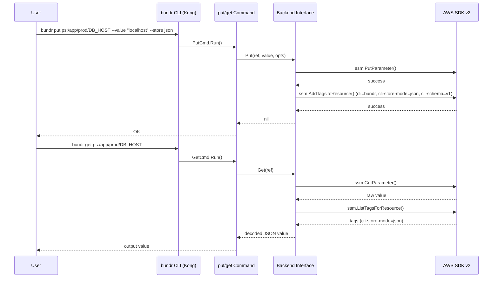

# M1: プロジェクト骨格 + put/get コア実装

## Overview
| 項目 | 値 |
|------|---|
| ステータス | 未着手 |
| 依存 | なし (初回マイルストーン) |
| 推定ファイル数 | ~20 ファイル |
| 対象ファイル | go.mod, cmd/root.go, cmd/put.go, cmd/get.go, internal/backend/interface.go, internal/backend/ps.go, internal/backend/sm.go, internal/backend/mock.go, internal/tags/tags.go, internal/config/config.go |

## Goal
- `bundr put <ref> --value <string> --store raw|json` が動作する
- `bundr get <ref>` が cli-store-mode タグを参照して適切に値を返す
- AWS は mock interface で隔離され、単体テストが CI で通過する

## Directory Structure

```
bundr/
├── go.mod
├── go.sum
├── main.go
├── cmd/
│   ├── root.go          # Kong CLI エントリーポイント
│   ├── put.go           # put コマンド
│   └── get.go           # get コマンド
└── internal/
    ├── backend/
    │   ├── interface.go  # Backend インターフェース
    │   ├── ps.go         # SSM Parameter Store (ps, psa)
    │   ├── sm.go         # Secrets Manager
    │   └── mock.go       # テスト用 mock
    ├── tags/
    │   └── tags.go       # AWS タグスキーマ定義
    └── config/
        └── config.go     # 設定管理 (Viper)
```

## Sequence Diagram



## Backend Interface Design

```go
// internal/backend/interface.go

type PutOptions struct {
    Value     string
    StoreMode string // "raw" | "json"
    ValueType string // "string" | "secure"
    KMSKeyID  string
    Tags      map[string]string
}

type GetOptions struct {
    ForceRaw  bool
    ForceJSON bool
}

type Backend interface {
    Put(ctx context.Context, ref string, opts PutOptions) error
    Get(ctx context.Context, ref string, opts GetOptions) (string, error)
}
```

## Tag Schema

```go
// internal/tags/tags.go
const (
    TagCLI       = "cli"
    TagStoreMode = "cli-store-mode"
    TagSchema    = "cli-schema"
    TagFlatten   = "cli-flatten"
    TagOwner     = "cli-owner"

    TagCLIValue    = "bundr"
    TagSchemaValue = "v1"
)
```

## TDD Test Design

| # | テストケース | 入力 | 期待出力 |
|---|-------------|------|---------|
| 1 | put raw モード | ref=ps:/test/key, value="hello", store=raw | AWS PutParameter "hello" + tags: store-mode=raw |
| 2 | put json モード (スカラー) | value="hello", store=json | AWS PutParameter "\"hello\"" (JSON エンコード) |
| 3 | put json モード (オブジェクト) | value='{"k":"v"}', store=json | AWS PutParameter '{"k":"v"}' |
| 4 | get (cli-store-mode=json) | タグに cli-store-mode=json | JSON デコードした値を返す |
| 5 | get (cli-store-mode=raw) | タグに cli-store-mode=raw | リテラル文字列を返す |
| 6 | get --raw フラグ | タグ関係なく | 生の値を返す |
| 7 | get --json フラグ | タグ関係なく | JSON デコードした値を返す |
| 8 | sm バックエンド put | ref=sm:my-secret, value="val" | Secrets Manager CreateSecret/UpdateSecret |
| 9 | ref パース: ps:/ プレフィックス | "ps:/app/key" | backend=ps, path="/app/key" |
| 10 | ref パース: sm: プレフィックス | "sm:my-secret" | backend=sm, name="my-secret" |

## Implementation Steps

- [ ] Step 1: go.mod 初期化 (`go mod init github.com/youyo/bundr`)
- [ ] Step 2: 依存パッケージ追加 (Kong, Viper, AWS SDK v2)
- [ ] Step 3: `internal/backend/interface.go` - Backend インターフェース定義
- [ ] Step 4: `internal/backend/mock.go` - テスト用 mock 実装
- [ ] Step 5: `internal/tags/tags.go` - タグ定数定義
- [ ] Step 6: ref パーサー実装 + テスト (TDD: まず失敗するテストを書く)
- [ ] Step 7: `internal/backend/ps.go` - SSM Parameter Store 実装 + テスト
- [ ] Step 8: `internal/backend/sm.go` - Secrets Manager 実装 + テスト
- [ ] Step 9: `internal/config/config.go` - Viper 設定管理
- [ ] Step 10: `cmd/root.go` - Kong CLI ルート設定
- [ ] Step 11: `cmd/put.go` - put コマンド実装 + テスト
- [ ] Step 12: `cmd/get.go` - get コマンド実装 + テスト
- [ ] Step 13: `main.go` - エントリーポイント
- [ ] Step 14: `go test ./...` で全テスト通過確認

## Risks

| リスク | 影響度 | 対策 |
|--------|--------|------|
| Kong の学習コスト | 低 | 公式ドキュメント + サンプル参照 |
| AWS SDK v2 mock 複雑性 | 中 | aws-sdk-go-v2/aws/smithy-go の `testing` パッケージ活用、または手動 interface mock |
| psa (Advanced) と ps の差異 | 低 | パラメータ作成時の Tier 指定で対応 |
| SecureString KMS 設定 | 低 | オプション扱い、デフォルトは aws/ssm |

## Dependencies

```
github.com/alecthomas/kong
github.com/spf13/viper
github.com/aws/aws-sdk-go-v2
github.com/aws/aws-sdk-go-v2/config
github.com/aws/aws-sdk-go-v2/service/ssm
github.com/aws/aws-sdk-go-v2/service/secretsmanager
```
