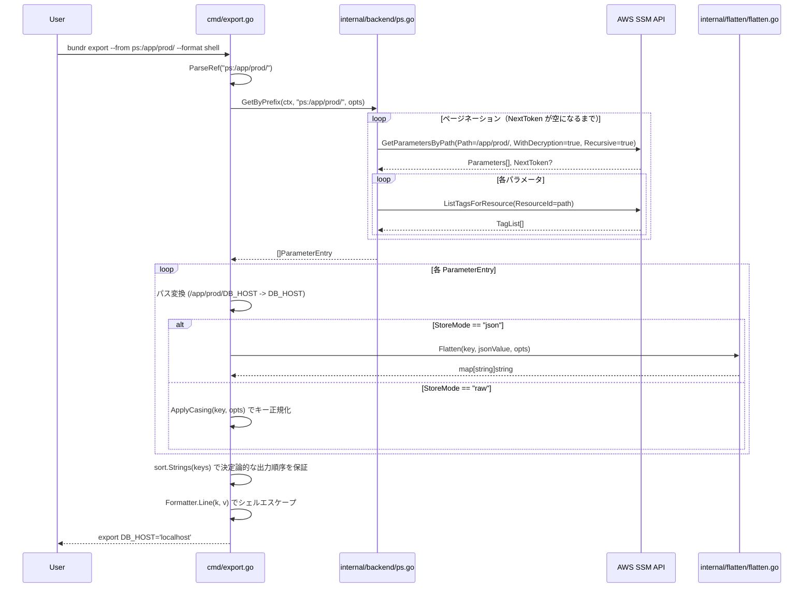
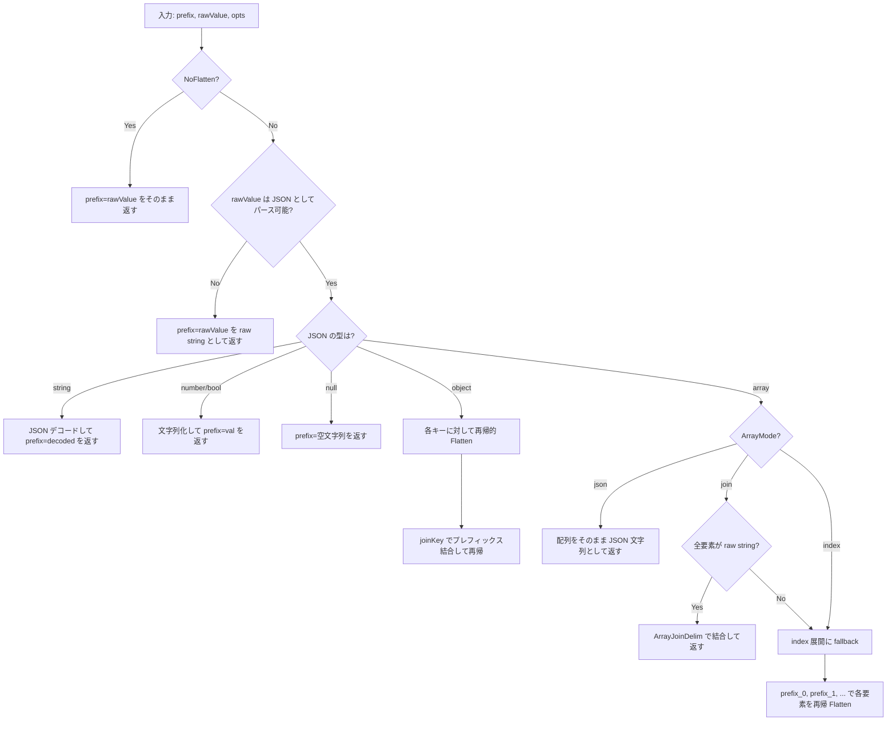
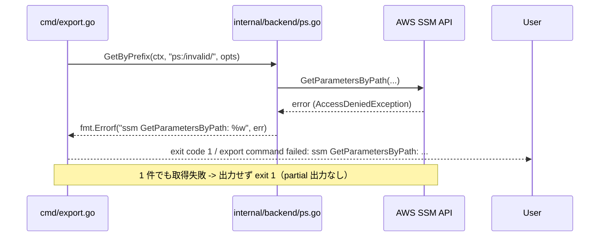

# M2: export + flatten ロジック

## 概要

SSM Parameter Store (ps:/psa:) のプレフィックス配下パラメータを一括取得し、JSON 値をフラット化して環境変数形式（shell/dotenv/direnv）で出力する export コマンドを TDD で実装する。

---

## スコープ

### 実装範囲

| 機能 | 詳細 |
|------|------|
| bundr export コマンド | --from, --format, --no-flatten, --array-mode, --array-join-delim, --flatten-delim, --upper |
| Backend.GetByPrefix() | SSM GetParametersByPath + ページネーション + タグ取得 |
| flatten エンジン | Objects(_ 区切り) + Arrays(join/index/json モード) |
| シェルエスケープ | eval による安全な出力 |
| MockBackend 拡張 | GetByPrefix のインメモリ実装 |

### スコープ外

| 機能 | 理由 |
|------|------|
| sm: バックエンドの export | Secrets Manager は複数キー取得 API がない |
| ストリーミング出力 | M2 では全件取得後に一括出力 |
| キャッシュ | M4 で実装 |
| 並行取得 | M2 はシーケンシャル取得でシンプルに |

---

## アーキテクチャ設計

### ディレクトリ構造（追加分）

追加・変更ファイルの一覧:

- cmd/root.go: Export フィールド追加
- cmd/export.go: 新規 ExportCmd 実装
- cmd/export_test.go: 新規 ExportCmd テスト
- internal/backend/interface.go: GetByPrefix メソッド追加
- internal/backend/ps.go: GetParametersByPath 追加、GetByPrefix 実装
- internal/backend/ps_test.go: GetByPrefix テスト追加
- internal/backend/mock.go: GetByPrefix 実装追加
- internal/backend/sm.go: GetByPrefix スタブ追加
- internal/flatten/flatten.go: 新規 flatten エンジン
- internal/flatten/flatten_test.go: 新規 flatten 単体テスト

### 新規インターフェース/型定義

#### Backend interface 拡張 (internal/backend/interface.go)

GetByPrefixOptions 型:
- Recursive bool: true のとき再帰的にパスを取得する（デフォルト true）

ParameterEntry 型:
- Path string: SSM パス（例: /app/prod/DB_HOST）
- Value string: raw 値（JSON デコード前）
- StoreMode string: "raw" または "json"

Backend interface への追加メソッド:
  GetByPrefix(ctx context.Context, prefix string, opts GetByPrefixOptions) ([]ParameterEntry, error)

設計判断 - map[string]string ではなく []ParameterEntry を返す理由:
- タグ情報（StoreMode）をキーごとに保持するため
- 順序が SSM API の返却順に依存しないよう、呼び出し側でソート可能にするため

#### flatten エンジン公開 API (internal/flatten/flatten.go)

Options 型フィールド:
- Delimiter string: キー区切り文字（デフォルト "_"）
- ArrayMode string: 配列展開モード "join" | "index" | "json"
- ArrayJoinDelim string: ArrayMode=join 時の連結文字（デフォルト ","）
- Upper bool: キーを大文字化するか（デフォルト true）
- NoFlatten bool: flatten を無効化するか（デフォルト false）

公開関数:
- DefaultOptions() Options: デフォルト設定を返す
- Flatten(prefix, rawValue string, opts Options) (map[string]string, error): rawValue を解析して key=value マップを返す
- ApplyCasing(key string, opts Options) string: キー文字列に大文字/小文字変換を適用（export コマンドが raw 値のキー生成に使用）

---

## シーケンス図（Mermaid 形式）

### export コマンド正常系



### flatten ロジックフロー



### エラーフロー



---

## TDD テスト設計書

### internal/flatten/flatten_test.go

テスト関数は TestFlatten のテーブル駆動テスト。各ケースは t.Run(tc.id, ...) で識別する。

テスト構造の骨格:

```go
func TestFlatten(t *testing.T) {
    tests := []struct {
        id      string
        prefix  string
        raw     string
        opts    flatten.Options
        want    map[string]string
        wantErr bool
    }{
        // ケースを列挙
    }
    for _, tc := range tests {
        t.Run(tc.id, func(t *testing.T) {
            got, err := flatten.Flatten(tc.prefix, tc.raw, tc.opts)
            // assertion
        })
    }
}
```

#### 正常系ケース（テーブル形式: ID | prefix | rawValue | opts 変更点 | 期待出力）

| ID | prefix | rawValue | opts 変更点 | 期待出力 |
|----|--------|----------|------------|---------|
| F-01 | "DB_HOST" | "localhost" (JSON でない) | デフォルト | {DB_HOST: "localhost"} |
| F-02 | "DB_HOST" | '"localhost"' (JSON文字列) | デフォルト | {DB_HOST: "localhost"} |
| F-03 | "DB" | {"host":"localhost","port":5432} | デフォルト | {DB_HOST: "localhost", DB_PORT: "5432"} |
| F-04 | "DB" | {"host":"localhost","port":5432} | Upper=false | {db_host: "localhost", db_port: "5432"} |
| F-05 | "DB" | {"conn":{"host":"localhost","port":5432}} | デフォルト | {DB_CONN_HOST: "localhost", DB_CONN_PORT: "5432"} |
| F-06 | "TAGS" | ["a","b","c"] | ArrayMode="join" | {TAGS: "a,b,c"} |
| F-07 | "TAGS" | ["a","b","c"] | ArrayMode="join", ArrayJoinDelim=":" | {TAGS: "a:b:c"} |
| F-08 | "TAGS" | ["a","b","c"] | ArrayMode="index" | {TAGS_0: "a", TAGS_1: "b", TAGS_2: "c"} |
| F-09 | "TAGS" | ["a","b","c"] | ArrayMode="json" | {TAGS: '["a","b","c"]'} |
| F-10 | "SERVERS" | [{"host":"x"},{"host":"y"}] | ArrayMode="join" | join 不可 -> index fallback: {SERVERS_0_HOST: "x", SERVERS_1_HOST: "y"} |
| F-11 | "SERVERS" | [{"host":"x"},{"host":"y"}] | ArrayMode="index" | {SERVERS_0_HOST: "x", SERVERS_1_HOST: "y"} |
| F-12 | "MIXED" | ["a",{"key":"v"}] | ArrayMode="join" | 混在 -> index fallback: {MIXED_0: "a", MIXED_1_KEY: "v"} |
| F-13 | "NUM" | 42 (JSON number) | デフォルト | {NUM: "42"} |
| F-14 | "FLAG" | true (JSON bool) | デフォルト | {FLAG: "true"} |
| F-15 | "NIL" | null | デフォルト | {NIL: ""} |
| F-16 | "DB_HOST" | "localhost" | NoFlatten=true | {DB_HOST: "localhost"} |
| F-17 | "DB" | {"host":"x"} | NoFlatten=true | {DB: '{"host":"x"}'} (JSON をそのまま文字列として返す) |
| F-18 | "STRS" | ['["nested"]',"b"] | ArrayMode="join" | 要素が JSON -> index fallback: {STRS_0_0: "nested", STRS_1: "b"} |
| F-19 | "DEEP" | {"a":{"b":{"c":"val"}}} | デフォルト | {DEEP_A_B_C: "val"} |
| F-20 | "K" | {"key-name":"v"} | デフォルト | {K_KEY_NAME: "v"} (ハイフン -> アンダースコア) |
| F-21 | "K" | {"key_name":"v"} | Upper=false | {k_key_name: "v"} |
| F-22 | "PRICE" | 42.5 | デフォルト | {PRICE: "42.5"} |
| F-23 | "COUNT" | 100 | デフォルト | {COUNT: "100"} (整数 .0 なし) |

#### 異常系ケース

| ID | rawValue | 期待する結果 |
|----|----------|------------|
| FE-01 | "{invalid json" | JSON でないため raw string として扱う: {prefix: "{invalid json"} |
| FE-02 | "" (空文字列) | JSON でないため raw string として扱う: {prefix: ""} |

注: FE-01 は JSON パースに失敗するため raw string として処理される（エラーではない）

#### エッジケース

| ID | 説明 | prefix | rawValue | opts 変更点 | 期待出力 |
|----|------|--------|----------|------------|---------|
| FEC-01 | 空配列 | "A" | [] | デフォルト | {} (エントリなし) |
| FEC-02 | prefix が空文字列 | "" | {"k":"v"} | デフォルト | {K: "v"} (先頭アンダースコアなし) |
| FEC-03 | ネスト深さ 10 層 | "ROOT" | {"a":{"b":{"c":{"d":{"e":{"f":{"g":{"h":{"i":{"j":"v"}}}}}}}}}} | デフォルト | {ROOT_A_B_C_D_E_F_G_H_I_J: "v"} |
| FEC-04 | 空オブジェクト | "A" | {} | デフォルト | {} (エントリなし) |
| FEC-05 | null を含む配列 | "A" | ["x",null,"y"] | ArrayMode="join" | null 混在 -> index fallback: {A_0: "x", A_1: "", A_2: "y"} |
| FEC-06 | カスタム区切り文字 | "DB" | {"host":"localhost"} | Delimiter="__" | {DB__HOST: "localhost"} |
| FEC-07 | 数値キー | "P" | {"1":"v"} | デフォルト | {P_1: "v"} |
| FEC-08 | 単一要素配列 | "A" | ["only"] | ArrayMode="join" | {A: "only"} |
| FEC-09 | 真偽値を含む配列 | "A" | [true,false] | ArrayMode="join" | bool 混在 -> index fallback: {A_0: "true", A_1: "false"} |

---

### cmd/export_test.go

テスト構造は M1 の cmd/get_test.go に倣い、MockBackend を Context.BackendFactory に注入する。
ExportCmd.out フィールドに bytes.Buffer を注入してコンソール出力をキャプチャする。

テストヘルパー:

```go
func newExportTestContext(t *testing.T) (*backend.MockBackend, *Context) {
    t.Helper()
    mb := backend.NewMockBackend()
    return mb, &Context{
        Config: &config.Config{},
        BackendFactory: func(bt backend.BackendType) (backend.Backend, error) {
            return mb, nil
        },
    }
}
```

#### 正常系ケース

| ID | --from | MockBackend 事前データ (ref=raw: "value" または ref=json: jsonstr) | --format | オプション | 期待出力 |
|----|--------|------------------------------------------------------------------|---------|----------|---------|
| E-01 | ps:/app/prod/ | ps:/app/prod/DB_HOST=raw:"localhost", ps:/app/prod/DB_PORT=raw:"5432" | shell | デフォルト | export DB_HOST='localhost' / export DB_PORT='5432' |
| E-02 | ps:/app/prod/ | 同上 | dotenv | デフォルト | DB_HOST=localhost / DB_PORT=5432 |
| E-03 | ps:/app/prod/ | 同上 | direnv | デフォルト | export DB_HOST='localhost' / export DB_PORT='5432' |
| E-04 | ps:/app/prod/ | ps:/app/prod/CONFIG=json:'{"db":{"host":"localhost"}}' | shell | デフォルト | export CONFIG_DB_HOST='localhost' |
| E-05 | ps:/app/prod/ | 同上 | shell | Upper=false (--no-upper) | export config_db_host='localhost' |
| E-06 | ps:/app/prod/ | ps:/app/prod/DB_HOST=raw:"localhost" | shell | --no-flatten | export DB_HOST='localhost' |
| E-07 | ps:/app/prod/ | ps:/app/prod/CONFIG=json:'{"db":{"host":"localhost"}}' | shell | --no-flatten | export CONFIG='{"db":{"host":"localhost"}}' |
| E-08 | ps:/app/prod/ | なし（空） | shell | デフォルト | "" (空出力、exit 0) |
| E-09 | ps:/app/prod/ | ps:/app/prod/KEY=raw:"it's a test" | shell | デフォルト | export KEY='it'"'"'s a test' (シングルクォートエスケープ) |
| E-10 | ps:/app/prod/ | ps:/app/prod/TAGS=json:'["a","b","c"]' | shell | デフォルト | export TAGS='a,b,c' |
| E-11 | psa:/app/prod/ | psa:/app/prod/KEY=raw:"val" | shell | デフォルト | export KEY='val' (psa: も動作) |

#### 異常系ケース

| ID | 状況 | 期待するエラー文字列 |
|----|------|------------------|
| EE-01 | --from sm:secret-id | "export command failed: sm: backend is not supported (use ps: or psa:)" |
| EE-02 | --from invalid-ref | "export command failed: invalid ref: ..." |
| EE-03 | MockBackend.GetByPrefix がエラー返却 | "export command failed: ..." |
| EE-04 | --array-mode invalid | Kong の enum バリデーションエラー |
| EE-05 | --format invalid | Kong の enum バリデーションエラー |

---

### internal/backend/ps_test.go（GetByPrefix 追加分）

mockSSMClient に GetParametersByPath メソッドを追加:

```go
type mockSSMClient struct {
    // 既存フィールド ...
    getParametersByPathFn func(ctx context.Context, input *ssm.GetParametersByPathInput, optFns ...func(*ssm.Options)) (*ssm.GetParametersByPathOutput, error)
}

func (m *mockSSMClient) GetParametersByPath(ctx context.Context, input *ssm.GetParametersByPathInput, optFns ...func(*ssm.Options)) (*ssm.GetParametersByPathOutput, error) {
    return m.getParametersByPathFn(ctx, input, optFns...)
}
```

| ID | テスト名 | モックの設定 | 期待する戻り値 |
|----|---------|------------|--------------|
| PS-GB-01 | TestPSBackend_GetByPrefix_Basic | 3件のパラメータを返す（タグ: StoreModeRaw） | []ParameterEntry 3件、全 StoreMode="raw" |
| PS-GB-02 | TestPSBackend_GetByPrefix_Paginated | 1回目: 2件+NextToken="tok"、2回目: 3件 | []ParameterEntry 5件 |
| PS-GB-03 | TestPSBackend_GetByPrefix_EmptyResult | Parameters=[] | []ParameterEntry{} (エラーなし) |
| PS-GB-04 | TestPSBackend_GetByPrefix_StoreModeFromTags | タグに cli-store-mode=json | StoreMode="json" の Entry |
| PS-GB-05 | TestPSBackend_GetByPrefix_APIError | GetParametersByPath がエラー返却 | error: "ssm GetParametersByPath: ..." |
| PS-GB-06 | TestPSBackend_GetByPrefix_TagsAPIError | ListTagsForResource がエラー返却 | error: "get store mode for ..." |
| PS-GB-07 | TestPSBackend_GetByPrefix_DefaultStoreModeRaw | TagList=[] (タグなし) | StoreMode="raw" (デフォルト) |

---

## 実装手順（Red -> Green -> Refactor サイクル）

### Step 1: internal/flatten/flatten_test.go — テスト先行（Red）

**目標**: テストファイルを作成し、`go test ./internal/flatten/...` が compile error になることを確認する。

**作業内容**:
1. `internal/flatten/` ディレクトリを作成
2. `flatten_test.go` を作成（上記テーブルの全 F-XX, FE-XX, FEC-XX ケースを網羅）
3. `go test ./internal/flatten/...` で compile error を確認（flatten.go が存在しないため）

**確認コマンド**:
```bash
mkdir -p internal/flatten
go test ./internal/flatten/...
# -> build failed: cannot find package... (これが Red の状態)
```

---

### Step 2: internal/flatten/flatten.go — flatten 実装（Green）

**目標**: 全 F-XX, FE-XX, FEC-XX テストが Green になる最小限の実装。

**実装の中核ロジック概要**:

`flattenValue(key, rawValue, opts, result)` 内部再帰関数:
1. `opts.NoFlatten == true` の場合: setKey して return
2. `json.Unmarshal(rawValue, &v)` を試みる
3. 失敗 -> raw string として setKey
4. 成功 -> 型スイッチで分岐:
   - `map[string]interface{}`: 各キーに対して `flattenAny(joinKey(key, k, delim), v, opts, result)` で再帰
   - `[]interface{}`: `flattenArray(key, arr, opts, result)` へ委譲
   - `string`: setKey
   - `float64`: `formatNumber(val)` で文字列化して setKey
   - `bool`: "true"/"false" で setKey
   - `nil`: "" で setKey

`flattenArray(key, arr, opts, result)` の配列処理:
- 空配列: return nil (エントリなし)
- ArrayMode="json": json.Marshal して setKey
- ArrayMode="join": `tryJoinStrings(arr)` で全要素が raw string か確認 -> 成功なら join、失敗なら index 展開に fallback
- ArrayMode="index" / fallback: for i, elem -> `flattenAny(joinKey(key, strconv.Itoa(i), delim), elem, opts, result)`

`tryJoinStrings(arr)` の判定ロジック:
- 各要素が `string` 型でない -> false
- 各要素に対して `json.Unmarshal` が成功する -> false（JSON としてパースできる文字列は join 不可）
- 全要素が raw string -> ([]string, true)

`setKey(result, key, value, opts)`:
- `ApplyCasing(key, opts)` を適用してから result に格納

`ApplyCasing(key, opts)`:
- ハイフンをアンダースコアに置換: `strings.ReplaceAll(key, "-", "_")`
- Upper=true: `strings.ToUpper(k)` / false: `strings.ToLower(k)`

`joinKey(prefix, suffix, delimiter)`:
- prefix が空: suffix を返す
- prefix が非空: `prefix + delimiter + suffix`

`formatNumber(f float64)`:
- `f == float64(int64(f))` の場合: `fmt.Sprintf("%d", int64(f))` (整数表示)
- それ以外: `fmt.Sprintf("%g", f)` (小数点表示)

**確認コマンド**:
```bash
go test ./internal/flatten/...
# -> PASS
```

**設計上の責務分担（Critical #2 対応）**:

- **flatten エンジン（flatten.go）の責務**: 受け取った `rawValue` 文字列を JSON としてパースして展開する。JSON として解析できない場合は raw string として扱う。StoreMode を知らない。
- **CLI 層（export.go）の責務**: `entry.StoreMode` に基づいて JSON デコード要否を判定し、`StoreMode="json"` の場合のみ `flatten.Flatten()` を呼び出す。`StoreMode="raw"` の場合は `flatten.Flatten()` を呼ばず、値をそのまま格納する。
- **整合性**: `get` コマンドの StoreMode 優先ルールと同じ原則。JSON デコード判定の責務は CLI 層に一本化。

**Refactor ポイント**:
- `flattenObject` として map 処理を独立した関数に切り出す
- `delimiter` を opts から取り出して冗長な引数渡しを削減
- `FEC-03`（10層ネスト）で stack overflow が起きないことを確認

---

### Step 3: internal/backend/interface.go — GetByPrefix 追加

**変更内容**:

```go
// GetByPrefixOptions を追加
type GetByPrefixOptions struct {
    Recursive bool
}

// ParameterEntry を追加
type ParameterEntry struct {
    Path      string
    Value     string
    StoreMode string
}

// Backend interface に GetByPrefix を追加
type Backend interface {
    Put(ctx context.Context, ref string, opts PutOptions) error
    Get(ctx context.Context, ref string, opts GetOptions) (string, error)
    GetByPrefix(ctx context.Context, prefix string, opts GetByPrefixOptions) ([]ParameterEntry, error)
}
```

**注意**: この変更後、SMBackend と MockBackend がコンパイルエラーになるため、Step 4/5 と同時または直後に対応する。

---

### Step 4: internal/backend/ps.go + sm.go 更新

**ps.go の変更点**:

SSMClient interface に追加:
```go
GetParametersByPath(ctx context.Context, input *ssm.GetParametersByPathInput, optFns ...func(*ssm.Options)) (*ssm.GetParametersByPathOutput, error)
```

PSBackend.GetByPrefix の実装:

```go
func (b *PSBackend) GetByPrefix(ctx context.Context, prefix string, opts GetByPrefixOptions) ([]ParameterEntry, error) {
    recursive := true
    if !opts.Recursive {
        recursive = false
    }

    var entries []ParameterEntry
    var nextToken *string

    for {
        input := &ssm.GetParametersByPathInput{
            Path:           aws.String(prefix),
            WithDecryption: aws.Bool(true),
            Recursive:      aws.Bool(recursive),
        }
        if nextToken != nil {
            input.NextToken = nextToken
        }

        out, err := b.client.GetParametersByPath(ctx, input)
        if err != nil {
            return nil, fmt.Errorf("ssm GetParametersByPath: %w", err)
        }

        for _, param := range out.Parameters {
            path := aws.ToString(param.Name)
            value := aws.ToString(param.Value)

            storeMode, err := b.getStoreMode(ctx, path)
            if err != nil {
                return nil, fmt.Errorf("get store mode for %s: %w", path, err)
            }

            entries = append(entries, ParameterEntry{
                Path:      path,
                Value:     value,
                StoreMode: storeMode,
            })
        }

        if out.NextToken == nil {
            break
        }
        nextToken = out.NextToken
    }

    return entries, nil
}

// getStoreMode は既存の Get 実装から抽出したヘルパー関数。
// ListTagsForResource を使って cli-store-mode タグを取得する。
func (b *PSBackend) getStoreMode(ctx context.Context, path string) (string, error) {
    tagsOut, err := b.client.ListTagsForResource(ctx, &ssm.ListTagsForResourceInput{
        ResourceId:   aws.String(path),
        ResourceType: ssmtypes.ResourceTypeForTaggingParameter,
    })
    if err != nil {
        return "", err
    }

    for _, tag := range tagsOut.TagList {
        if aws.ToString(tag.Key) == tags.TagStoreMode {
            return aws.ToString(tag.Value), nil
        }
    }
    return tags.StoreModeRaw, nil
}
```

**sm.go のスタブ追加**:

```go
func (b *SMBackend) GetByPrefix(_ context.Context, _ string, _ GetByPrefixOptions) ([]ParameterEntry, error) {
    return nil, fmt.Errorf("GetByPrefix is not supported for Secrets Manager backend")
}
```

**補足 - GetParametersByPath の SSM API 仕様**:
- MaxResults のデフォルトは 10（明示的に設定しなくてよい）
- NextToken が nil になったらページネーション終了
- WithDecryption=true で SecureString も復号して返す
- Recursive=true でサブパスも再帰取得

---

### Step 5: internal/backend/mock.go — GetByPrefix 実装

MockBackend 構造体への追加フィールド:
```go
GetByPrefixCalls []GetByPrefixCall
```

GetByPrefixCall 型:
```go
type GetByPrefixCall struct {
    Prefix string
    Opts   GetByPrefixOptions
}
```

GetByPrefix の実装（prefix は ref 形式でマッチング）:

```go
func (m *MockBackend) GetByPrefix(_ context.Context, prefix string, opts GetByPrefixOptions) ([]ParameterEntry, error) {
    m.mu.RLock()
    defer m.mu.RUnlock()

    m.GetByPrefixCalls = append(m.GetByPrefixCalls, GetByPrefixCall{Prefix: prefix, Opts: opts})

    var result []ParameterEntry
    for ref, entry := range m.store {
        if !strings.HasPrefix(ref, prefix) {
            continue
        }
        parsed, err := ParseRef(ref)
        if err != nil {
            continue
        }
        result = append(result, ParameterEntry{
            Path:      parsed.Path,
            Value:     entry.Value,
            StoreMode: entry.StoreMode,
        })
    }
    return result, nil
}
```

**設計ノート**: MockBackend の store は Put 時に ref 形式（例: `ps:/app/prod/DB_HOST`）で格納される。
GetByPrefix の prefix も ref プレフィックス形式（例: `ps:/app/prod/`）でマッチングするため、テストコードで一貫した ref 形式を使用できる。

---

### Step 6: cmd/export.go — export コマンド実装

**ExportCmd 構造体**:

```go
type ExportCmd struct {
    From           string `required:"" help:"Source prefix (e.g. ps:/app/prod/)"`
    Format         string `default:"shell" enum:"shell,dotenv,direnv" help:"Output format"`
    NoFlatten      bool   `name:"no-flatten" help:"Disable JSON flattening"`
    ArrayMode      string `default:"join" enum:"join,index,json" help:"Array handling mode"`
    ArrayJoinDelim string `default:"," help:"Delimiter for array join mode"`
    FlattenDelim   string `default:"_" help:"Delimiter for flattened keys"`
    Upper          bool   `default:"true" negatable:"" help:"Uppercase key names"`

    out io.Writer // テスト用: nil の場合は os.Stdout を使用
}
```

**Run 関数の処理フロー**:

1. `c.out == nil` の場合 `c.out = os.Stdout`
2. `backend.ParseRef(c.From)` で ref をパース
3. `ref.Type == backend.BackendTypeSM` の場合: エラー返却
4. `appCtx.BackendFactory(ref.Type)` でバックエンドを取得
5. `b.GetByPrefix(ctx, ref.Path, GetByPrefixOptions{Recursive: true})` で全パラメータ取得
   - **重要**: `c.From`（ref 文字列 `ps:/app/prod/`）をそのまま渡すと SSM API がエラーになるため、`ParseRef()` で取得した `ref.Path`（`/app/prod/`）のみを渡す
6. `flatOpts` を構築（ExportCmd のフラグから）
7. 各 ParameterEntry に対して:
   a. `pathToKey(entry.Path, ref.Path, c.FlattenDelim)` でキープレフィックスを生成
   b. `entry.StoreMode == "json"` の場合: `flatten.Flatten(keyPrefix, entry.Value, flatOpts)` で JSON デコード後に flatten エンジンへ渡す
   c. `entry.StoreMode == "raw"` の場合: isJSON 判定は一切行わず、`flatten.ApplyCasing(keyPrefix, flatOpts)` でキー正規化して値をそのまま格納
   - **StoreMode 優先ルール**: JSON デコード判定は cli-store-mode タグ（StoreMode）のみで決定する。raw 値に {/[ が含まれていても flatten しない。責務の重複を避けるため、flatten エンジン（flatten.go）は受け取った値を純粋に flatten するだけであり、JSON 解析は CLI 層（export.go）が StoreMode に基づいて行う
   d. 取得した map を vars に統合
8. `sort.Strings(keys)` で決定論的な出力順序
9. `newFormatter(c.Format)` でフォーマッタを選択
10. 各 k,v に対して `fmt.Fprintln(c.out, formatter.Line(k, vars[k]))`

**キー変換ロジック (pathToKey)**:

```
引数:
  path     = "/app/prod/DB_HOST"  (SSM パス)
  fromPath = "/app/prod/"         (ref.Path、例: ParseRef("ps:/app/prod/").Path)
  delim    = "_"

処理:
  trimmed = strings.TrimPrefix(path, strings.TrimRight(fromPath, "/") + "/")
         = strings.TrimPrefix("/app/prod/DB_HOST", "/app/prod/")
         = "DB_HOST"
  
  サブパスの場合 (path="/app/prod/sub/KEY"):
  trimmed = "sub/KEY"
  result  = strings.ReplaceAll("sub/KEY", "/", delim) = "sub_KEY"
```

**シェルエスケープ (shellQuote)**:

シングルクォートでラップし、値内のシングルクォートを '"'"' で置換する:

```
値:     it's a test
変換:   it'"'"'s a test
出力:   'it'"'"'s a test'

検証:   sh -c 'echo '"'"'it'"'"'"'"'"'s a test'"'"'' -> it's a test
```

**dotenv エスケープ (dotenvQuote)**:

- 特殊文字（スペース、タブ、改行、引用符、バックスラッシュ、#）を含まない場合: そのまま
- 含む場合: ダブルクォートでラップし、内部の " と \ をエスケープ

**StoreMode 優先ルール（isJSON 判定を使わない）**:

`cli-store-mode` タグの値（`StoreMode`）のみで JSON デコード要否を決定する。`isJSON` による自動判定は行わない。これにより `get` コマンドの StoreMode 優先ルールと一致し、JSON デコード責務の重複を防ぐ:

```go
// StoreMode に基づく分岐（isJSON 判定は行わない）
if entry.StoreMode == tags.StoreModeJSON {
    // JSON デコードしてから flatten エンジンへ渡す
    kvs, err := flatten.Flatten(keyPrefix, entry.Value, flatOpts)
    // ...
} else {
    // StoreMode="raw": 値をそのまま格納（JSON として見えても flatten しない）
    normalizedKey := flatten.ApplyCasing(keyPrefix, flatOpts)
    vars[normalizedKey] = entry.Value
}
```

---

### Step 7: cmd/root.go — CLI 構造体更新

```go
type CLI struct {
    Put    PutCmd    `cmd:"" help:"Store a value to AWS Parameter Store or Secrets Manager."`
    Get    GetCmd    `cmd:"" help:"Get a value from a backend."`
    Export ExportCmd `cmd:"" help:"Export parameters as environment variables."`
}
```

---

### Step 8: 全テスト PASS 確認 + Refactor

**確認コマンド**:

```bash
# 全テスト実行
go test ./...

# カバレッジ確認（80%+ 目標）
go test -coverprofile=coverage.out ./...
go tool cover -func=coverage.out | grep -E "(total|flatten|export)"

# ビルド確認
go build -o bundr ./...

# linter
golangci-lint run
```

**Refactor チェックリスト**:
- [ ] `pathToKey` の trailing slash あり/なし両方で動作するか確認
- [ ] `isJSON` を `json.Valid` ベースに統一して `{` `[` 先頭チェックより堅牢化
- [ ] `getStoreMode` を Get と GetByPrefix で共有しているか確認（コードDRY）
- [ ] テスト内の重複するモックセットアップをヘルパー関数に抽出
- [ ] `flattenObject` を独立した内部関数に切り出す
- [ ] 既存テスト（TestPSBackend_GetRaw 等）が mockSSMClient の新メソッド追加後も Green か確認

---

## リスク評価

| リスク | 重大度 | 対策 |
|--------|--------|------|
| SSM GetParametersByPath の N+1 問題（パラメータ数 × タグ取得） | 中 | M2 ではシーケンシャル実装。多数のパラメータでは遅いことをドキュメントに記載。M4 以降で並行化を検討 |
| シェルエスケープの抜け（インジェクション） | 高 | shellQuote のテストで特殊文字パターンを網羅（シングルクォート、改行、タブ、バックスラッシュ）。E-09 テストで実証 |
| flatten の無限再帰（自己参照 JSON） | 低 | Go の encoding/json は自己参照 JSON を生成できないため実質リスクなし |
| --upper デフォルト true と Kong bool フラグ設計の衝突 | 中 | Kong の negatable:"" タグで --no-upper を自動生成。`default:"true"` で明示設定。テストで Upper/NoUpper 両方を検証 |
| MockBackend の GetByPrefix が ref 形式前提であること | 低 | テストコメントで明示。PSBackend は SSM パスを直接使用するため整合性あり |
| StoreMode="raw" 時の isJSON 誤判定は廃止（設計変更） | - | isJSON 判定を廃止し、StoreMode タグのみで JSON デコード要否を決定する（Critical #2 対応済み） |
| ページネーションのテスト複雑度 | 低 | mockSSMClient の GetParametersByPath に NextToken ステートマシンを実装（PS-GB-02） |
| 出力順序の非決定性（map イテレーション） | 中 | vars 収集後に sort.Strings(keys) で明示的にソートして決定論的な出力を保証 |
| existing test の mockSSMClient 拡張 | 中 | GetParametersByPath メソッドを mockSSMClient に追加する際、既存テストのモック構造体を更新する必要がある。nil チェックか default 実装を用意してパニック回避 |
| IAM 権限不足（`ssm:GetParametersByPath` 不足） | 高 | 実行前に必要 IAM 権限（ssm:GetParametersByPath、ssm:ListTagsForResource）を README に明記。AccessDenied を受けたら exit 1 + 明確なエラーメッセージを返す |
| AWS API Throttling（ページネーション中のレート制限） | 中 | AWS SDK v2 の default retrier に委譲。大量取得時はページ間に 100ms sleep を検討（M4 以降で対応） |
| `ListTagsForResource` 権限不足による StoreMode 取得失敗 | 中 | Step 4 の `getStoreMode` 実装で明記：タグが取得できない場合（AccessDenied を含む）は `raw` として扱う（フォールバック）。全体失敗はしない設計とする。ただし警告ログを出力することを推奨 |

### ロールバック計画

M2 は純粋な追加実装（既存 M1 の put/get には非破壊的）のため、ロールバックは以下の手順で可能：

1. **即時ロールバック**: `git revert` または `git checkout feat-m1-scaffold-core-commands` で M1 完了状態に戻す
2. **Backend インターフェース変更の影響**: `GetByPrefix` 追加は既存 `Get/Put` に非影響。ただし mock.go も変更されるため、リバート時はセットで戻す
3. **ロールバック判断基準**: 全テスト PASS しない / ビルドが失敗する場合は即座にリバートする
4. **責任者**: 実装担当者がテスト PASS を確認してからマージ

---

## Codex Plan Review チェックリスト（5観点27項目）

### 1. 仕様整合性（5項目）

- [ ] スペック Section 6.3 の全フラグが ExportCmd に定義されているか: from, format, no-flatten, array-mode, array-join-delim, flatten-delim, upper（7フラグ全て）
- [ ] スペック Section 7 の flatten ルール（Objects: _ 区切り、Arrays 4 ルール）がテストケース F-01〜F-23 で全パターン網羅されているか
- [ ] eval 安全な出力が shellQuote によって保証され、E-09 テストで実証されているか
- [ ] --upper がデフォルト true かつ negatable:"" で --no-upper が生成されるか（Kong 設計）
- [ ] sm: バックエンドの非サポートが明示的なエラー返却で表現されているか（EE-01）

### 2. TDD サイクル整合性（5項目）

- [ ] Step 1 完了時点で flatten.go が存在せず、テストが compile error になることを実際に確認したか
- [ ] Step 2 で全 F-XX テストが Green になる最小限の実装のみか（過実装していないか）
- [ ] Step 3-5 の Backend 変更後に既存テスト（TestPSBackend_PutRaw 等）が引き続き Green か
- [ ] Step 6 の export テストが MockBackend のみで AWS 実呼び出しを含まないか
- [ ] Refactor フェーズでテスト Green を維持したまま構造改善が行われているか（go test ./... で確認）

### 3. インターフェース設計（5項目）

- [ ] Backend interface 変更後に SMBackend も更新されてコンパイルエラーがないか
- [ ] ParameterEntry がスライスで返される設計判断がコメントで説明されているか
- [ ] GetByPrefixOptions.Recursive の呼び出し側でのデフォルト値（true）が正しく設定されているか
- [ ] lineFormatter interface が io.Writer ではなく string を返す設計でテスト容易性が確保されているか
- [ ] ApplyCasing が public 関数として export され、cmd/export.go から直接利用できるか

### 4. エラーハンドリング（6項目）

- [ ] GetByPrefix の全 API エラーが fmt.Errorf("ssm GetParametersByPath: %w", err) でラップされているか
- [ ] 1 件でも失敗したら全体を exit 1 で終了し、partial 出力が発生しないか（全 flatten 後に一括出力）
- [ ] flatten エラーのメッセージに対象パスが含まれているか（例: "flatten /app/prod/KEY: ..."）
- [ ] sm: 非サポートのエラーメッセージにガイダンスが含まれているか（"use ps: or psa:"）
- [ ] 無効 JSON 値（FE-01）のエラーが flatten -> export コマンドまで伝播するか（または raw として処理されるか）
- [ ] 空結果（E-08, PS-GB-03）が正常終了（exit 0）するか

### 5. テスト網羅性（6項目）

- [ ] シェルエスケープテスト（E-09）のシングルクォート置換パターン '"'"' が実際のシェルで動作するか（手動検証推奨）
- [ ] ページネーションテスト（PS-GB-02）が 2 ページ以上の取得フローを実証しているか
- [ ] 空結果（E-08, PS-GB-03, FEC-01, FEC-04）のゼロ値処理が一貫しているか（nil vs 空スライスの区別）
- [ ] --no-flatten フラグ（E-06, E-07）で JSON 値が展開されずそのまま出力されるか
- [ ] 10 層ネスト（FEC-03）が stack overflow なく処理できるか（再帰深度の上限なし設計）
- [ ] カバレッジ目標（80%+）が internal/flatten パッケージで達成されているか（go test -coverprofile で数値確認）

---

## Codex Plan Review — Critical 対応記録

| ID | 指摘内容 | 対応状況 |
|----|---------|---------|
| Critical #1 | `GetByPrefix` に ref 文字列（`c.From`）を渡す設計 -> API エラー | **対応済み**: Step 6 手順5を `ref.Path` を渡す設計に修正。`ParseRef()` で取得した `ref.Path` のみを `GetByPrefix` に渡すことを明記 |
| Critical #2 | raw でも isJSON 判定で flatten する記述 -> `get` の StoreMode 優先ルールと不整合 | **対応済み**: isJSON 廃止。StoreMode 優先ルールに一本化。Step 2 に責務分担を明記、Step 6 の分岐ロジックを StoreMode ベースに修正 |
| Critical #3 | IAM 権限不足時の影響と対策がリスク評価に未記載 | **対応済み**: `ssm:GetParametersByPath` 不足（High）、AWS API Throttling（Medium）、`ListTagsForResource` 権限不足（Medium）の3行をリスク評価表に追加 |
| Critical #4 | ロールバック計画が未定義 | **対応済み**: リスク評価セクション末尾に「ロールバック計画」サブセクションを追加 |
