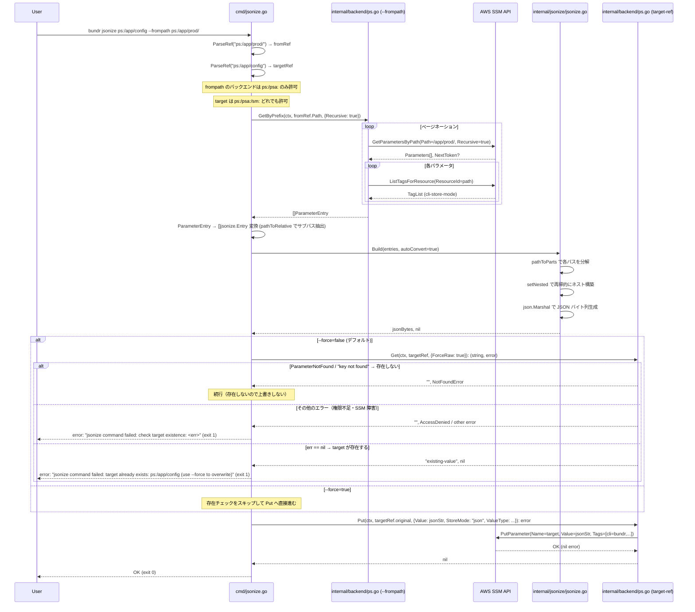
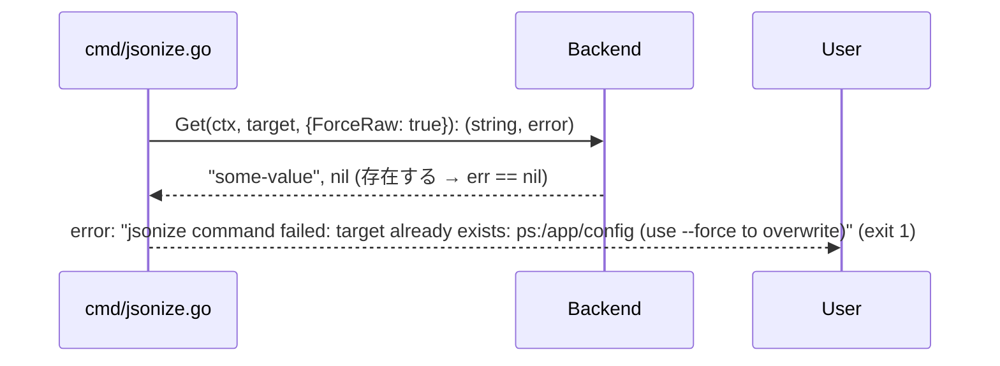
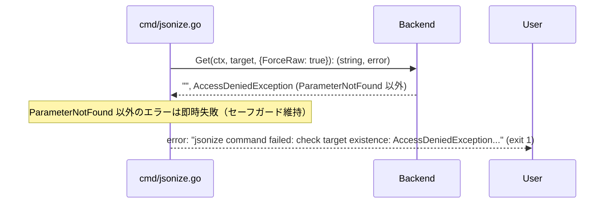
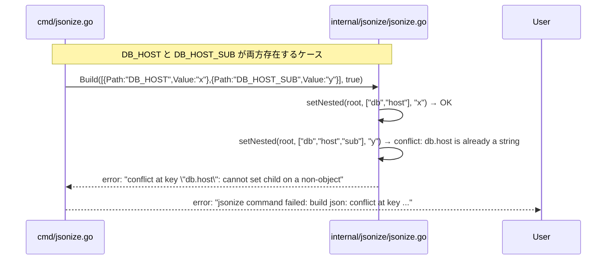

# M3: jsonize コマンド

## 概要

SSM Parameter Store (ps:/psa:) のプレフィックス配下パラメータを一括取得し、パス構造 (`_` 区切り) をネスト JSON に変換して、指定した target-ref に単一 JSON 値として書き込む `jsonize` コマンドを TDD で実装する。

---

## スコープ

### 実装範囲

| 機能 | 詳細 |
|------|------|
| `bundr jsonize` コマンド | `<target-ref> --frompath --store --value-type --force` |
| `internal/jsonize/` パッケージ | パス → ネスト JSON 変換エンジン (TDD) |
| `--force` フラグ | target-ref の上書き制御 |
| 型変換ロジック | 文字列 → 数値 / bool / null 自動変換 |
| エラーハンドリング | キー競合 / StoreMode 変換 / 既存キー上書き禁止 |

### スコープ外

| 機能 | 理由 |
|------|------|
| `--frompath sm:` のサポート | Secrets Manager は複数キー取得 API がない (export と同方針) |
| JSON スキーマバリデーション | M3 では構造の正しさのみ保証 |
| キャッシュ | M4 で実装 |
| 並行取得 | M3 はシーケンシャル取得でシンプルに |
| `--dry-run` フラグ | M3 スコープ外 |

---

## アーキテクチャ設計

### ディレクトリ構造（追加・変更ファイル）

```
bundr/
├── cmd/
│   ├── root.go          # Jsonize フィールド追加 (変更)
│   ├── jsonize.go       # 新規: JsonizeCmd 実装
│   └── jsonize_test.go  # 新規: JsonizeCmd テスト
└── internal/
    └── jsonize/
        ├── jsonize.go       # 新規: Build 関数（パス→ネストJSON変換エンジン）
        └── jsonize_test.go  # 新規: Build テスト
```

変更ファイル一覧:
- `cmd/root.go`: `CLI` 構造体に `Jsonize JsonizeCmd` フィールドを追加
- `cmd/jsonize.go`: 新規作成
- `cmd/jsonize_test.go`: 新規作成
- `internal/jsonize/jsonize.go`: 新規作成
- `internal/jsonize/jsonize_test.go`: 新規作成
- `README.md`: IAM 権限（`ssm:GetParametersByPath`, `ssm:ListTagsForResource`, `ssm:PutParameter`, `secretsmanager:PutSecretValue`）を `jsonize` セクションに追記（Step 5 完了後）

既存ファイルへの変更なし:
- `internal/backend/interface.go` — 変更不要 (既存 Put / GetByPrefix で十分)
- `internal/backend/mock.go` — 変更不要
- `internal/flatten/flatten.go` — 変更不要

---

## internal/jsonize パッケージ設計

### 公開 API

```go
package jsonize

// Entry はパス→値の単一エントリを表す。
type Entry struct {
    // Path は frompath プレフィックスを除去したサブパス。
    // 例: frompath=/app/prod/, paramPath=/app/prod/DB_HOST → Path="DB_HOST"
    Path  string
    // Value は raw 文字列値 (StoreMode が json の場合は JSON エンコード済み文字列)。
    Value string
    // StoreMode は "raw" または "json"。
    StoreMode string
}

// Build は entries を受け取り、ネスト JSON オブジェクトを構築して JSON バイト列を返す。
// パス区切りルール:
//   - まず "/" でパスを分割してネスト階層を構築
//   - さらに "_" で各セグメントを分割してネストを深める
//   - 同一キーへの競合（既存の map を string で上書きなど）はエラー
// 型変換ルール:
//   - StoreMode="json" の entry は JSON としてデコードしてからネストに組み込む
//   - StoreMode="raw" の entry の値は autoConvert で型変換を試みる
// autoConvert=true の場合:
//   - "true"/"false" → bool
//   - 整数文字列 → float64 (JSON の数値型)
//   - 小数文字列 → float64
//   - "null" → nil
//   - その他 → string のまま
func Build(entries []Entry, autoConvert bool) ([]byte, error)
```

### パス → ネスト JSON 変換アルゴリズム

**変換規則（確定版）**:

1. `entry.Path` を `"/"` で分割してスラッシュ階層を構成
2. 各セグメントをさらに `"_"` で分割してアンダースコア階層を構成
3. 分割後のキー列 `parts` を小文字変換して JSON オブジェクトのキーに使用
4. ネストが衝突する場合（既存の string キーに対してオブジェクトを追加しようとするなど）はエラー

**例**:

```
entries:
  {Path: "DB_HOST",       Value: "localhost", StoreMode: "raw"}
  {Path: "DB_PORT",       Value: "5432",      StoreMode: "raw"}
  {Path: "DB_PASSWORD",   Value: "secret",    StoreMode: "raw"}
  {Path: "APP_NAME",      Value: "myapp",     StoreMode: "raw"}

パス分解:
  "DB_HOST"     → ["db", "host"]
  "DB_PORT"     → ["db", "port"]
  "DB_PASSWORD" → ["db", "password"]
  "APP_NAME"    → ["app", "name"]

結果 JSON:
  {
    "db": {
      "host": "localhost",
      "port": 5432,
      "password": "secret"
    },
    "app": {
      "name": "myapp"
    }
  }
```

**スラッシュ + アンダースコア混在例**:

```
entries:
  {Path: "nested/DB_HOST", Value: "localhost", StoreMode: "raw"}

パス分解:
  "nested/DB_HOST" → "/" 分割: ["nested", "DB_HOST"]
                  → 各セグメントを "_" 分割: ["nested", "db", "host"]

結果 JSON:
  {
    "nested": {
      "db": {
        "host": "localhost"
      }
    }
  }
```

**StoreMode=json 処理例**:

```
entries:
  {Path: "CONFIG", Value: `{"timeout":30,"enabled":true}`, StoreMode: "json"}

パス分解:
  "CONFIG" → ["config"]

StoreMode=json のため JSON デコード → map[string]interface{}{"timeout": 30, "enabled": true}

結果 JSON:
  {
    "config": {
      "timeout": 30,
      "enabled": true
    }
  }
```

### 内部実装方針

```go
// setNested は root マップの parts[0..n] の階層に value を設定する。
// 競合がある場合はエラーを返す。
func setNested(root map[string]interface{}, parts []string, value interface{}) error

// pathToParts は "/" と "_" でパスを分割して小文字化した parts スライスを返す。
// 例: "DB_HOST" → ["db", "host"]
// 例: "nested/DB_HOST" → ["nested", "db", "host"]
func pathToParts(path string) []string

// autoConvertValue は raw 文字列を Go の型に変換する (autoConvert=true 時のみ)。
func autoConvertValue(raw string) interface{}
```

### エラー種別

| エラー種別 | 発生条件 | エラーメッセージ例 |
|-----------|---------|----------------|
| キー競合エラー | `db.host` が既に string なのに `db.host.sub` を追加しようとした | `"conflict at key \"db.host\": cannot set child on a non-object"` |
| JSON デコードエラー | StoreMode=json だが値が不正 JSON | `"invalid json value for path \"CONFIG\": ..."` |
| 空エントリ | entries が空スライス | `{}` を返す (エラーなし) |

---

## シーケンス図（Mermaid 形式）

### jsonize コマンド正常系



### エラーフロー: target 既存 + --force=false



### エラーフロー: target の Get で権限エラー + --force=false



### エラーフロー: キー競合



---

## TDD テスト設計書

### internal/jsonize/jsonize_test.go

#### テスト構造の骨格

```go
func TestBuild(t *testing.T) {
    tests := []struct {
        id          string
        entries     []jsonize.Entry
        autoConvert bool
        wantJSON    string // json.Marshal 後の JSON 文字列（比較は map 経由）
        wantErr     string // 空文字列ならエラーなし
    }{
        // ケースを列挙
    }
    for _, tc := range tests {
        t.Run(tc.id, func(t *testing.T) {
            got, err := jsonize.Build(tc.entries, tc.autoConvert)
            if tc.wantErr != "" {
                if err == nil {
                    t.Fatalf("expected error %q, got nil", tc.wantErr)
                }
                if !strings.Contains(err.Error(), tc.wantErr) {
                    t.Fatalf("error %q does not contain %q", err.Error(), tc.wantErr)
                }
                return
            }
            if err != nil {
                t.Fatalf("unexpected error: %v", err)
            }
            // JSON 比較は map[string]interface{} 経由で行う（キー順不定のため）
            var gotMap, wantMap interface{}
            if err := json.Unmarshal(got, &gotMap); err != nil {
                t.Fatalf("unmarshal got: %v", err)
            }
            if err := json.Unmarshal([]byte(tc.wantJSON), &wantMap); err != nil {
                t.Fatalf("unmarshal want: %v", err)
            }
            if !reflect.DeepEqual(gotMap, wantMap) {
                t.Errorf("got %s, want %s", got, tc.wantJSON)
            }
        })
    }
}
```

#### 正常系テストケース

| ID | entries (Path / Value / StoreMode) | autoConvert | 期待 JSON |
|----|-----------------------------------|-----------|-----------| 
| J-01 | DB_HOST/localhost/raw, DB_PORT/5432/raw | true | `{"db":{"host":"localhost","port":5432}}` |
| J-02 | DB_HOST/localhost/raw, DB_PORT/5432/raw | false | `{"db":{"host":"localhost","port":"5432"}}` |
| J-03 | APP_NAME/myapp/raw | true | `{"app":{"name":"myapp"}}` |
| J-04 | KEY/value/raw | true | `{"key":"value"}` (アンダースコアなし) |
| J-05 | DB_HOST/localhost/raw, APP_NAME/myapp/raw | true | `{"db":{"host":"localhost"},"app":{"name":"myapp"}}` |
| J-06 | nested/DB_HOST/localhost/raw | true | `{"nested":{"db":{"host":"localhost"}}}` (スラッシュ+アンダースコア混在) |
| J-07 | CONFIG/`{"timeout":30,"enabled":true}`/json | true | `{"config":{"timeout":30,"enabled":true}}` |
| J-08 | DB_HOST/localhost/raw, CONFIG/`{"db":{"port":5432}}`/json | true | `{"db":{"host":"localhost","port":5432},"config":{"db":{"port":5432}}}` |
| J-09 | DB_ENABLED/true/raw | true | `{"db":{"enabled":true}}` (bool 変換) |
| J-10 | DB_ENABLED/false/raw | true | `{"db":{"enabled":false}}` (bool 変換) |
| J-11 | VALUE/null/raw | true | `{"value":null}` (null 変換) |
| J-12 | PRICE/42.5/raw | true | `{"price":42.5}` (float 変換) |
| J-13 | COUNT/100/raw | true | `{"count":100}` (int → float64 で 100.0) |
| J-14 | TAGS/`["a","b"]`/json | true | `{"tags":["a","b"]}` (配列 JSON) |
| J-15 | `` (空 entries スライス) | true | `{}` |
| J-16 | KEY_A_B_C/val/raw | true | `{"key":{"a":{"b":{"c":"val"}}}}` (深いネスト) |
| J-17 | DB_HOST/localhost/raw, DB_PORT/5432/raw, DB_NAME/mydb/raw | true | `{"db":{"host":"localhost","port":5432,"name":"mydb"}}` (同一親への複数子) |

##### J-01 の詳細展開（実装検証用）

```
entries:
  [{Path:"DB_HOST", Value:"localhost", StoreMode:"raw"},
   {Path:"DB_PORT", Value:"5432",     StoreMode:"raw"}]

pathToParts("DB_HOST") → ["db", "host"]
pathToParts("DB_PORT") → ["db", "port"]

setNested(root, ["db", "host"], "localhost")
  root["db"] が存在しない → root["db"] = map{} を作成
  root["db"]["host"] = "localhost"

setNested(root, ["db", "port"], 5432)  ← autoConvert で "5432" → 5432
  root["db"] が存在する (map) → 続行
  root["db"]["port"] = 5432

json.Marshal(root) → {"db":{"host":"localhost","port":5432}}
```

#### 異常系テストケース

| ID | entries | autoConvert | 期待するエラー文字列 |
|----|---------|------------|-----------------|
| JE-01 | DB_HOST/x/raw, DB_HOST_SUB/y/raw | true | `"conflict at key \"db.host\""` |
| JE-02 | A/x/raw, A_B/y/raw | true | `"conflict at key \"a\""` (A が string、A_B が object に) |
| JE-03 | CONFIG/`{invalid json}`/json | true | `"invalid json value for path \"CONFIG\""` |
| JE-04 | DB_HOST/x/json | true | `"invalid json value for path \"DB_HOST\""` (x は不正 JSON) |

##### JE-01 の詳細展開

```
entries:
  [{Path:"DB_HOST",     Value:"x", StoreMode:"raw"},
   {Path:"DB_HOST_SUB", Value:"y", StoreMode:"raw"}]

pathToParts("DB_HOST")     → ["db", "host"]
pathToParts("DB_HOST_SUB") → ["db", "host", "sub"]

setNested(root, ["db", "host"], "x") → OK: root["db"]["host"] = "x"
setNested(root, ["db", "host", "sub"], "y"):
  root["db"] は map → OK
  root["db"]["host"] は "x" (string) だが, さらに子を設定しようとしている → conflict エラー
  → error: `conflict at key "db.host": cannot set child on a non-object`
```

#### エッジケーステストケース

| ID | 説明 | entries | autoConvert | 期待出力 |
|----|------|---------|------------|---------|
| JEC-01 | 単一セグメントキー (アンダースコアなし) | HOST/localhost/raw | true | `{"host":"localhost"}` |
| JEC-02 | 連続アンダースコア | A__B/val/raw | true | `{"a":{"":{"b":"val"}}}` ← 空文字列セグメントが間に入る |
| JEC-03 | 先頭アンダースコア | _KEY/val/raw | true | `{"":{"key":"val"}}` ← 先頭に空文字列セグメント |
| JEC-04 | 数値のみの値 (autoConvert=false) | PORT/8080/raw | false | `{"port":"8080"}` |
| JEC-05 | 大文字変換確認 | DB_HOST/val/raw | true | `{"db":{"host":"val"}}` (大文字 → 小文字) |
| JEC-06 | 10 階層深いパス | A_B_C_D_E_F_G_H_I_J/val/raw | true | `{"a":{"b":{"c":{"d":{"e":{"f":{"g":{"h":{"i":{"j":"val"}}}}}}}}}}` |
| JEC-07 | StoreMode=json で string 値 | KEY/`"hello"`/json | true | `{"key":"hello"}` (JSON string デコード) |
| JEC-08 | StoreMode=json で数値 | KEY/`42`/json | true | `{"key":42}` |
| JEC-09 | スラッシュのみ区切り (アンダースコアなし) | app/config/val/raw | true | `{"app":{"config":{"val":"..."}}}` ← 注意: Path は "app/config" で Value は "val" |
| JEC-10 | ハイフンを含むキー | DB-HOST/val/raw | true | `{"db-host":"val"}` ← ハイフンは区切らない |

##### JEC-02 の注記

連続アンダースコア (`A__B`) は意図的に空セグメントが生じる設計とするか、`strings.Split` の動作に従う。
`strings.Split("A__B", "_")` → `["A", "", "B"]`
空文字列セグメントは空文字列のキーとして扱う。この挙動をテストで明示する。

実装上は特別なハンドリングは不要（`strings.Split` の自然な動作に従う）。

---

### cmd/jsonize_test.go

#### テストヘルパー

```go
func newJsonizeTestContext(t *testing.T) (*backend.MockBackend, *Context) {
    t.Helper()
    mb := backend.NewMockBackend()
    return mb, &Context{
        Config: &config.Config{},
        BackendFactory: func(bt backend.BackendType) (backend.Backend, error) {
            return mb, nil
        },
    }
}

func setupJsonizeCmd(target, frompath string, opts ...func(*JsonizeCmd)) *JsonizeCmd {
    cmd := &JsonizeCmd{
        Target:    target,
        Frompath:  frompath,
        Store:     "json",
        ValueType: "string",
        Force:     false,
    }
    for _, opt := range opts {
        opt(cmd)
    }
    return cmd
}
```

#### 正常系テストケース

| ID | target | --frompath | MockBackend 事前データ | オプション | 期待する Put 呼び出し |
|----|--------|-----------|----------------------|---------|-------------------|
| JC-01 | ps:/app/config | ps:/app/prod/ | ps:/app/prod/DB_HOST=raw:localhost, ps:/app/prod/DB_PORT=raw:5432 | デフォルト | Value=`{"db":{"host":"localhost","port":5432}}`, StoreMode="json" |
| JC-02 | ps:/app/config | ps:/app/prod/ | ps:/app/prod/APP_NAME=raw:myapp | Store="raw" | Value=`{"app":{"name":"myapp"}}`, StoreMode="raw" |
| JC-03 | ps:/app/config | ps:/app/prod/ | なし (空) | デフォルト | Value=`{}`, StoreMode="json" |
| JC-04 | ps:/app/config | ps:/app/prod/ | ps:/app/prod/DB_HOST=raw:localhost | --force (target 存在あり) | Put 成功 (上書き) |
| JC-05 | psa:/app/config | psa:/app/prod/ | psa:/app/prod/DB_HOST=raw:localhost | デフォルト | psa: バックエンドで Put 成功 |
| JC-06 | sm:app-config | ps:/app/prod/ | ps:/app/prod/DB_HOST=raw:localhost | デフォルト | sm: バックエンドへ Put 成功 (target は sm: でも可) |
| JC-07 | ps:/app/config | ps:/app/prod/ | ps:/app/prod/DB_HOST=raw:localhost, ps:/app/prod/CONFIG=json:`{"timeout":30,"enabled":true}` | デフォルト | Value に `{"db":{"host":"localhost"},"config":{"timeout":30,"enabled":true}}` が含まれる（raw と json 混在）, StoreMode="json" |

##### JC-04 の詳細 (--force テスト)

```go
// 事前: target-ref に既存値をセット
mb.Put(ctx, "ps:/app/config", backend.PutOptions{Value: "old", StoreMode: "raw"})
// frompath にデータをセット
mb.Put(ctx, "ps:/app/prod/DB_HOST", backend.PutOptions{Value: "localhost", StoreMode: "raw"})

cmd := setupJsonizeCmd("ps:/app/config", "ps:/app/prod/",
    func(c *JsonizeCmd) { c.Force = true })
err := cmd.Run(appCtx)
// → エラーなし
// → PutCalls に ps:/app/config が含まれる
```

#### 異常系テストケース

| ID | 状況 | 期待するエラー文字列 |
|----|------|------------------|
| JCE-01 | --frompath sm:secret | `"jsonize command failed: --frompath sm: backend is not supported"` |
| JCE-02 | target が不正 ref | `"jsonize command failed: invalid target ref"` |
| JCE-03 | --frompath が不正 ref | `"jsonize command failed: invalid frompath ref"` |
| JCE-04 | target が既存 かつ --force=false | `"jsonize command failed: target already exists"` |
| JCE-05 | GetByPrefix がエラー | `"jsonize command failed: get parameters"` |
| JCE-06 | Build がエラー (キー競合) | `"jsonize command failed: build json"` |
| JCE-07 | Put がエラー | `"jsonize command failed: put target"` |
| JCE-08 | target の Get で権限エラー発生（--force=false, ParameterNotFound 以外） | `"jsonize command failed: check target existence"` |

##### JCE-04 の詳細 (--force=false でターゲット既存)

```go
// 事前: target-ref に既存値をセット
mb.Put(ctx, "ps:/app/config", backend.PutOptions{Value: "old", StoreMode: "raw"})
// frompath にデータをセット
mb.Put(ctx, "ps:/app/prod/DB_HOST", backend.PutOptions{Value: "localhost", StoreMode: "raw"})

cmd := setupJsonizeCmd("ps:/app/config", "ps:/app/prod/")  // Force=false (デフォルト)
err := cmd.Run(appCtx)
// → エラー: "jsonize command failed: target already exists: ps:/app/config (use --force to overwrite)"
```

---

## cmd/jsonize.go 実装仕様

### JsonizeCmd 構造体

```go
// JsonizeCmd represents the "jsonize" subcommand.
type JsonizeCmd struct {
    Target    string `arg:"" help:"Target ref to store the JSON (e.g. ps:/app/config, sm:app-config)"`
    Frompath  string `required:"" help:"Source prefix (e.g. ps:/app/prod/)"`
    Store     string `default:"json" enum:"raw,json" help:"Storage mode for target (raw|json)"`
    ValueType string `default:"string" enum:"string,secure" help:"Value type (string|secure)"`
    Force     bool   `help:"Overwrite target if it already exists"`
}
```

### Run 関数の処理フロー

```
1. ParseRef(c.Frompath) → fromRef
   → 失敗: エラー "invalid frompath ref"

2. fromRef.Type が sm: → エラー "--frompath sm: backend is not supported (use ps: or psa:)"

3. ParseRef(c.Target) → targetRef
   → 失敗: エラー "invalid target ref"

4. appCtx.BackendFactory(fromRef.Type) → fromBackend

5. fromBackend.GetByPrefix(ctx, fromRef.Path, {Recursive: true}) → entries
   → 失敗: エラー "get parameters: ..."

6. c.Force == false の場合:
   appCtx.BackendFactory(targetRef.Type) → targetBackend
   targetBackend.Get(ctx, c.Target, {ForceRaw: true}) → value, err
   err == nil (値が存在する) → エラー "target already exists: %s (use --force to overwrite)"
   err が NotFound 系 → 存在しない → 続行
     判定: errors.As(err, &notFound) で AWS SDK の ParameterNotFound / ResourceNotFoundException を確認
     フォールバック: strings.Contains(err.Error(), "key not found") で MockBackend を検出
   その他 err（権限エラー・API 障害等）→ 即時失敗 "check target existence: ..."
     ※ NotFound 以外を「存在しない」と扱わない（フェイルセーフ）

7. []backend.ParameterEntry → []jsonize.Entry 変換:
   各 entry に対して:
     relPath = strings.TrimPrefix(entry.Path, strings.TrimRight(fromRef.Path, "/") + "/")
     jsonize.Entry{Path: relPath, Value: entry.Value, StoreMode: entry.StoreMode}

8. jsonize.Build(jsonizeEntries, autoConvert=true) → jsonBytes, err
   → 失敗: エラー "build json: ..."

9. appCtx.BackendFactory(targetRef.Type) → targetBackend
   (Force=true の場合はここで初めてバックエンドを作成)

10. targetBackend.Put(ctx, c.Target, PutOptions{
        Value:     string(jsonBytes),
        StoreMode: c.Store,
        ValueType: c.ValueType,
    })
    → 失敗: エラー "put target: ..."

11. fmt.Println("OK")
    return nil
```

**注意点**: ステップ 6 の NotFound 判定（フェイルセーフ設計）

エラーを `ParameterNotFound` / `key not found` と「それ以外」で明確に区別する:

| エラー種別 | 判定方法 | 処理 |
|-----------|---------|------|
| PSBackend: `*ssm.ParameterNotFound` | `errors.As(err, &notFound)` | 存在しない → 続行 |
| SMBackend: `*secretsmanager.ResourceNotFoundException` | `errors.As(err, &notFound)` | 存在しない → 続行 |
| MockBackend: `"key not found: ..."` | `strings.Contains(err.Error(), "key not found")` | 存在しない → 続行 |
| `AccessDeniedException`, SSM 障害, その他 | 上記のいずれにも該当しない | 即時失敗 → エラー返却 |

```go
// isNotFound は "存在しない" エラーかどうかを判定する。
func isNotFound(err error) bool {
    var pnf *ssm.ParameterNotFound
    var rnf *secretsmanager.ResourceNotFoundException
    if errors.As(err, &pnf) || errors.As(err, &rnf) {
        return true
    }
    // MockBackend のフォールバック
    return strings.Contains(err.Error(), "key not found")
}
```

**設計判断**: `--force=false` のセーフガードは「誤上書き防止」のため、権限エラー時は Put に進まず即時失敗させる。
これにより IAM 設定ミスや一時障害で既存値が誤上書きされる事故を防ぐ。

---

## 実装手順（Red → Green → Refactor サイクル）

### Step 1: internal/jsonize/jsonize_test.go — テスト先行（Red）

**目標**: テストファイルを作成し、`go test ./internal/jsonize/...` が compile error になることを確認する。

**作業内容**:
1. `internal/jsonize/` ディレクトリを作成
2. `jsonize_test.go` を作成（上記 J-XX, JE-XX, JEC-XX ケースを全て記述）
3. `go test ./internal/jsonize/...` で compile error を確認

**確認コマンド**:
```bash
mkdir -p internal/jsonize
go test ./internal/jsonize/...
# → build failed: no Go files in ... (これが Red の状態)
```

---

### Step 2: internal/jsonize/jsonize.go — Build 実装（Green）

**実装ファイル**: `internal/jsonize/jsonize.go`

**インポート**:
```go
import (
    "encoding/json"
    "fmt"
    "strconv"
    "strings"
)
```

**実装の中核ロジック詳細**:

#### pathToParts(path string) []string

```
1. "/" で分割: segments = strings.Split(path, "/")
2. 各 segment を "_" で分割してフラットな parts スライスに追加
3. 各 part を strings.ToLower で小文字化
4. 全 parts を返す

例:
  pathToParts("DB_HOST")     → ["db", "host"]
  pathToParts("nested/DB_HOST") → ["nested", "db", "host"]
  pathToParts("KEY")         → ["key"]
  pathToParts("A__B")        → ["a", "", "b"]  ← 空文字列セグメント（自然な動作）
```

#### autoConvertValue(raw string) interface{}

```
優先順位:
1. raw == "null"  → nil
2. raw == "true"  → true (bool)
3. raw == "false" → false (bool)
4. strconv.ParseFloat(raw, 64) 成功 → float64 値
5. その他 → raw (string のまま)
```

#### setNested(root map[string]interface{}, parts []string, value interface{}) error

```
再帰的にマップを構築する:

func setNested(root map[string]interface{}, parts []string, value interface{}) error:
    if len(parts) == 1:
        key = parts[0]
        // 既存値のチェック
        if existing, ok := root[key]; ok:
            // 既存が map の場合（object）: value が map 以外 → conflict
            // 既存が map 以外（scalar）: value が何であれ → conflict (上書き不可)
            // 注: TDD で "同一キーへの上書き" はエラーとする
            → error: fmt.Errorf("conflict at key %q: key already set", dotPath(parts))
        root[key] = value
        return nil
    
    key = parts[0]
    rest = parts[1:]
    
    // 中間ノードの確保
    child, ok := root[key]
    if !ok:
        child = map[string]interface{}{}
        root[key] = child
    
    childMap, ok := child.(map[string]interface{})
    if !ok:
        // 既存が scalar なのに子を設定しようとしている → conflict
        → error: fmt.Errorf("conflict at key %q: cannot set child on a non-object", dotPath)
    
    return setNested(childMap, rest, value)
```

**注**: `dotPath` はデバッグ用のキーパス表示（例: "db.host"）。

#### Build(entries []Entry, autoConvert bool) ([]byte, error)

```
1. root = map[string]interface{}{} を初期化
2. 各 entry に対して:
   a. pathToParts(entry.Path) → parts
   b. value の決定:
      - StoreMode == "json":
        var jsonVal interface{}
        json.Unmarshal([]byte(entry.Value), &jsonVal) → 失敗 → error: "invalid json value for path %q"
        value = jsonVal
      - StoreMode == "raw" && autoConvert:
        value = autoConvertValue(entry.Value)
      - StoreMode == "raw" && !autoConvert:
        value = entry.Value  // 文字列のまま
   c. setNested(root, parts, value) → エラーがあれば返す
3. json.Marshal(root) → bytes, err
4. bytes を返す
```

**確認コマンド**:
```bash
go test ./internal/jsonize/...
# → PASS
```

---

### Step 3: cmd/jsonize_test.go — コマンドテスト先行（Red）

**作業内容**:
1. `cmd/jsonize_test.go` を作成（JC-XX, JCE-XX ケースを記述）
2. `go test ./cmd/...` で compile error を確認（JsonizeCmd が未定義）

**確認コマンド**:
```bash
go test ./cmd/...
# → compile error: undefined JsonizeCmd (Red の状態)
```

---

### Step 4: cmd/jsonize.go — コマンド実装（Green）

**実装ファイル**: `cmd/jsonize.go`

**インポート**:
```go
import (
    "context"
    "fmt"
    "strings"

    "github.com/youyo/bundr/internal/backend"
    "github.com/youyo/bundr/internal/jsonize"
)
```

**上述「Run 関数の処理フロー」に従って実装する。**

補助関数 `parameterEntriesToJsonizeEntries`:
```go
func parameterEntriesToJsonizeEntries(entries []backend.ParameterEntry, fromPath string) []jsonize.Entry {
    base := strings.TrimRight(fromPath, "/") + "/"
    result := make([]jsonize.Entry, 0, len(entries))
    for _, e := range entries {
        relPath := strings.TrimPrefix(e.Path, base)
        result = append(result, jsonize.Entry{
            Path:      relPath,
            Value:     e.Value,
            StoreMode: e.StoreMode,
        })
    }
    return result
}
```

**確認コマンド**:
```bash
go test ./cmd/...
# → PASS
```

---

### Step 5: cmd/root.go — CLI 構造体更新

**変更内容**:

```go
type CLI struct {
    Put     PutCmd     `cmd:"" help:"Store a value to AWS Parameter Store or Secrets Manager."`
    Get     GetCmd     `cmd:"" help:"Get a value from a backend."`
    Export  ExportCmd  `cmd:"" help:"Export parameters as environment variables."`
    Jsonize JsonizeCmd `cmd:"" help:"Build a nested JSON from parameter prefix and store it."`
}
```

**確認コマンド**:
```bash
go build -o bundr ./...
./bundr jsonize --help
# → jsonize の help が表示される
```

---

### Step 6: 全テスト PASS 確認 + Refactor

**確認コマンド**:
```bash
# 全テスト実行
go test ./...

# カバレッジ確認（80%+ 目標）
go test -coverprofile=coverage.out ./...
go tool cover -func=coverage.out | grep -E "(total|jsonize|cmd)"

# ビルド確認
go build -o bundr ./...

# linter
golangci-lint run
```

**Refactor チェックリスト**:
- [ ] `pathToParts` が単体テスト可能な独立関数か確認
- [ ] `autoConvertValue` の型変換が `strconv.ParseFloat` ベースで整数/小数を統一処理しているか
- [ ] `setNested` のエラーメッセージが競合箇所の dotPath を含んでいるか
- [ ] `parameterEntriesToJsonizeEntries` が `cmd/export.go` の `pathToKey` と共通化できるか検討（重複ロジックの排除）
- [ ] テスト内の重複モックセットアップをヘルパー関数に抽出
- [ ] `JCE-04` の target 存在チェックが MockBackend と PSBackend 両方で動作するか確認

---

## Codex 5観点チェックリスト（27項目）

### 1. 実装実現可能性（5項目）

- [ ] `internal/jsonize/jsonize.go` の `Build` 関数が既存 Backend interface (`GetByPrefix`, `Put`) のみで完結しているか（新規メソッド追加なし）
- [ ] `cmd/jsonize.go` が既存 `Context.BackendFactory` パターンに従っているか（M1/M2 と同じ依存注入構造）
- [ ] `--frompath` に sm: を指定した場合のエラーが `ExportCmd` と同じパターン（早期リターン）で実装されているか
- [ ] `--force=false` 時の target 存在チェックが `Get` 呼び出し（追加 API コストあり）で行われていることがテストで検証されているか
- [ ] `root.go` への `JsonizeCmd` 追加が既存コマンド（Put/Get/Export）に非影響であるか（コンパイル確認）

### 2. TDD テスト設計（6項目）

- [ ] Step 1 完了時点で `jsonize.go` が存在せず、テストが compile error になることを確認したか
- [ ] `TestBuild` の JSON 比較が `reflect.DeepEqual` over `map[string]interface{}` を使用し、キー順序に依存していないか
- [ ] `JE-01` (キー競合) のテストが `setNested` の競合検出を正確に検証しているか（入力・出力が明示）
- [ ] `JC-04` (--force) のテストが MockBackend の `PutCalls` を検査して上書きが発生したことを確認しているか
- [ ] `JCE-04` (--force=false + target 既存) のテストが Put が呼ばれていないことも検証しているか
- [ ] cmd テストが MockBackend のみを使用し、AWS 実呼び出しを含まないか

### 3. アーキテクチャ整合性（5項目）

- [ ] `internal/jsonize` パッケージが `internal/backend` / `internal/flatten` に依存していないか（純粋な変換ロジック）
- [ ] `cmd/jsonize.go` の StoreMode 処理が M2 の方針（StoreMode タグのみで JSON デコード要否を決定）と一致しているか
- [ ] `pathToParts` の小文字変換が `export` コマンドの `upper=true` デフォルトとの整合性を保つ設計説明があるか（export はキーを大文字化、jsonize はキーを小文字化 — 意図的な相違）
- [ ] `target-ref` が ps:/psa:/sm: どれでも受け付けることが `ParseRef` の変更なしで実現されているか
- [ ] `parameterEntriesToJsonizeEntries` と `export.go` の `pathToKey` が同じロジックの重複か、責務が異なるか明確か

### 4. リスク評価（6項目）

- [ ] `setNested` の再帰で深いネスト（JEC-06: 10 階層）が stack overflow なく処理できるか（Go の default stack は増長するため実質リスクなし、念のため確認）
- [ ] 空 entries（JC-03）が `json.Marshal(map{})` → `{}` で正常終了するか
- [ ] 連続アンダースコア（JEC-02: `A__B`）の空文字列キーが AWS 側で問題ないか（AWS 側のキー制約は気にしない、bundr 側の変換動作のみ定義）
- [ ] `--force=false` 時の Get エラー（権限不足）が「存在しない」と誤判定されるリスク（設計判断として許容し、Pull 失敗でエラーが顕在化する）
- [ ] target が frompath の配下にある場合の自己参照（例: `bundr jsonize ps:/app/prod/config --frompath ps:/app/prod/`）: GetByPrefix が config を含む可能性 → JSON 生成後に config 自身を上書きするため循環しない（一度 GET してから PUT するだけ）
- [ ] IAM 権限: `ssm:GetParametersByPath`, `ssm:ListTagsForResource`, `ssm:PutParameter` が必要。Put 先が SecretManager の場合 `secretsmanager:PutSecretValue` も必要。README に追記

---

## リスク評価

| リスク | 重大度 | 対策 |
|--------|--------|------|
| `setNested` の競合検出漏れ（キーが map でも scalar でも上書き可能な実装ミス） | 高 | JE-01, JE-02 テストで正確に検証。競合時は必ずエラー返却 |
| pathToParts の "小文字化" と export の "大文字化" の不整合ドキュメント不足 | 中 | CLAUDE.md や README に jsonize は小文字化する設計を明記。export コマンドは逆方向（JSON → env var）のため大文字化が適切 |
| `--force=false` の存在チェックで Get を使うと N+1 的なコスト | 低 | M3 ではシンプルさ優先。M4 以降でキャッシュ検討 |
| target に sm: を指定した場合の StoreMode=raw は意味があるか | 低 | StoreMode は bundr のタグ管理に使用。sm: でも raw/json の区別は保持するため問題なし |
| 連続アンダースコアで空文字列キーが JSON に含まれる | 低 | 仕様として「自然な split 動作」を採用し、テスト JEC-02 で明示 |
| IAM 権限不足（ssm:PutParameter, secretsmanager:PutSecretValue 等） | 高 | README に必要 IAM 権限を列挙。AccessDenied → exit 1 + 明確なエラーメッセージ |
| target が既存で --force=false の場合の Get 権限不足 → 誤判定 | 中 | ParameterNotFound 以外のエラーを即時失敗にする（フェイルセーフ設計）。`isNotFound()` 関数で型チェックを実施 |
| target が frompath 配下にある自己参照（例: target=`ps:/app/prod/config`, frompath=`ps:/app/prod/`） | 中 | GetByPrefix が config 自身を含んで取得し、JSON 生成後に config を上書き → 予期しない値に変化。事前バリデーション: `targetRef.Path` が `fromRef.Path` で始まる場合はエラーまたは警告を出力 |
| json.Marshal の出力キー順序が非決定的 | 低 | Go の map はイテレーション順序が非決定的。テストは `reflect.DeepEqual(map...)` 比較で順序非依存にする |

### ロールバック計画

M3 は純粋な追加実装（M1/M2 の put/get/export には非破壊的）のため、ロールバックは以下の手順:

1. **即時ロールバック**: `git revert` または `git checkout` で M2 完了状態に戻す
2. **影響ファイル**: cmd/root.go, cmd/jsonize.go, cmd/jsonize_test.go, internal/jsonize/ のみ
3. **既存インターフェース非破壊**: Backend interface は変更しないため、ロールバック時も M1/M2 の動作が保証される
4. **ロールバック判断基準**: 全テスト PASS しない / ビルドが失敗する場合は即座にリバートする

---

## 設計上の FAQ

### Q: なぜ jsonize は小文字化でキーを生成し、export は大文字化なのか？

A: 変換方向が逆だから。
- `export`: SSM パラメータ → 環境変数 → 環境変数は慣習として大文字（`DB_HOST`）
- `jsonize`: SSM パラメータ → JSON オブジェクト → JSON キーは慣習として小文字 camelCase または snake_case

SSM パラメータ名 `DB_HOST` を `export` すると `DB_HOST` (大文字)、`jsonize` すると `{"db": {"host": ...}}` (小文字) になるのは正しい動作。

### Q: pathToParts で "/" と "_" 両方で分割する理由は？

A: スペック Section 8 の例：
```
/app/prod/DB_HOST=localhost
→ { "db": { "host": "localhost" } }
```

GetByPrefix で取得した後、frompath プレフィックスを除去すると `DB_HOST` というサブパスになる。`DB_HOST` を `_` で分割して `["db", "host"]` を作る。

recursive 取得で `/app/prod/nested/DB_HOST` が含まれる場合は、プレフィックス除去後に `nested/DB_HOST` となり、`/` で `["nested", "DB_HOST"]` に分割し、さらに `DB_HOST` を `_` で `["nested", "db", "host"]` とする。

### Q: autoConvert で "5432" が 5432 (数値) になると JSON 上のスキーマが変わる。危険ではないか？

A: `--value-type=string` デフォルトのまま autoConvert=true を適用する設計。
スペック例が `"port": 5432` のように数値変換を期待しているため、autoConvert は常に true とする。
将来的に `--no-auto-convert` フラグを検討できるが M3 スコープ外。

### Q: target-ref の StoreMode がデフォルト "json" なのはなぜか？

A: jsonize は JSON 値を生成して書き込むコマンドのため、StoreMode=json がデフォルトに最も適している。
ユーザーが `--store raw` を指定した場合は、JSON 文字列をそのまま raw として格納する（bundr タグでは raw と記録される）。

