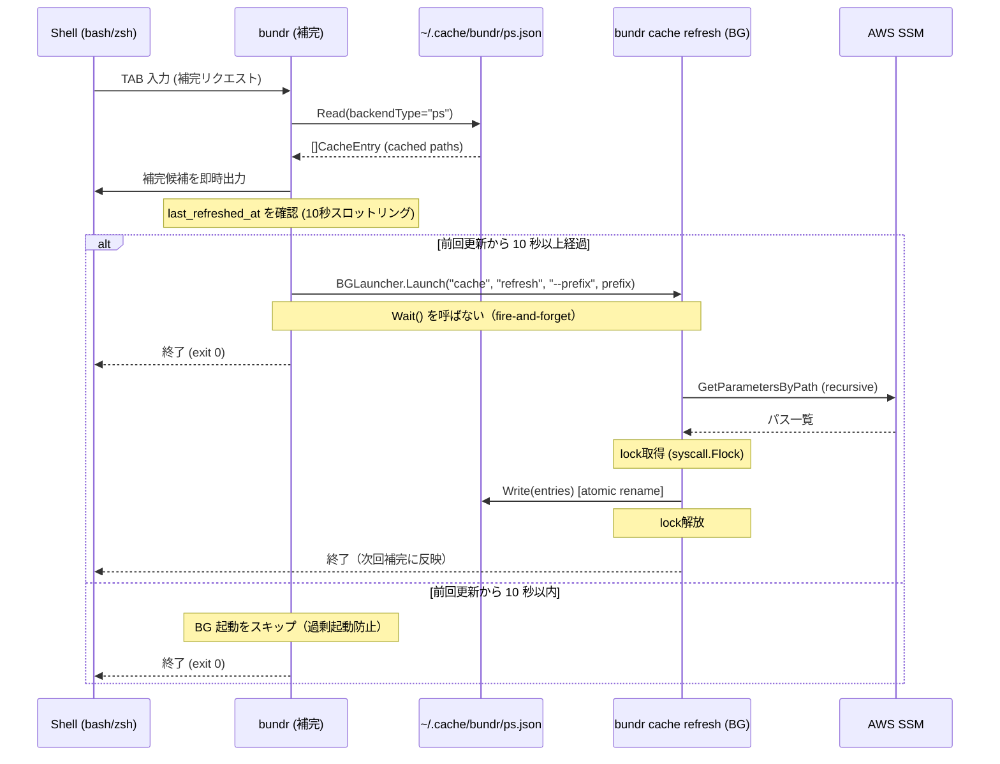
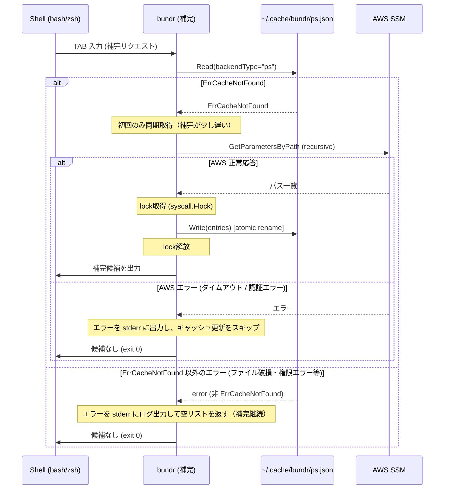
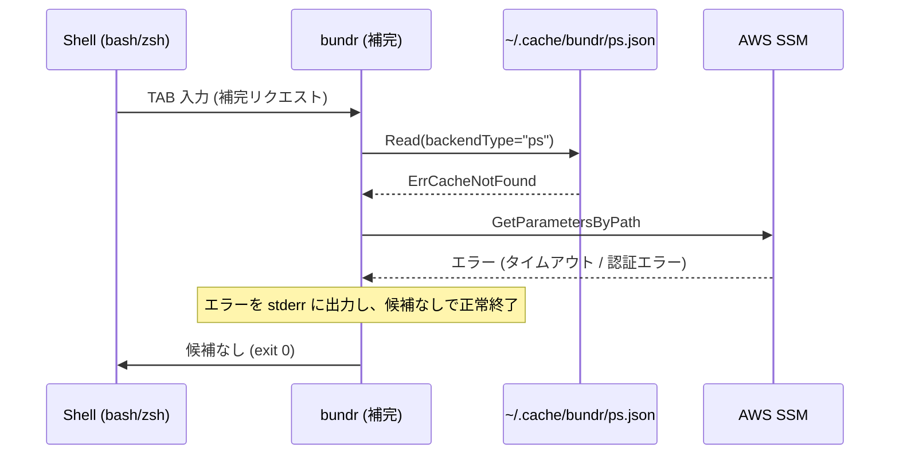

# M4: completion + cache システム

## 概要

`bundr` の補完（tab completion）を高速に動作させるための **キャッシュシステム** と、bash/zsh の **シェル補完スクリプト** を実装する。

補完の原則: **Completion must never block on API call** (スペック Section 11)

---

## 技術調査結果

### Kong v1.14.0 の補完 API

**調査結論**: Kong v1.14.0 には組み込みの補完機能が存在しない。

- `Predict`, `PredictFunc`, `CompleteArg` などのフィールドは Tag に含まれない（`tag.go` を確認済み）
- `--completion-bash`, `--completion-zsh` フラグも存在しない
- Kong の README/ソースにも補完関連記述なし

**採用戦略**: `kongplete` (v0.4.0, MIT) + `posener/complete` の組み合わせで実装する。

- `kongplete.Complete()` を `main()` で `kong.Parse()` の前に呼び出す
- 構造体タグに `predictor:"<name>"` を追加してカスタム Predictor を登録する
- `kongplete.InstallCompletions` コマンドでユーザーがシェル補完をインストール/アンインストールできる

代替案として `miekg/king`（ソースレベル変更不要、コード生成型）も存在するが、
動的補完（キャッシュからリアルタイムに候補を取得）には kongplete が適している。

### ファイルロック

- `syscall.Flock` は macOS + Linux 両対応だが、Windows 非対応（bundr は対象外）
- `github.com/gofrs/flock` (BSD-3-Clause, v0.13.0) はスレッドセーフで `TryLock` / `TryLockContext` を提供
- **採用**: 標準ライブラリ `syscall.Flock` を直接使用（依存を最小化）

### アトミックキャッシュ書き込み

- `os.CreateTemp` で同一ディレクトリに一時ファイル作成 → `os.Rename` でアトミック移動
- 外部ライブラリ（`renameio`, `atomicfile` 等）は不要（標準ライブラリで十分）

### 非同期バックグラウンド更新

- `exec.Command("bundr", "cache", "refresh", "--prefix", prefix).Start()` で起動
- `Wait()` を呼ばないことでデタッチ（fire-and-forget）
- プロセスの出力は `/dev/null` にリダイレクト

---

## スコープ

### 実装範囲

| 機能 | 詳細 |
|------|------|
| `internal/cache/` パッケージ | キャッシュ読み書き・ロック・アトミック更新 |
| `cmd/cache.go` | `bundr cache refresh` サブコマンド |
| `cmd/complete.go` | `bundr install-completions` サブコマンド |
| `cmd/root.go` 修正 | `Cache`, `InstallCompletions` フィールド追加、`CacheStore`・`BGLauncher` フィールド追加、kongplete 統合 |
| `main.go` 修正 | `kongplete.Complete()` 呼び出し追加、初期化シーケンス明記 |
| カスタム Predictor | `CachePredictor` — キャッシュから補完候補を返す |
| GetByPrefix の補完連携 | キャッシュの Always-Refresh-on-Read 実装 |
| bash/zsh 統合スクリプト | `install-completions` コマンドが生成・配置 |

### スコープ外

| 機能 | 理由 |
|------|------|
| sm: バックエンドの補完 | Secrets Manager は GetByPrefix 概念なし |
| Windows 対応 | bundr は macOS/Linux のみ対象 |
| ネットワーク障害時のリトライ | キャッシュ miss 時のエラーは警告のみ（補完候補なし）|
| JSON キー補完 | スペック "optional" のため M4 スコープ外 |
| 補完候補のスコア/ランキング | 単純なプレフィックスマッチで十分 |
| TTL ベースのキャッシュ失効 | 今回は Always-Refresh-on-Read（毎回更新）|

---

## アーキテクチャ設計

### ディレクトリ構造（追加・変更ファイル）

```
bundr/
├── main.go                          # 変更: kongplete.Complete() 追加、初期化シーケンス整理
├── cmd/
│   ├── root.go                      # 変更: Cache/InstallCompletions/CacheStore/BGLauncher フィールド追加
│   ├── cache.go                     # 新規: CacheCmd (cache refresh)
│   ├── cache_test.go                # 新規
│   ├── complete.go                  # 新規: CompleteCmd (install-completions)
│   └── complete_test.go             # 新規
└── internal/
    └── cache/
        ├── cache.go                 # 新規: Store interface + FileStore 実装
        ├── cache_test.go            # 新規
        ├── lock.go                  # 新規: ファイルロック (syscall.Flock)
        └── lock_test.go             # 新規
```

変更ファイル一覧:
- `go.mod` / `go.sum`: `github.com/willabides/kongplete`, `github.com/posener/complete` 追加
- `main.go`: `kongplete.Complete()` 呼び出し、CachePredictor 登録、初期化シーケンス整理
- `cmd/root.go`: `Cache CacheCmd` / `InstallCompletions kongplete.InstallCompletions` / `CacheStore cache.Store` / `BGLauncher BGLauncher` フィールド追加
- `cmd/get.go`: `Ref string` フィールドに `predictor:"ref"` タグ追加（フィールド名は変更しない）
- `cmd/put.go`: `Ref string` フィールドに `predictor:"ref"` タグ追加（フィールド名は変更しない）
- `cmd/export.go`: `From string` フィールドに `predictor:"prefix"` タグ追加（フィールド名は変更しない）
- `cmd/jsonize.go`: `Target string` フィールドに `predictor:"ref"` タグ追加（フィールド名は `Target` のまま変更しない）

既存ファイルへの影響なし:
- `internal/backend/` — 変更不要
- `internal/flatten/` — 変更不要
- `internal/jsonize/` — 変更不要

---

### キャッシュファイル構造（JSON スキーマ）

**保存場所**: `~/.cache/bundr/{backend_type}.json`

例: `~/.cache/bundr/ps.json`, `~/.cache/bundr/psa.json`

```json
{
  "schema_version": "v1",
  "backend_type": "ps",
  "updated_at": "2026-02-27T12:34:56Z",
  "last_refreshed_at": "2026-02-27T12:34:56Z",
  "entries": [
    {
      "path": "/app/prod/DB_HOST",
      "store_mode": "raw"
    },
    {
      "path": "/app/prod/DB_PORT",
      "store_mode": "raw"
    },
    {
      "path": "/app/prod/config",
      "store_mode": "json"
    }
  ]
}
```

**スキーマ設計上の制約**:
- `path` のみ保存（値は絶対に保存しない — スペック Section 12, 14）
- `store_mode` はメタデータとして保存可（秘密情報でない）
- `updated_at` はデバッグ用。TTL 判定には使用しない（Always-Refresh-on-Read）
- `last_refreshed_at` は BG 更新スロットリング用。前回更新から 10 秒以内ならば BG 起動をスキップする

**パッケージ内の Go 構造体**:

```go
package cache

// SchemaVersion はキャッシュファイルのスキーマバージョン。
const SchemaVersion = "v1"

// CacheFile はキャッシュファイル全体を表す。
type CacheFile struct {
    SchemaVersion   string       `json:"schema_version"`
    BackendType     string       `json:"backend_type"`
    UpdatedAt       time.Time    `json:"updated_at"`
    LastRefreshedAt time.Time    `json:"last_refreshed_at"`
    Entries         []CacheEntry `json:"entries"`
}

// CacheEntry はキャッシュ内の 1 エントリ（パスとメタデータ）。
type CacheEntry struct {
    Path      string `json:"path"`
    StoreMode string `json:"store_mode"`
}

// Store はキャッシュの読み書きインターフェース（テスト容易性のため）。
type Store interface {
    Read(backendType string) ([]CacheEntry, error)
    Write(backendType string, entries []CacheEntry) error
    // LastRefreshedAt は指定バックエンドの最終 BG 更新時刻を返す。
    // キャッシュが存在しない場合は zero time を返す。
    LastRefreshedAt(backendType string) time.Time
}

// FileStore は ~/.cache/bundr/ へのファイルベースの実装。
type FileStore struct {
    baseDir string // デフォルト: os.UserCacheDir() + "/bundr"
}
```

---

### `internal/cache/` パッケージ API

```go
// NewFileStore はデフォルトキャッシュディレクトリを使用する FileStore を返す。
func NewFileStore() (*FileStore, error)

// NewFileStoreWithDir はテスト用にカスタムディレクトリを指定できる。
func NewFileStoreWithDir(dir string) *FileStore

// Read は指定バックエンドのキャッシュエントリを読み込む。
// キャッシュが存在しない場合は (nil, ErrCacheNotFound) を返す。
// ErrCacheNotFound 以外のエラー（ファイル破損・権限エラー等）も error として返す。
func (s *FileStore) Read(backendType string) ([]CacheEntry, error)

// Write はエントリをキャッシュファイルにアトミックに書き込む。
// ファイルロックを取得してから書き込み、ロック解放する。
func (s *FileStore) Write(backendType string, entries []CacheEntry) error

// LastRefreshedAt は指定バックエンドのキャッシュから last_refreshed_at を返す。
// キャッシュが存在しない場合は zero time を返す（エラーは無視）。
func (s *FileStore) LastRefreshedAt(backendType string) time.Time

// ErrCacheNotFound はキャッシュが存在しない場合のエラー。
var ErrCacheNotFound = errors.New("cache not found")
```

---

### `internal/cache/lock.go`

```go
// withExclusiveLock はファイルへの排他ロックを取得して fn を実行する。
// ロック取得待ちタイムアウトは 5 秒。
func withExclusiveLock(path string, fn func() error) error

// withSharedLock はファイルへの共有ロックを取得して fn を実行する。
func withSharedLock(path string, fn func() error) error
```

実装方針: `syscall.Flock` を使用（macOS/Linux 共通）。ロックファイルは `{cache_file}.lock` とする。
Read はロックフリー（Read-only is lock-free）。Write のみ排他ロックを使用する。

---

### Always-Refresh-on-Read シーケンス図（Mermaid）

#### 正常系: キャッシュ hit（非同期更新）



#### 正常系: キャッシュ miss（同期取得）



#### エラー系: AWS 到達不能



---

## テスト設計書（TDD）

### `internal/cache/cache_test.go`

#### 正常系テスト

| ID | 入力 | 期待出力 |
|----|------|----------|
| cache-001 | Write("ps", entries) → Read("ps") | 書いたエントリが読める |
| cache-002 | Write("ps", entries) でのファイル内容 | JSON スキーマに準拠している |
| cache-003 | キャッシュ不在で Read("ps") | ErrCacheNotFound を返す |
| cache-004 | Write → ファイル確認 | `{backendType}.json` として保存される |
| cache-005 | Write でディレクトリが存在しない場合 | ディレクトリを自動作成して書き込む |
| cache-006 | entries が空のスライス | 空エントリで正常に書き込む |
| cache-007 | Write → LastRefreshedAt("ps") | last_refreshed_at が記録されている |

#### 異常系テスト

| ID | 入力 | 期待出力 |
|----|------|----------|
| cache-010 | 破損 JSON ファイルを Read | error を返す（panic しない）。ErrCacheNotFound とは区別される |
| cache-011 | 書き込み権限のないディレクトリで Write | error を返す（ロールバックなし） |
| cache-012 | スキーマバージョン不一致のキャッシュを Read | ErrCacheNotFound 相当のエラー |
| cache-013 | 破損ファイルを Read した場合 | stderr にログ出力し、空リストを返す（Predictor が補完継続できる） |

#### エッジケーステスト

| ID | 入力 | 期待出力 |
|----|------|----------|
| cache-020 | 並行 Write x 5 ゴルーチン | 最後の Write が確実に反映され、ファイル破損なし |
| cache-021 | 非常に長いパス（1024文字） | 正常に書き込み・読み込みできる |
| cache-022 | エントリ数 10000 件 | 正常に処理できる |

#### スロットリングテスト

| ID | 入力 | 期待出力 |
|----|------|----------|
| cache-030 | Write 後 5 秒以内に LastRefreshedAt | 10 秒未満であることが確認できる |
| cache-031 | 前回更新から 10 秒以内 → CachePredictor | BGLauncher.Launch が呼ばれない |
| cache-032 | 前回更新から 10 秒超過 → CachePredictor | BGLauncher.Launch が呼ばれる |

### `internal/cache/lock_test.go`

| ID | 入力 | 期待出力 |
|----|------|----------|
| lock-001 | withExclusiveLock — 正常ケース | fn が実行される |
| lock-002 | withExclusiveLock — fn がエラーを返す | エラーが伝播し、ロックは解放される |
| lock-003 | 排他ロック中に別ゴルーチンが TryLock | 待機してから取得できる |

### `cmd/cache_test.go`

| ID | 入力 | 期待出力 |
|----|------|----------|
| cmd-cache-001 | `cache refresh --prefix ps:/app/prod/` | MockBackend.GetByPrefix が呼ばれ、ctx.CacheStore.Write でキャッシュに書き込まれる |
| cmd-cache-002 | prefix が sm: | エラー: sm: は補完対象外 |
| cmd-cache-003 | AWS エラー時 | stderr にエラーを出力し、exit code != 0 |

### `cmd/complete_test.go`

| ID | 入力 | 期待出力 |
|----|------|----------|
| cmd-complete-001 | `install-completions` (bash) | bash 補完スクリプト設置の確認 |
| cmd-complete-002 | `install-completions` (zsh) | zsh 補完スクリプト設置の確認 |

### CachePredictor のテスト（main.go または別ファイル）

| ID | シナリオ | 期待出力 |
|----|----------|----------|
| pred-001 | キャッシュあり、prefix="ps:/app" | `/app/prod/DB_HOST` 等を含む候補リスト |
| pred-002 | キャッシュなし（初回）| AWS から取得し候補を返す |
| pred-003 | prefix="sm:" | 空リストを返す（sm: 未対応） |
| pred-004 | キャッシュあり、前回更新 10 秒超過 → BG 更新コマンドが起動されているか確認 | MockBGLauncher.Launch が呼ばれた記録あり |
| pred-005 | prefix="" (空文字) | ps:/psa: 両方のパスを返す |
| pred-006 | Cache.Read が ErrCacheNotFound 以外のエラーを返す | stderr にログ出力し、空リストを返す（補完継続） |
| pred-007 | キャッシュあり、前回更新 10 秒以内 | MockBGLauncher.Launch が呼ばれない（スロットリング） |

### モック設計

```go
// MockStore は Store インターフェースのテスト用実装。
type MockStore struct {
    ReadFunc            func(backendType string) ([]CacheEntry, error)
    WriteFunc           func(backendType string, entries []CacheEntry) error
    LastRefreshedAtFunc func(backendType string) time.Time
    ReadCalls           []string    // 呼ばれた backendType を記録
    WriteCalls          []WriteCall
}

// BGLauncher はバックグラウンド更新プロセスの起動を抽象化する。
// main.go では ExecBGLauncher を注入。テスト時は MockBGLauncher を差し替え。
type BGLauncher interface {
    Launch(args ...string) error
}

// ExecBGLauncher は exec.Command(os.Args[0], args...).Start() で実装。
type ExecBGLauncher struct{}

// MockBGLauncher はテスト用の BGLauncher 実装。
type MockBGLauncher struct {
    LaunchCalls [][]string // 呼ばれた引数を記録
}

// CachePredictor のテストでは、MockStore と MockBGLauncher を Context 経由で注入する。
// Context 構造体:
type Context struct {
    BackendFactory BackendFactory
    CacheStore     cache.Store   // テスト時は MockStore を差し替え
    BGLauncher     BGLauncher    // テスト時は MockBGLauncher を差し替え
}
```

---

## 実装手順（Step by Step）

### Step 1: 依存ライブラリの追加

**変更ファイル**: `go.mod`, `go.sum`

**作業内容**:
```bash
go get github.com/willabides/kongplete@v0.4.0
go get github.com/posener/complete/v2@latest
go mod tidy
```

**テスト方法**: `go build ./...` が通ること

**依存ステップ**: なし

---

### Step 2: `internal/cache/lock.go` 実装（TDD Red）

**変更ファイル**: `internal/cache/lock.go`, `internal/cache/lock_test.go`

**作業内容（Red フェーズ）**:

1. `lock_test.go` を先に作成（lock-001 〜 lock-003 のテストケース）
2. テストを実行して失敗を確認（コンパイルエラーで可）

**テスト方法**: `go test ./internal/cache/...` が失敗すること

**依存ステップ**: Step 1

---

### Step 3: `internal/cache/lock.go` 実装（TDD Green）

**変更ファイル**: `internal/cache/lock.go`

**作業内容（Green フェーズ）**:

```go
package cache

import (
    "os"
    "syscall"
    "time"
)

const lockTimeout = 5 * time.Second

func withExclusiveLock(lockPath string, fn func() error) error {
    f, err := os.OpenFile(lockPath, os.O_CREATE|os.O_RDWR, 0o600)
    if err != nil {
        return err
    }
    defer f.Close()

    deadline := time.Now().Add(lockTimeout)
    for {
        err = syscall.Flock(int(f.Fd()), syscall.LOCK_EX|syscall.LOCK_NB)
        if err == nil {
            break
        }
        if time.Now().After(deadline) {
            return fmt.Errorf("cache lock timeout: %w", err)
        }
        time.Sleep(10 * time.Millisecond)
    }
    defer syscall.Flock(int(f.Fd()), syscall.LOCK_UN) //nolint:errcheck

    return fn()
}
```

**テスト方法**: `go test ./internal/cache/...` が全テスト通ること

**依存ステップ**: Step 2

---

### Step 4: `internal/cache/cache.go` 実装（TDD Red）

**変更ファイル**: `internal/cache/cache.go`, `internal/cache/cache_test.go`

**作業内容（Red フェーズ）**:

1. `cache_test.go` を先に作成（cache-001 〜 cache-032 のテストケース）
2. `TestMain` でテスト用一時ディレクトリを作成・削除
3. `go test ./internal/cache/...` が失敗することを確認

**依存ステップ**: Step 3

---

### Step 5: `internal/cache/cache.go` 実装（TDD Green）

**変更ファイル**: `internal/cache/cache.go`

**作業内容（Green フェーズ）**:

```go
package cache

// Write はアトミック書き込みパターン:
// 1. 同一ディレクトリに os.CreateTemp でテンポラリファイル作成
// 2. JSON エンコードして書き込み（last_refreshed_at を time.Now() で記録）
// 3. os.Rename でアトミック移動
// 4. ロックファイルへ排他ロックを取得してから実行
func (s *FileStore) Write(backendType string, entries []CacheEntry) error {
    if err := os.MkdirAll(s.baseDir, 0o700); err != nil {
        return fmt.Errorf("create cache dir: %w", err)
    }
    target := filepath.Join(s.baseDir, backendType+".json")
    lockPath := target + ".lock"

    return withExclusiveLock(lockPath, func() error {
        tmp, err := os.CreateTemp(s.baseDir, ".tmp-"+backendType+"-")
        if err != nil {
            return err
        }
        tmpPath := tmp.Name()
        defer os.Remove(tmpPath) // 失敗時のクリーンアップ

        now := time.Now().UTC()
        cf := CacheFile{
            SchemaVersion:   SchemaVersion,
            BackendType:     backendType,
            UpdatedAt:       now,
            LastRefreshedAt: now,
            Entries:         entries,
        }
        if err := json.NewEncoder(tmp).Encode(cf); err != nil {
            tmp.Close()
            return err
        }
        if err := tmp.Close(); err != nil {
            return err
        }
        return os.Rename(tmpPath, target)
    })
}

// LastRefreshedAt は指定バックエンドのキャッシュから last_refreshed_at を返す。
// キャッシュが存在しない場合やエラーの場合は zero time を返す（エラーは無視）。
func (s *FileStore) LastRefreshedAt(backendType string) time.Time {
    entries, err := s.readFile(backendType)
    if err != nil {
        return time.Time{}
    }
    return entries.LastRefreshedAt
}
```

**テスト方法**: `go test -v ./internal/cache/...` が全テスト通ること

**依存ステップ**: Step 4

---

### Step 6: `cmd/cache.go` 実装（TDD Red → Green）

**変更ファイル**: `cmd/cache.go`, `cmd/cache_test.go`

**作業内容**:

```go
// CacheCmd は cache サブコマンドの Kong 構造体。
type CacheCmd struct {
    Refresh CacheRefreshCmd `cmd:"" help:"Refresh the local cache by fetching paths from AWS."`
}

// CacheRefreshCmd はキャッシュを更新するサブコマンド。
type CacheRefreshCmd struct {
    Prefix string `required:"" help:"SSM prefix to refresh (e.g. ps:/app/prod/)"`
}

func (c *CacheRefreshCmd) Run(appCtx *Context) error {
    // 1. ParseRef で prefix を検証
    // 2. BackendFactory でバックエンドを作成
    // 3. GetByPrefix(ctx, prefix, {Recursive: true}) を呼び出す
    // 4. entries を appCtx.CacheStore.Write に渡す（直接 FileStore を使わない）
}
```

**テスト設計**: MockBackend + MockStore（`appCtx.CacheStore` に注入）を使用

**テスト方法**: `go test -v ./cmd/...` が通ること

**依存ステップ**: Step 5

---

### Step 7: `cmd/complete.go` 実装（TDD Red → Green）

**変更ファイル**: `cmd/complete.go`, `cmd/complete_test.go`

**作業内容**:

```go
// root.go に追加するフィールド:
type CLI struct {
    Put                PutCmd                          `cmd:"" help:"..."`
    Get                GetCmd                          `cmd:"" help:"..."`
    Export             ExportCmd                       `cmd:"" help:"..."`
    Jsonize            JsonizeCmd                      `cmd:"" help:"..."`
    Cache              CacheCmd                        `cmd:"" help:"Manage local completion cache."`
    InstallCompletions kongplete.InstallCompletions    `cmd:"" help:"Install shell completions."`
}
```

**テスト方法**: `go build ./...` が通り、`bundr install-completions --help` が動作すること

**依存ステップ**: Step 6

---

### Step 8: `main.go` の修正 + CachePredictor 実装（TDD Red → Green）

**変更ファイル**: `main.go`

**初期化シーケンス（順序厳守）**:

1. `config.Load()` — 設定ファイル・環境変数を読み込む
2. `BackendFactory` 構築 — AWS 認証情報を含むファクトリを作成
3. `CacheStore` 構築 — `cache.NewFileStore()` で FileStore を初期化
4. `BGLauncher` 構築 — `ExecBGLauncher{}` を生成
5. `kongplete.Complete()` — 補完リクエストを処理（通常実行はスルー）
6. `kong.Parse()` — 通常コマンドを解析・実行

```go
func main() {
    // 1. 設定ロード
    cfg, err := config.Load()
    if err != nil {
        fmt.Fprintf(os.Stderr, "config error: %v\n", err)
        os.Exit(1)
    }

    // 2. BackendFactory 構築
    factory := backend.NewAWSFactory(cfg)

    // 3. CacheStore 構築
    cacheStore, err := cache.NewFileStore()
    if err != nil {
        fmt.Fprintf(os.Stderr, "cache init error: %v\n", err)
        os.Exit(1)
    }

    // 4. BGLauncher 構築
    bgLauncher := &cmd.ExecBGLauncher{}

    cli := cmd.CLI{}
    parser := kong.Must(&cli,
        kong.Name("bundr"),
        kong.Description("Unified AWS Parameter Store and Secrets Manager CLI"),
        kong.Bind(&cmd.Context{
            BackendFactory: factory,
            CacheStore:     cacheStore,
            BGLauncher:     bgLauncher,
        }),
    )

    // 5. kongplete で補完リクエストを処理（通常実行はスルー）
    kongplete.Complete(parser,
        kongplete.WithPredictor("ref", newRefPredictor(cacheStore, bgLauncher)),
        kongplete.WithPredictor("prefix", newPrefixPredictor(cacheStore, bgLauncher)),
    )

    // 6. 通常コマンドを解析・実行
    kctx := kong.Parse(&cli)
    // ... 以降は既存と同じ
}

// newRefPredictor は ps:/path... / psa:/path... / sm:name... の補完候補を返す。
// CacheStore と BGLauncher を受け取り、AWS 直接アクセスは行わない。
func newRefPredictor(store cache.Store, launcher cmd.BGLauncher) complete.Predictor {
    return complete.PredictFunc(func(prefix string) []string {
        return predictRef(prefix, store, launcher)
    })
}
```

**CachePredictor の実装方針**:

1. `prefix` 文字列からバックエンドタイプを判定（`ps:`, `psa:`, `sm:`）
2. `sm:` の場合は空リストを返す
3. `ctx.CacheStore.Read(backendType)` でキャッシュを読む（AWS 直接アクセスなし）
4. **ErrCacheNotFound**: 同期的に AWS から取得して候補を返す
5. **ErrCacheNotFound 以外のエラー**: stderr にログ出力し、空リストを返す（補完継続）
6. **キャッシュあり**: エントリをフィルタリングして候補を返す
7. **BG 更新スロットリング**: `ctx.CacheStore.LastRefreshedAt()` を確認し、10 秒以内ならスキップ
8. **BG 起動**: `ctx.BGLauncher.Launch("cache", "refresh", "--prefix", prefix)` を呼ぶ
9. **AWS エラー時**: 空リストを返してキャッシュ更新をスキップ

**テスト方法**: `go test -v ./...` 全テストが通ること

**依存ステップ**: Step 7

---

### Step 9: predictor タグの追加

**変更ファイル**: `cmd/get.go`, `cmd/put.go`, `cmd/export.go`, `cmd/jsonize.go`

**作業内容（フィールド名は既存のまま、タグのみ追加）**:

```go
// get.go — Ref フィールドに predictor タグを追加（フィールド名変更なし）
type GetCmd struct {
    Ref  string `arg:"" predictor:"ref" help:"Target ref (e.g. ps:/app/prod/DB_HOST, sm:secret-id)"`
    Raw  bool   `help:"Force raw output"`
    JSON bool   `name:"json" help:"Force JSON decode output"`
}

// put.go — Ref フィールドに predictor タグを追加（フィールド名変更なし）
type PutCmd struct {
    Ref   string `arg:"" predictor:"ref" help:"Target ref"`
    Value string `required:"" help:"Value to store"`
    Store string `default:"raw" help:"Storage mode (raw|json)"`
}

// export.go — From フィールドに predictor タグを追加（フィールド名変更なし）
type ExportCmd struct {
    From string `required:"" predictor:"prefix" help:"Source prefix (e.g. ps:/app/prod/)"`
    // ...
}

// jsonize.go — Target フィールドに predictor タグを追加（フィールド名は Target のまま変更しない）
type JsonizeCmd struct {
    Target   string `arg:"" predictor:"ref" help:"Target ref for output JSON"`
    FromPath string `required:"" predictor:"prefix" help:"Source prefix"`
    // ...
}
```

**テスト方法**: bash/zsh で `bundr get <TAB>` が候補を表示すること（手動確認）

**依存ステップ**: Step 8

---

### Step 10: カバレッジ確認 + リファクタリング

**作業内容**:
- `go test -coverprofile=coverage.out ./...` でカバレッジを計測
- `internal/cache/` パッケージ: 目標 85% 以上
- `cmd/` パッケージ: 目標 75% 以上
- 重複ロジックの抽出
- `go vet ./...`, `golangci-lint run` でリント確認

**依存ステップ**: Step 9

---

## リスク評価

| リスク | 重大度 | 発生可能性 | 対策 |
|--------|--------|-----------|------|
| kongplete の API が期待と異なる | 高 | 低（ソース確認済み） | 独自 `__complete` コマンド実装に切り替え |
| syscall.Flock がテスト環境で動作しない | 中 | 低（macOS/Linux 標準） | テスト用に Lock/Unlock をインターフェース化して差し替え |
| BG 更新プロセスの孤立（ゾンビプロセス） | 低 | 低（`Start()` のみで OK） | `cmd.SysProcAttr` で Setpgid を設定して孤立防ぐ |
| アトミック rename がクロスデバイスで失敗 | 中 | 低（同一 fs 内の temp file） | `os.CreateTemp` を `~/.cache/bundr/` 内に作成することで防止 |
| `sm:` に predictor を誤適用 | 中 | 中 | predictor 関数内でプレフィックスを確認して空リストを返す |
| キャッシュファイルが肥大化 | 低 | 低 | 1 バックエンドタイプあたり 1 ファイル。Write で全置換 |
| CI 環境での AWS 呼び出し（テスト） | 高 | 高 | MockBackend/MockStore を徹底使用。実 AWS 呼び出しなし |
| 4-6: キャッシュ書き込み失敗・破損時のロールバック | 中 | 低 | **ロールバック計画**: (1) `bundr cache clear` コマンドでキャッシュファイルを削除して再取得。(2) BG 更新失敗時は stderr にエラーをログ出力（補完には影響しない）。(3) キャッシュ破損（パース失敗）時は当該ファイルを自動削除して graceful degradation（次回補完で再取得）。テンポラリファイルの残留は `defer os.Remove(tmpPath)` で保証。 |

---

## 成功基準

- [ ] `go test ./...` 全テスト PASS
- [ ] `internal/cache/` カバレッジ 85% 以上
- [ ] `cmd/` カバレッジ 75% 以上
- [ ] `go vet ./...` 警告ゼロ
- [ ] `bundr install-completions` でシェル補完が有効化される
- [ ] 補完時に AWS API を同期ブロックしない（キャッシュあり時）
- [ ] キャッシュに値（secret）が保存されないことを確認（テストでアサート）
- [ ] 並行 Write でキャッシュファイルが破損しないことをテストで確認
- [ ] BG 更新スロットリング（10 秒）が機能することをテストで確認

---

## Codex Plan Review の5観点チェックリスト

### 観点1: 実装実現可能性

- [ ] 1-1. Kong v1.14.0 に補完 API が存在しないことを確認し、kongplete を採用する根拠が明確か
- [ ] 1-2. `kongplete.Complete()` を `kong.Parse()` の前に呼び出す実装順序が正しいか
- [ ] 1-3. `syscall.Flock` が macOS/Linux 両環境で動作するか（ビルドタグ不要か）
- [ ] 1-4. `os.CreateTemp` + `os.Rename` のアトミック書き込みが同一ファイルシステム内で確実に動作するか
- [ ] 1-5. `exec.Command(...).Start()` で `Wait()` を呼ばない場合のゾンビプロセス対策は十分か

### 観点2: TDDテスト設計

- [ ] 2-1. 全テストが MockBackend / MockStore を使い AWS を呼ばないか
- [ ] 2-2. 並行書き込みテスト (cache-020) が競合状態を確実に検出できるか（ゴルーチン数・回数は十分か）
- [ ] 2-3. キャッシュに値が含まれないことをアサートするテストケースがあるか
- [ ] 2-4. BG 更新プロセス起動の確認テスト (pred-004) で MockBGLauncher が適切に注入されているか
- [ ] 2-5. エラーケース（破損 JSON, 権限エラー, ErrCacheNotFound 以外の Read エラー）が全てカバーされているか
- [ ] 2-6. カバレッジ目標（cache: 85%, cmd: 75%）が達成可能なテストケース数か
- [ ] 2-7. スロットリングテスト (cache-030〜032) が pred-007 と整合しているか

### 観点3: アーキテクチャ整合性

- [ ] 3-1. `internal/cache/` が `internal/backend/` に依存しないか（循環参照なし）
- [ ] 3-2. `Store` interface の設計が `CacheRefreshCmd.Run()` および `CachePredictor` の両方で `ctx.CacheStore` 経由でテスト注入可能か
- [ ] 3-3. キャッシュスキーマ (JSON) が将来のスキーマバージョンアップに対応できる設計か
- [ ] 3-4. `BGLauncher` の抽象化が `main.go` の構造を複雑にしすぎないか
- [ ] 3-5. M5 (設定階層) でキャッシュディレクトリのカスタマイズが追加される場合、`FileStore.baseDir` の差し込みが容易か
- [ ] 3-6. 初期化シーケンス（config → BackendFactory → CacheStore → BGLauncher → Complete → Parse）の依存関係が正しいか

### 観点4: リスク評価と対策

- [ ] 4-1. sm: バックエンドへの誤った補完リクエストを predictor 内で防いでいるか
- [ ] 4-2. CI でのテスト実行時に実 AWS が呼ばれないことが保証されているか
- [ ] 4-3. ロックタイムアウト（5秒）はシェル補完の UX を損なわないか（十分に長いか / 短いか）
- [ ] 4-4. アトミック rename でテンポラリファイルが残るエッジケース（プロセス中断）への対処はあるか
- [ ] 4-5. キャッシュファイルのパーミッション（0o600）がセキュリティ要件を満たすか
- [ ] 4-6. `kongplete v0.4.0` が v1 未満（不安定版）である点に対し、代替案（独自 `__complete` コマンド）が検討されているか
- [ ] 4-7. キャッシュ破損時のロールバック（ファイル削除 → 再取得）が graceful degradation として機能するか

### 観点5: シーケンス図

- [ ] 5-1. キャッシュ hit 時の正常系フローが「補完候補を即時返却し、スロットリング確認後 BG 起動」という順序で正しく描かれているか
- [ ] 5-2. キャッシュ miss 時（初回）のフローが「同期 AWS 取得 → キャッシュ書き込み → 候補返却」の順で正しいか
- [ ] 5-3. AWS エラー時に「補完候補なし (exit 0)」で補完をブロックしないことが明示されているか
- [ ] 5-4. ファイルロックの適用タイミング（Write 時のみ、Read はロックフリー）が図から読み取れるか
- [ ] 5-5. 外部依存（AWS SSM, ローカルファイルシステム）が図に明示されているか
- [ ] 5-6. ErrCacheNotFound 以外のエラー（ファイル破損・権限エラー）のフォールバックが図に描かれているか

---

## 付録: 補完インストール手順（ユーザー向け）

### bash

```bash
bundr install-completions
# ~/.bash_completion.d/bundr が作成される
# ~/.bashrc に以下を追加:
# source ~/.bash_completion.d/bundr
```

### zsh

```bash
bundr install-completions
# ~/.zsh/completions/_bundr が作成される
# ~/.zshrc に以下を追加:
# fpath=(~/.zsh/completions $fpath)
# autoload -U compinit && compinit
```

---

*このドキュメントは M4 実装の詳細計画書です。実装開始前に Codex Plan Review の承認を得てください。*
