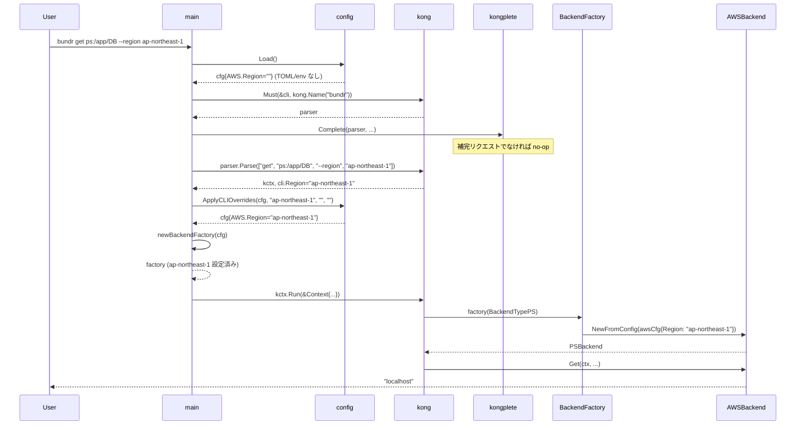
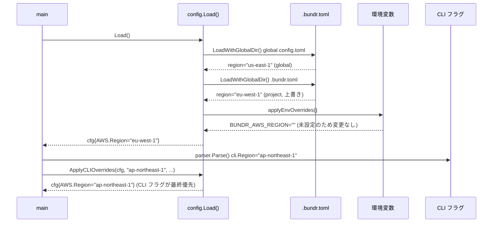
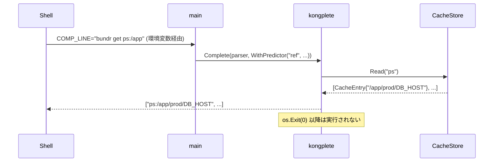
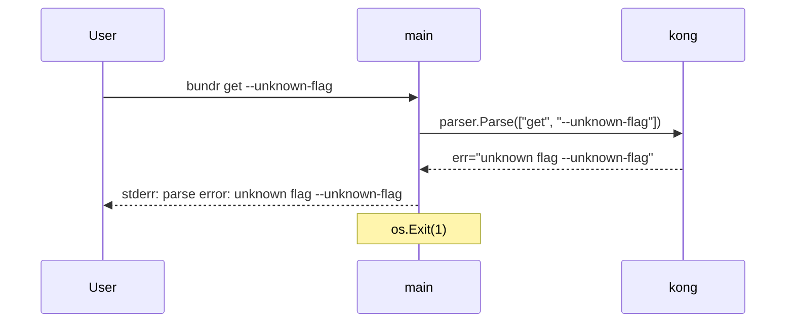

# M5: 設定階層 + CI/CD + goreleaser リリース

## 概要

M1〜M4 で実装したコア機能（put/get/export/jsonize/completion）に加え、本マイルストーンでは **プロダクション品質の完成度** を担保する以下 4 つの柱を実装する:

1. **設定階層の完全実装**: CLI flags > 環境変数 > .bundr.toml > ~/.config/bundr/config.toml の優先順位を CLI フラグレベルで確立
2. **GitHub Actions CI/CD**: test / lint / release の 3 ワークフロー
3. **goreleaser 設定**: 静的バイナリの多プラットフォーム配布
4. **ドキュメント整備**: README.md + docs/configuration.md

M1〜M4 でのアーキテクチャ決定（Kong / Viper / BackendFactory / CacheStore / BGLauncher）を尊重し、**既存テストを壊さない** ことを最優先とする。

---

## スコープ

### 実装範囲

| 機能 | 詳細 |
|------|------|
| CLI グローバルフラグ追加 | cmd/root.go の CLI struct に --region, --profile, --kms-key-id を追加 |
| 優先度マージ関数 | internal/config/config.go に ApplyCLIOverrides() 追加 |
| main.go の優先度統合 | config.Load() 後に CLI フラグで上書きするロジックを追加 |
| GitHub Actions test.yml | push to main + PR で go test ./... + coverage |
| GitHub Actions lint.yml | push to main + PR で golangci-lint run |
| GitHub Actions release.yml | tag push (v*) で goreleaser リリース / main push で snapshot |
| .goreleaser.yaml | 5 プラットフォーム、静的バイナリ、チェックサム |
| README.md | インストール手順 + クイックスタート + コマンドリファレンス |
| docs/configuration.md | 設定ファイル形式 + 環境変数リファレンス |

### スコープ外

| 機能 | 理由 |
|------|------|
| --tags グローバルフラグ | スペックでは put コマンドのみ対象 |
| Windows 対応 | bundr は macOS/Linux のみ対象（goreleaser には含める） |
| Homebrew Tap | M6 以降でスコープ判断 |
| Docker イメージ | 単一バイナリで十分、コンテナ化は別議論 |
| 既存コマンドのシグネチャ変更 | 後方互換性を守る |
| KMSKeyID のバックエンドへの伝播 | M1 でバックエンドのインターフェースは確立済み。KMSKeyID を Backend に渡す拡張は別 PR |

---

## ファイル変更リスト

### 新規作成

新規作成ファイル:
- .github/workflows/test.yml      — go test + coverage
- .github/workflows/lint.yml      — golangci-lint
- .github/workflows/release.yml   — goreleaser (tag + main snapshot)
- .goreleaser.yaml                 — goreleaser 設定
- README.md                        — インストール + クイックスタート + リファレンス
- docs/configuration.md            — 設定ファイル + 環境変数リファレンス

### 変更ファイル

変更対象ファイル:
- cmd/root.go                      — CLI struct に --region / --profile / --kms-key-id 追加
- internal/config/config.go        — ApplyCLIOverrides() 関数追加
- main.go                          — config.Load() 後に ApplyCLIOverrides() 呼び出し

### テストファイル（新規・変更）

- internal/config/config_test.go   — ApplyCLIOverrides() テスト追加（既存に追記）
- cmd/root_test.go                 — グローバルフラグの統合テスト（新規）

---

## テスト設計書

### 1. ApplyCLIOverrides のテスト（TDD Red → Green → Refactor）

#### 正常系

| テスト ID | 入力 | 期待出力 | 説明 |
|-----------|------|----------|------|
| cfg-001 | region=ap-northeast-1, cfg.AWS.Region= | cfg.AWS.Region=ap-northeast-1 | 空のベース設定に CLI フラグを適用 |
| cfg-002 | region=ap-northeast-1, cfg.AWS.Region=us-east-1 | cfg.AWS.Region=ap-northeast-1 | CLI フラグがファイル設定を上書き |
| cfg-003 | region=, cfg.AWS.Region=us-east-1 | cfg.AWS.Region=us-east-1 | CLI フラグが空の場合はベース設定を保持 |
| cfg-004 | profile=my-profile, cfg.AWS.Profile= | cfg.AWS.Profile=my-profile | profile の上書き |
| cfg-005 | kmsKeyID=arn:aws:kms:..., cfg.AWS.KMSKeyID= | cfg.AWS.KMSKeyID=arn:aws:kms:... | KMSKeyID の上書き |
| cfg-006 | region=ap-northeast-1, profile=prod, kmsKeyID=key-1 | 全フィールドが上書き | 全フラグ同時指定 |

#### 境界値テスト

| テスト ID | 入力 | 期待出力 | 説明 |
|-----------|------|----------|------|
| cfg-007 | 全フラグが空文字 | cfg は変更なし | CLI フラグ未指定の場合は何も変えない |
| cfg-008 | region=ap-northeast-1 のみ、他は空 | profile/kmsKeyID は保持 | 部分指定時の動作確認 |

#### 異常系

ApplyCLIOverrides はエラーを返さない設計（空文字チェックのみ）。異常系なし。

---

### 2. CLI フラグ統合テスト（cmd/root_test.go）

Kong の CLI struct を直接インスタンス化し、フラグが Context.Config に正しく伝播するか検証する。

| テスト ID | シナリオ | 期待動作 |
|-----------|----------|----------|
| cli-001 | --region フラグを指定 | BackendFactory に region が渡される |
| cli-002 | BUNDR_AWS_REGION 環境変数 + --region フラグ両方指定 | CLI フラグが環境変数より優先される |
| cli-003 | .bundr.toml に region 設定 + --region フラグ指定 | CLI フラグが TOML 設定より優先される |
| cli-004 | フラグ未指定 + TOML に region 設定 | TOML の値が使われる（既存動作を壊さない） |
| cli-005 | フラグ未指定 + 環境変数 BUNDR_AWS_REGION 設定 | 環境変数の値が使われる（既存動作を壊さない） |

テスト戦略: BackendFactory を Mock に差し替えて AWS API 呼び出しなしで検証。

---

### 3. エッジケース

| テスト ID | シナリオ | 期待動作 |
|-----------|----------|----------|
| edge-001 | --region に空文字列 | TOML / 環境変数の値を保持（上書きしない） |
| edge-002 | --kms-key-id に長い ARN 文字列 | 文字列がそのまま設定に反映される |

---

## 実装手順

依存関係に従い Step 1 から Step 6 の順で実装する。Step 4〜6 は Step 3 と並列実行可能。

---

### Step 1: ApplyCLIOverrides 関数の追加（TDD）

**対象ファイル**: internal/config/config.go

**Red フェーズ**: internal/config/config_test.go に cfg-001〜cfg-008 のテストを追加。
**Green フェーズ**: ApplyCLIOverrides を実装。
**Refactor フェーズ**: applyEnvOverrides との一貫性を確認し整理。

実装イメージ:

実装のポイント:
- applyEnvOverrides と同じシグネチャパターンに統一する
- エラーは返さない（バリデーションは Kong が担当）
- 引数は位置引数（シンプルさ優先）

---

### Step 2: CLI struct へのグローバルフラグ追加

**対象ファイル**: cmd/root.go

**採用方式**: 直接フィールド追加方式（現状 3 フラグのためシンプルさ優先）

help:"AWS region (overrides config and env)" env:"BUNDR_AWS_REGION" optional:"" name:"region"help:"AWS profile (overrides config and env)" env:"BUNDR_AWS_PROFILE" optional:"" name:"profile"help:"KMS key ID or ARN for encryption" env:"BUNDR_AWS_KMS_KEY_ID" optional:"" name:"kms-key-id"cmd:"" help:"Store a value."cmd:"" help:"Get a value from a backend."cmd:"" help:"Export parameters as environment variables."cmd:"" help:"Build a nested JSON from parameter prefix."cmd:"" help:"Manage local completion cache."cmd:"install-completions" help:"Install shell completions."

**環境変数の二重適用について**:
config.Load() は内部で applyEnvOverrides() が環境変数を読む。Kong の env: タグも同じ環境変数を読む。
最終的に ApplyCLIOverrides(cfg, cli.Region, ...) で CLI フラグ値（Kong が解決した値）で上書きするため整合性に問題なし。
Kong の env: タグを付けることで bundr --help に環境変数名が表示される副次効果がある（ドキュメント性向上）。

---

### Step 3: main.go 初期化シーケンス変更

**対象ファイル**: main.go

変更後の初期化シーケンス:

1. config.Load()                          # TOML + 環境変数で cfg を構築
2. cli := cmd.CLI{} / kong.Must(...)      # kong.Bind() は削除
3. cache.NewFileStore() or NewNoopStore()  # 補完用に先行初期化
4. ExecBGLauncher 構築
5. kongplete.Complete(parser, ...)        # 補完リクエストならここで os.Exit
6. parser.Parse(os.Args[1:])              # cli.Region 等が確定
7. config.ApplyCLIOverrides(cfg, cli.Region, cli.Profile, cli.KMSKeyID)
8. newBackendFactory(cfg)                 # 最終的な cfg で factory を構築
9. kctx.Run(&Context{...})

**kong.Bind() の削除理由**:
現在の main.go では kong.Must() の kong.Bind() に Context を渡し、さらに kctx.Run() にも Context を渡している（二重バインド）。
ApplyCLIOverrides を Parse 後に実行するには kctx.Run() 時に最終 Context を渡す必要がある。
kctx.Run() の引数が優先されるため、kong.Bind() を削除しても動作は変わらない（M4 までのテストが証明する）。

---

### Step 4: GitHub Actions ワークフロー作成

詳細な YAML 設定は以下の通り。

#### .github/workflows/test.yml

name: Test
on:
  push:
    branches: [main]
  pull_request:
jobs:
  test:
    runs-on: ubuntu-latest
    steps:
      - uses: actions/checkout@v4
      - uses: actions/setup-go@v5
        with:
          go-version-file: go.mod
          cache: true
      - name: Run tests with race detector
        run: go test -v -race -coverprofile=coverage.out ./...
      - name: Upload coverage artifact
        uses: actions/upload-artifact@v4
        with:
          name: coverage
          path: coverage.out

#### .github/workflows/lint.yml
name: Lint
on:
  push:
    branches: [main]
  pull_request:
jobs:
  lint:
    runs-on: ubuntu-latest
    steps:
      - uses: actions/checkout@v4
      - uses: actions/setup-go@v5
        with:
          go-version-file: go.mod
          cache: true
      - name: golangci-lint
        uses: golangci/golangci-lint-action@v6
        with:
          version: latest

---

#### .github/workflows/release.yml
name: Release
on:
  push:
    tags:
      - "v*"  # v で始まるタグ全て
    branches:
      - main
jobs:
  goreleaser:
    needs: [test, lint]
    runs-on: ubuntu-latest
    permissions:
      contents: write
    steps:
      - uses: actions/checkout@v4
        with:
          fetch-depth: 0
      - uses: actions/setup-go@v5
        with:
          go-version-file: go.mod
          cache: true
      - name: Run goreleaser (正式リリース)
        if: startsWith(github.ref, "refs/tags/")
        uses: goreleaser/goreleaser-action@v6
        with:
          version: latest
          args: release --clean
        env:
          GITHUB_TOKEN: ${{ secrets.GITHUB_TOKEN }}
      - name: Run goreleaser (snapshot: main)
        if: github.ref == "refs/heads/main"
        uses: goreleaser/goreleaser-action@v6
        with:
          version: latest
          args: release --snapshot --clean
        env:
          GITHUB_TOKEN: ${{ secrets.GITHUB_TOKEN }}

### Step 5: goreleaser 設定

**ファイル**: .goreleaser.yaml

設定概要:
- version: 2
- CGO_ENABLED=0 で静的バイナリ
- -trimpath フラグ
- ldflags: -s -w でバイナリサイズ削減
- ターゲット: linux/amd64, linux/arm64, darwin/amd64, darwin/arm64, windows/amd64
- windows/arm64 は ignore で除外
- archives: linux/darwin は .tar.gz, windows は .zip
- checksums: SHA256 (checksums.txt)
- snapshot.version_template: {{incpatch .Version}}-next
- release.prerelease: auto

.goreleaser.yaml の主要設定:

builds:
  - id: bundr
    binary: bundr
    env:
      - CGO_ENABLED=0
    flags:
      - -trimpath
    ldflags:
      - -s -w
    goos: [linux, darwin, windows]
    goarch: [amd64, arm64]
    ignore:
      - goos: windows
        goarch: arm64

archives:
  - format_overrides:
      - goos: windows
        format: zip

checksum:
  algorithm: sha256

snapshot:
  version_template: "{{incpatch .Version}}-next"

release:
  prerelease: auto

**設計判断**:
- prerelease: auto — v1.0.0-rc.1 のようなタグは自動的に pre-release になる
- snapshot ビルドは goreleaser が自動で pre-release フラグを付ける
- windows/arm64 は ignore で除外（需要低、クロスコンパイル複雑性を回避）
- ldflags: -s -w でバイナリサイズを削減（デバッグシンボル除去）

---

### Step 6: ドキュメント整備

**README.md の主要セクション**:

# bundr

AWS Parameter Store (Standard/Advanced) と Secrets Manager を統合する単一バイナリ Go CLI。

## インストール

GitHub Releases からダウンロード:
  macOS (Apple Silicon): bundr_VERSION_darwin_arm64.tar.gz
  macOS (Intel): bundr_VERSION_darwin_amd64.tar.gz
  Linux (amd64): bundr_VERSION_linux_amd64.tar.gz

ソースからビルド:
  go install github.com/youyo/bundr@latest

## クイックスタート

  bundr put ps:/myapp/prod/DB_HOST --value localhost --store raw
  bundr get ps:/myapp/prod/DB_HOST
  bundr export --from ps:/myapp/prod/ --format shell
  bundr jsonize ps:/myapp/prod/config --frompath ps:/myapp/prod/
  bundr install-completions --shell zsh

## グローバルフラグ

  --region      AWS リージョン（最高優先）
  --profile     AWS プロファイル名（最高優先）
  --kms-key-id  KMS キー ID または ARN（最高優先）

**docs/configuration.md の主要セクション**:

## 設定の優先順位（高 → 低）

1. CLI フラグ (--region, --profile, --kms-key-id)
2. 環境変数 (BUNDR_AWS_REGION, BUNDR_AWS_PROFILE, BUNDR_AWS_KMS_KEY_ID)
3. プロジェクト設定 (.bundr.toml)
4. グローバル設定 (~/.config/bundr/config.toml)

## 設定ファイル形式（TOML）

  [aws]
  region = "ap-northeast-1"
  profile = "my-aws-profile"
  kms_key_id = "arn:aws:kms:ap-northeast-1:123456789012:key/..."

## 環境変数

  BUNDR_AWS_REGION      AWS リージョン
  BUNDR_AWS_PROFILE     AWS プロファイル名
  BUNDR_AWS_KMS_KEY_ID  KMS キー ID または ARN

---

## アーキテクチャ検討

### 設定階層の実装方式比較

| 評価軸 | 方式 A: Kong BeforeApply | 方式 B: Parse 後 ApplyCLIOverrides (採用) | 方式 C: main.go インライン |
|--------|--------------------------|------------------------------------------|---------------------------|
| 開発速度 | 低 (API 学習コスト) | 高 (既存パターン踏襲) | 中 |
| 保守性 | 中 | 高 (config パッケージに集約) | 低 (main.go が肥大化) |
| テスタビリティ | 低 | 高 (config_test.go で単独テスト可) | 低 |
| 整合性 | 低 | 高 (applyEnvOverrides と同パターン) | 中 |
| 実装リスク | 低 | 高 (シンプル、副作用なし) | 中 |

**採用: 方式 B** — テスタビリティと既存パターン（applyEnvOverrides）との一貫性を優先する。

### goreleaser snapshot / release 統合方式比較

| 評価軸 | 方式 A: 1 ファイルで条件分岐 (採用) | 方式 B: tag.yml / snapshot.yml 分離 |
|--------|-------------------------------------|------------------------------------|----
| ファイル数 | 少ない (1 ファイル) | 多い (2 ファイル) |
| 可読性 | 中 (if 条件分岐あり) | 高 (各ファイルがシンプル) |
| メンテナンス | 高 | 中 |

**採用: 方式 A** — ワークフローファイル数を最小化してレビューしやすくする。

---

## リスク評価

| リスク | 確率 | 影響 | 対策 |
|--------|------|------|------|
| parser.Parse() の移動で既存テストが壊れる | 中 | 大 | main_test.go を確認し、Parse 順序変更の影響を事前調査する。kong.Bind() 削除の影響を確認する |
| Kong グローバルフラグが補完と干渉する | 低 | 中 | kongplete.Complete() は kong.Must() 後・Parse() 前に呼ぶ順序を維持すれば問題なし |
| goreleaser snapshot の GitHub Release 公開失敗 | 低 | 低 | permissions: contents: write を明示。ローカルで goreleaser check を実行して事前検証 |
| golangci-lint バージョン不一致 | 中 | 低 | lint.yml で version: latest を使い、ローカルも同バージョンで実行して確認 |
| kong.Bind() 削除で補完コンテキストが壊れる | 低 | 中 | kongplete.Complete() は Bind に依存しない。kctx.Run() 引数でのみ Context を渡す設計が正しい |
| リリースロールバック | 中 | 中 | 失敗タグを削除し前バージョンを再発行: `git tag -d vX.Y.Z && git push origin :vX.Y.Z` → 前タグを再プッシュ |
| GITHUB_TOKEN 権限過多 | 低 | 高 | `permissions: contents: write` のみ付与し、GITHUB_TOKEN のデフォルト権限を最小化する |

---

## シーケンス図 (Mermaid)

### 正常系: --region フラグ付きコマンド実行

### 正常系: 設定優先順位の解決フロー

### 正常系: 補完リクエスト処理

### エラーケース: CLI フラグ解析エラー

---

## チェックリスト（5 観点 27 項目）

### 1. 機能正確性（7 項目）

- [ ] --region フラグが BackendFactory の AWS SDK 設定に反映される
- [ ] --profile フラグが BackendFactory の AWS SDK 設定に反映される
- [ ] --kms-key-id フラグが cfg.AWS.KMSKeyID に反映される
- [ ] CLI フラグが TOML 設定より優先される（cfg-002 テスト）
- [ ] CLI フラグが環境変数より優先される（cli-002 テスト）
- [ ] CLI フラグが空文字の場合は既存設定を保持する（cfg-003, cfg-007 テスト）
- [ ] 環境変数のみ設定してフラグ未指定の場合は環境変数の値が使われる（cli-005 テスト）

### 2. テスト（5 項目）

- [ ] internal/config/config_test.go に cfg-001〜cfg-008 のテストが追加されている
- [ ] cmd/root_test.go に cli-001〜cli-005 の統合テストが追加されている
- [ ] 全テストが go test ./... でパスする（既存テストを壊していない）
- [ ] カバレッジが前マイルストーン水準（cmd 86.9% / cache 87.3%）を下回らない
- [ ] AWS API を呼ぶテストが存在しない（MockBackend / 環境変数で制御）

### 3. CI/CD（6 項目）

- [ ] .github/workflows/test.yml が push to main / PR でトリガーされる
- [ ] .github/workflows/lint.yml が push to main / PR でトリガーされる
- [ ] .github/workflows/release.yml が tag push (v*) で goreleaser 正式リリースを実行する
- [ ] .github/workflows/release.yml が main push で goreleaser snapshot を実行する
- [ ] goreleaser snapshot は GitHub Release に pre-release として公開される
- [ ] permissions: contents: write が release.yml に設定されている

### 4. goreleaser / ビルド（5 項目）

- [ ] .goreleaser.yaml が linux/amd64, linux/arm64, darwin/amd64, darwin/arm64, windows/amd64 の 5 ターゲットをビルドする
- [ ] CGO_ENABLED=0 が設定されており、静的バイナリが生成される
- [ ] -trimpath フラグが設定されている
- [ ] checksums.txt（SHA256）が生成される
- [ ] goreleaser check でエラーが出ない（ローカル検証）

### 5. ドキュメント（4 項目）

- [ ] README.md にインストール手順（ダウンロード URL + go install）が含まれている
- [ ] README.md に全コマンドのクイックスタート例が含まれている
- [ ] docs/configuration.md に設定優先順位（CLI flags > env > TOML）が明記されている
- [ ] docs/configuration.md に全環境変数が一覧化されている

---

## 優先度と実装順序

Step 1: ApplyCLIOverrides テスト + 実装          (TDD: Red -> Green -> Refactor)
    |
    v
Step 2: CLI struct グローバルフラグ追加           (cmd/root.go 変更)
    |
    v
Step 3: main.go 初期化シーケンス変更             (Step 1, 2 に依存)
    |
    v (Step 4〜6 は並列実行可能)
Step 4: GitHub Actions ワークフロー作成
Step 5: goreleaser 設定
Step 6: ドキュメント整備

Step 4〜6 はコードロジックに依存しないため、Step 3 完了後に並列で進めることができる。

---

## 技術的検証項目

### PoC が必要な項目

1. **parser.Parse() の移動と kong.Bind() 削除**: kong.Bind() を削除して kctx.Run() にのみ Context を渡す変更が既存 main_test.go のテストに影響しないか確認する。Kong の内部では kctx.Run() 引数が kong.Bind() より優先されるため問題ない想定だが、実際にテストを実行して確認する。

2. **Kong グローバルフラグと --help 出力**: 3 つのグローバルフラグを CLI struct に追加したとき、bundr --help の出力が意図した形式（サブコマンドの前にフラグが表示される）になるか確認する。

### パフォーマンス検証

不要。設定ロードは起動時 1 回のみで、ApplyCLIOverrides は O(1) 操作。

### セキュリティ検証

- --kms-key-id は ARN 文字列。バリデーション（ARN 形式チェック）はバックエンド側（AWS SDK）が行うため、CLI 層では値をそのまま渡す。
- CI/CD で GITHUB_TOKEN の最小権限（contents: write のみ）を使用する。
- goreleaser のアーカイブにシークレット値が含まれないことを確認する（bundr はキャッシュに値を保存しない設計のため問題なし）。
