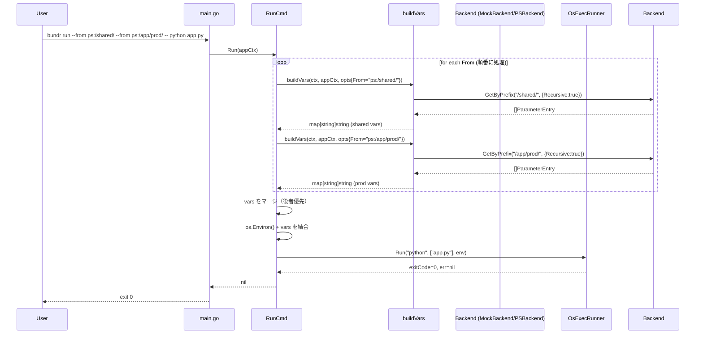
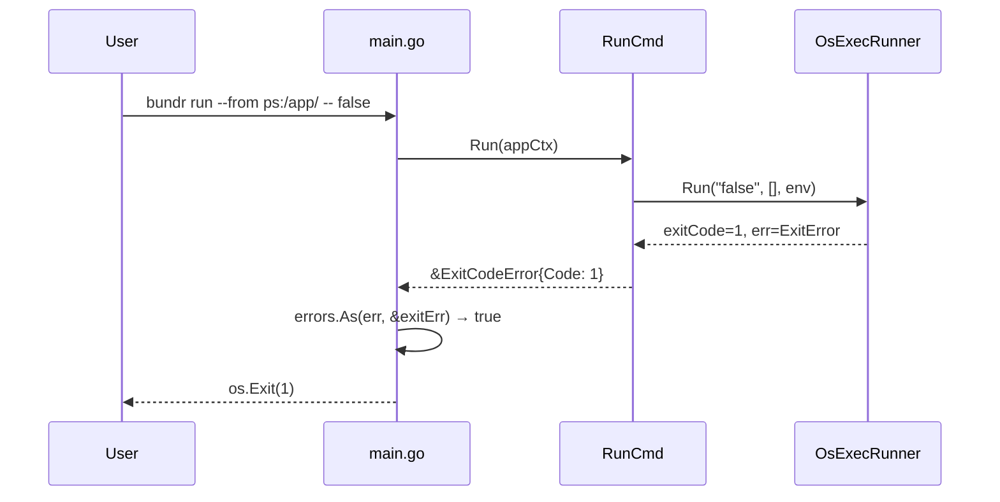
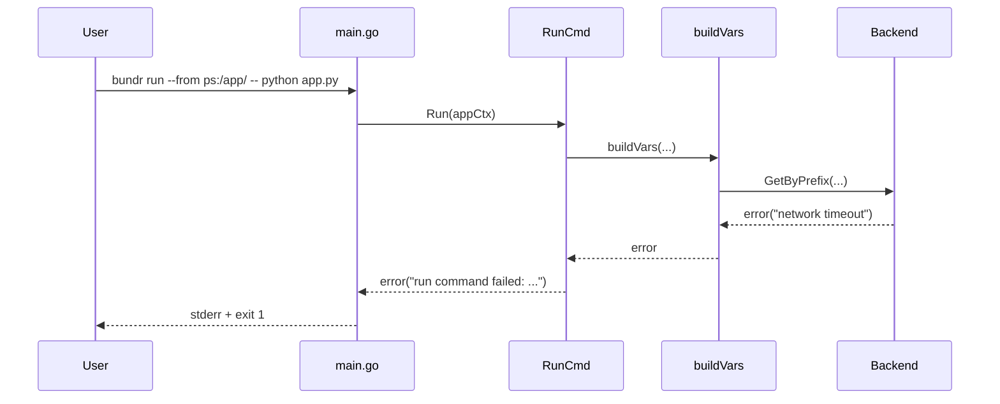

# M6: `bundr run` + `bundr ls` — AWS パラメータ活用コマンド群

## 1. 概要とスコープ

### 目的

`bundr run` は AWS Parameter Store から取得した値を環境変数として注入し、指定した子プロセスを起動するコマンドである。`bundr export` の「ファイル/シェル出力」を「プロセス環境変数への注入+起動」に変えたものと捉えられる。

```bash
# 単一プレフィックス
bundr run --from ps:/app/prod/ -- python app.py

# 複数プレフィックス（後者が優先）
bundr run --from ps:/shared/ --from ps:/app/prod/ -- python app.py

# strip-prefix で prefix 部分を除去
bundr run --from ps:/app/prod/ --strip-prefix -- env
# ps:/app/prod/db_host → DB_HOST（デフォルトだと APP_PROD_DB_HOST）
```

### スコープ（M6 全体）

| コマンド/変更 | 概要 |
|-------------|------|
| `bundr export` 修正 | `--from` フラグを位置引数 `From` に変更（`get`/`put` との統一） |
| `bundr ls` 新規 | 位置引数で prefix 配下のキーパスを再帰的に一覧表示 |
| `bundr run` 新規 | 位置引数（複数可）で env 注入して子プロセス実行 |

#### 統一後の引数スタイル

```bash
# 全コマンドが位置引数で一貫
bundr get  ps:/app/db_host
bundr put  ps:/app/db_host --value postgres
bundr export ps:/app/prod/ --format shell
bundr ls   ps:/app/prod/
bundr run  ps:/app/prod/ -- python app.py
bundr run  ps:/shared/ ps:/app/prod/ -- python app.py  # 複数 prefix

# completion: eval $(...) 形式で使える
eval "$(bundr completion zsh)"
eval "$(bundr completion bash)"
```

#### 変更対象ファイル

| ファイル | 変更内容 |
|---------|---------|
| `cmd/export.go` | `From string` を `arg:""` に変更（`required:""` + `predictor:"prefix"` 維持） |
| `cmd/export_test.go` | テストの `--from` 指定を位置引数に修正 + buildVars() テスト追記 |
| `cmd/ls.go` | 新規作成（LsCmd struct + Run()） |
| `cmd/ls_test.go` | 新規作成（TDD: MockBackend 使用） |
| `cmd/run.go` | 新規作成（RunCmd struct + Run()） |
| `cmd/run_test.go` | 新規作成（TDD: MockBackend / MockRunner） |
| `cmd/completion.go` | 新規作成（CompletionCmd: `bundr completion <shell>` → stdout 出力） |
| `cmd/completion_test.go` | 新規作成 |
| `cmd/root.go` | CLI struct: `Ls LsCmd` + `Run RunCmd` + `Completion CompletionCmd` 追加。`InstallCompletions` フィールド削除 |
| `main.go` | ExitCodeError ハンドリング追加 |

#### `completion` コマンド設計

```go
type CompletionCmd struct {
    Shell string `arg:"" enum:"bash,zsh,fish" help:"Shell type (bash|zsh|fish)"`
    out   io.Writer // for testing
}

// bundr completion zsh → stdout に zsh 補完スクリプトを出力
// ~/.zshrc に: eval "$(bundr completion zsh)"
```

スクリプト内容は `kongplete` の `shellInstall` マップと同等（`complete -C <bin> bundr` ベース）。
`InstallCompletions` は削除し `completion` コマンドに一本化。

### スコープ外

| 機能 | 理由 |
|------|------|
| sm: バックエンドのサポート | export と同様。複数キー取得の概念なし |
| 環境変数の削除・マスク機能 | 仕様外 |
| `--dry-run` フラグ | 将来の M7+ 検討 |
| `--timeout` フラグ | 子プロセス制御は scope 外 |
| 並列フェッチ（複数 --from を並行取得） | 初版はシリアル。後続 PR で対応可 |

---

## 2. TDD テスト設計書

### 2.1 テスト前提・依存関係

```
MockBackend    : internal/backend/mock.go（既存）
MockRunner     : cmd/run_test.go 内で定義（新規）
  - Run(cmd string, args []string, env []string) (exitCode int, err error)
  - interface で抽象化し、RunCmd に注入できる設計
```

`os/exec` を直接呼ぶとテストに実 OS 環境が必要になるため、`SubprocessRunner` インターフェースを RunCmd に持たせ、テスト時は `MockRunner` を差し込む。

### 2.2 正常系テスト

#### R-01: 単一 prefix + 正常実行 (exit code 0)

```
前提:
  MockBackend: ps:/app/prod/DB_HOST = "localhost" (raw)
               ps:/app/prod/DB_PORT = "5432"      (raw)
入力:
  RunCmd{
    From:        []string{"ps:/app/prod/"},
    StripPrefix: false,
    Upper:       true,
    FlattenDelim: "_",
    Args:        []string{"env"},
  }
期待:
  MockRunner.Run が呼ばれた env に以下が含まれる:
    "DB_HOST=localhost"
    "DB_PORT=5432"
  exit code: 0
```

#### R-02: 複数 prefix で後者が優先

```
前提:
  MockBackend: ps:/shared/DB_HOST    = "shared-host"  (raw)
               ps:/app/prod/DB_HOST  = "prod-host"    (raw)
               ps:/app/prod/DB_PORT  = "5432"          (raw)
入力:
  From: ["ps:/shared/", "ps:/app/prod/"]  ← prod が後で指定
期待:
  env["DB_HOST"] = "prod-host"  （shared が上書きされる）
  env["DB_PORT"] = "5432"
  exit code: 0
```

#### R-03: --strip-prefix で prefix 部分が除去される

```
前提:
  MockBackend: ps:/app/prod/db_host = "localhost" (raw)
               ps:/app/prod/db_port = "5432"      (raw)
入力:
  From:        ["ps:/app/prod/"]
  StripPrefix: true
  Upper:       true
期待:
  env["DB_HOST"] = "localhost"   （"APP_PROD_DB_HOST" ではない）
  env["DB_PORT"] = "5432"
```

#### R-04: 子プロセスが exit code 1 を返す

```
前提:
  MockRunner が exitCode=1 を返すように設定
入力:
  任意の --from
  Args: ["false"]
期待:
  RunCmd.Run() がエラーを返す (ExitError として exit code 1)
  または exit code 1 を取り出して bundr プロセスに伝搬
```

#### R-05: JSON mode flatten (StoreMode=json)

```
前提:
  MockBackend: ps:/app/prod/CONFIG = '{"db":{"host":"localhost"}}' (json)
入力:
  From: ["ps:/app/prod/"]
  NoFlatten: false
期待:
  env["CONFIG_DB_HOST"] = "localhost"
```

#### R-06: psa: バックエンドも使用可能

```
前提:
  MockBackend: psa:/app/prod/SECRET_KEY = "abc123" (raw)
入力:
  From: ["psa:/app/prod/"]
期待:
  env["SECRET_KEY"] = "abc123"
  exit code: 0
```

#### R-07: 現在の env が引き継がれる

```
前提:
  os.Environ() に "EXISTING_VAR=original" が存在
  MockBackend: ps:/app/prod/NEW_VAR = "injected" (raw)
入力:
  From: ["ps:/app/prod/"]
期待:
  MockRunner に渡る env に "EXISTING_VAR=original" と "NEW_VAR=injected" が両方含まれる
```

#### R-08: --no-flatten フラグ

```
前提:
  MockBackend: ps:/app/prod/CONFIG = '{"db":{"host":"localhost"}}' (json)
入力:
  From: ["ps:/app/prod/"]
  NoFlatten: true
期待:
  env["CONFIG"] = '{"db":{"host":"localhost"}}'  （flatten されない）
```

### 2.3 異常系テスト

#### RE-01: Args (サブコマンド) 未指定はエラー

```
入力:
  From:  ["ps:/app/prod/"]
  Args:  []  (空)
期待:
  error: "run command failed: no command specified"
  MockRunner は呼ばれない
```

#### RE-02: AWS エラー時はサブコマンド非実行でエラー

```
前提:
  BackendFactory が error を返す
入力:
  From:  ["ps:/app/prod/"]
  Args:  ["python", "app.py"]
期待:
  error: "run command failed: ..."
  MockRunner は呼ばれない
```

#### RE-03: sm: バックエンドはエラー

```
入力:
  From:  ["sm:secret-id"]
期待:
  error: "sm: backend is not supported"
```

#### RE-04: 無効な ref 文字列はエラー

```
入力:
  From: ["invalid-ref"]
期待:
  error: "invalid ref"
```

#### RE-05: 複数 from の一部が失敗した場合は全体失敗

```
前提:
  BackendFactory が ps: に対しては成功、2 回目の呼び出しでは error を返す実装
入力:
  From: ["ps:/app/prod/", "ps:/shared/"]
期待:
  error を返す
  MockRunner は呼ばれない
```

### 2.4 エッジケース

#### RE-06: From で指定した prefix が空（パラメータが 0 件）

```
前提:
  MockBackend: 該当 prefix にパラメータが存在しない
入力:
  From: ["ps:/empty/prefix/"]
  Args: ["env"]
期待:
  エラーにならず、子プロセスが起動する（env だけで実行）
  exit code: 0
```

#### RE-07: 環境変数名が重複（後者が優先の境界テスト）

```
前提:
  ps:/a/ -> KEY=value_a
  ps:/b/ -> KEY=value_b
入力:
  From: ["ps:/a/", "ps:/b/"]  ← b が後
期待:
  env["KEY"] = "value_b"
```

#### RE-08: 特殊文字を含む値（シングルクォート等）

```
前提:
  MockBackend: ps:/app/prod/MSG = "it's ok" (raw)
入力:
  From: ["ps:/app/prod/"]
  Args: ["printenv", "MSG"]
期待:
  MockRunner に渡る env["MSG"] = "it's ok"  （env 変数なのでクォート不要。シェル経由ではない）
```

---

## 3. アーキテクチャ検討

### 3.1 ExportCmd との共通化

現状の `ExportCmd.Run()` のコアロジックは以下のステップで構成される:

```
1. ParseRef(c.From)
2. BackendFactory(ref.Type)
3. b.GetByPrefix(...)
4. for entries: pathToKey + flatten/ApplyCasing → vars map
5. sort + format + output
```

`RunCmd` も 1〜4 は完全に同じ処理が必要。相違点は **ステップ 5** のみ（出力か子プロセス起動か）。

#### アプローチ A: buildVars() 共通関数を抽出（推奨）

`export.go` に `buildVars()` 関数を抽出し、ExportCmd/RunCmd の両方から呼ぶ。

```go
// export.go に追加
type VarsBuildOptions struct {
    From         string
    FlattenDelim string
    ArrayMode    string
    ArrayJoinDelim string
    Upper        bool
    NoFlatten    bool
    StripPrefix  bool   // RunCmd のみ使用
}

func buildVars(ctx context.Context, appCtx *Context, opts VarsBuildOptions) (map[string]string, error)
```

- 利点: 重複排除、テスト容易性（buildVars 単体でテスト可能）
- 欠点: 単一 From のみ対応。複数 From のマージロジックは RunCmd 側で行う必要がある

#### アプローチ B: ExportCmd を埋め込み（非推奨）

RunCmd が ExportCmd を embed する設計。

- 欠点: From が `string` (単一) と `[]string` (複数) で型が違うため embed できない

#### アプローチ C: 完全独立実装（シンプルだが重複あり）

RunCmd が独自に同等ロジックを実装。

- 欠点: 将来の変更時に 2 箇所修正が必要

**推奨: アプローチ A** — `buildVars()` を `export.go` から抽出。RunCmd は複数 From をループして `buildVars()` を呼び、マップをマージする。

### 3.2 評価マトリクス

| 評価軸 | A: buildVars 抽出 | B: embed | C: 独立実装 |
|--------|------------------|---------|------------|
| 重複排除 | ★★★★★ | ★★★ | ★ |
| 実装容易性 | ★★★★ | ★★ | ★★★★★ |
| テスタビリティ | ★★★★★ | ★★★ | ★★★ |
| 型整合性 | ★★★★ | ★★ | ★★★★★ |
| 保守性 | ★★★★★ | ★★★ | ★★ |

### 3.3 SubprocessRunner インターフェース設計

テスト時に実際の `os/exec` を呼ばないよう、`SubprocessRunner` インターフェースを定義する。

```go
// cmd/run.go
type SubprocessRunner interface {
    Run(cmd string, args []string, env []string, stdin, stdout, stderr interface{}) (int, error)
}

// 本番実装
type OsExecRunner struct{}
func (r *OsExecRunner) Run(...) (int, error) { ... }

// RunCmd に注入
type RunCmd struct {
    From         []string `short:"f" required:"" predictor:"prefix" sep:"" help:"..."`
    StripPrefix  bool     `name:"strip-prefix" help:"..."`
    // ... フラグ群
    Args         []string `arg:"" optional:"" passthrough:"all" help:"Command to run"`
    runner       SubprocessRunner // テスト時に差し替え
}
```

### 3.4 Kong での複数 --from の定義

Kong では `[]string` フィールドに複数フラグを受け付けられる。

```go
// 正しい定義（Kong v1.14.0 での動作が確認されているパターン）
From []string `short:"f" required:"" predictor:"prefix" sep:"" help:"Source prefixes"`
// sep:"" を指定することで --from a --from b が個別要素として扱われる
// （sep:"," だとカンマ区切りの単一フラグ値になる）
```

### 3.5 passthrough:"all" での `--` 区切り

Kong の `passthrough:"all"` を使うと `--` 以降の引数がすべて `Args` に入る。

```go
Args []string `arg:"" optional:"" passthrough:"all" help:"Command and arguments to run"`
```

- `bundr run --from ps:/app/ -- python app.py --verbose`
  - `Args` = `["python", "app.py", "--verbose"]`
- `--` は渡されない（Kong が消費する）

### 3.6 exit code の伝搬

`os.Exit()` は `Run()` メソッドからは呼べない（defer が動かない）。代わりに:

```go
// run.go
type ExitCodeError struct{ Code int }
func (e *ExitCodeError) Error() string { return fmt.Sprintf("exit status %d", e.Code) }
```

`main.go` 側で `ExitCodeError` を受け取ったら `os.Exit(code)` する。

**または** (よりシンプル): `*exec.ExitError` を wrap して返し、main.go で `errors.As` で判定。

```go
// main.go
if err != nil {
    var exitErr *exec.ExitError
    if errors.As(err, &exitErr) {
        os.Exit(exitErr.ExitCode())
    }
    fmt.Fprintf(os.Stderr, "command failed: %v\n", err)
    os.Exit(1)
}
```

ただし、テスト時は `MockRunner` が `*exec.ExitError` を返せない（別プロセスなしで exit code だけを持てない）。そのため `ExitCodeError` カスタム型を推奨する。

---

## 4. 実装手順（Step 別）

### Step 0: 事前確認

| # | 作業 | コマンド |
|---|------|---------|
| 0-1 | 既存テスト全 PASS 確認 | `go test ./...` |
| 0-2 | 実装ブランチ作成 | `git checkout -b feat-m6-run-command` |

### Step 1: Red フェーズ — テストを先に書く

**対象ファイル**: `cmd/run_test.go`（新規）

1-1. `MockRunner` 定義

```go
type MockRunner struct {
    // 呼ばれた際の記録
    Cmd      string
    Args     []string
    Env      []string
    // テストで設定するレスポンス
    ExitCode int
    Err      error
    Called   bool
}

func (m *MockRunner) Run(...) (int, error) {
    m.Called = true
    // 引数記録
    return m.ExitCode, m.Err
}
```

1-2. テストケース R-01〜RE-08 を `TestRunCmd` / `TestRunCmd_Errors` として実装（すべて失敗することを確認）

1-3. `go test ./cmd/... -run TestRun` で Red（コンパイルエラー含む）を確認

### Step 2: buildVars() の抽出（export.go リファクタ）

**対象ファイル**: `cmd/export.go`（変更）

2-1. `VarsBuildOptions` 構造体を定義

```go
type VarsBuildOptions struct {
    From           string
    FlattenDelim   string
    ArrayMode      string
    ArrayJoinDelim string
    Upper          bool
    NoFlatten      bool
    StripPrefix    bool
}
```

2-2. `buildVars(ctx context.Context, appCtx *Context, opts VarsBuildOptions) (map[string]string, error)` を実装

- 現在の `ExportCmd.Run()` のステップ 1〜4 をそのまま移動
- `pathToKey` vs `pathToKeyStripped` の分岐を `StripPrefix` で制御

2-3. `ExportCmd.Run()` を `buildVars()` を呼ぶよう書き換え

2-4. `go test ./cmd/... -run TestExport` で既存テストが Green のままであることを確認

### Step 3: cmd/run.go 新規作成

**対象ファイル**: `cmd/run.go`（新規）

3-1. `SubprocessRunner` インターフェース定義

```go
// SubprocessRunner abstracts subprocess execution for testability.
type SubprocessRunner interface {
    Run(cmd string, args []string, env []string) (int, error)
}
```

3-2. `OsExecRunner` 本番実装

```go
type OsExecRunner struct{}

func (r *OsExecRunner) Run(cmd string, args []string, env []string) (int, error) {
    c := exec.Command(cmd, args...)
    c.Env = env
    c.Stdin = os.Stdin
    c.Stdout = os.Stdout
    c.Stderr = os.Stderr
    if err := c.Run(); err != nil {
        var exitErr *exec.ExitError
        if errors.As(err, &exitErr) {
            return exitErr.ExitCode(), err
        }
        return 1, err
    }
    return 0, nil
}
```

3-3. `ExitCodeError` 型定義

```go
// ExitCodeError は子プロセスの非ゼロ exit code を表す。
// main.go で errors.As により os.Exit に変換される。
type ExitCodeError struct {
    Code int
}

func (e *ExitCodeError) Error() string {
    return fmt.Sprintf("exit status %d", e.Code)
}
```

3-4. `RunCmd` struct 定義

```go
type RunCmd struct {
    From           []string `short:"f" required:"" predictor:"prefix" sep:"" help:"Source prefixes (later takes precedence)"`
    StripPrefix    bool     `name:"strip-prefix" help:"Strip the prefix from variable names"`
    NoFlatten      bool     `name:"no-flatten" help:"Disable JSON flattening"`
    ArrayMode      string   `default:"join" enum:"join,index,json" help:"Array handling mode"`
    ArrayJoinDelim string   `default:"," help:"Delimiter for array join mode"`
    FlattenDelim   string   `default:"_" help:"Delimiter for flattened keys"`
    Upper          bool     `default:"true" negatable:"" help:"Uppercase variable names"`
    Args           []string `arg:"" optional:"" passthrough:"all" help:"Command and arguments to run"`

    runner SubprocessRunner // nil means OsExecRunner (injected for testing)
}
```

3-5. `RunCmd.Run()` 実装

```go
func (c *RunCmd) Run(appCtx *Context) error {
    if len(c.Args) == 0 {
        return fmt.Errorf("run command failed: no command specified")
    }

    runner := c.runner
    if runner == nil {
        runner = &OsExecRunner{}
    }

    // 複数 From を順番に処理（後者が優先）
    vars := make(map[string]string)
    for _, from := range c.From {
        result, err := buildVars(context.Background(), appCtx, VarsBuildOptions{
            From:           from,
            FlattenDelim:   c.FlattenDelim,
            ArrayMode:      c.ArrayMode,
            ArrayJoinDelim: c.ArrayJoinDelim,
            Upper:          c.Upper,
            NoFlatten:      c.NoFlatten,
            StripPrefix:    c.StripPrefix,
        })
        if err != nil {
            return fmt.Errorf("run command failed: %w", err)
        }
        // 後から処理した from が優先（上書き）
        for k, v := range result {
            vars[k] = v
        }
    }

    // 現在の環境変数に差分追加
    env := os.Environ()
    for k, v := range vars {
        env = append(env, k+"="+v)
    }

    exitCode, err := runner.Run(c.Args[0], c.Args[1:], env)
    if err != nil {
        if exitCode != 0 {
            return &ExitCodeError{Code: exitCode}
        }
        return fmt.Errorf("run command failed: %w", err)
    }
    return nil
}
```

### Step 4: cmd/root.go に RunCmd を追加

**対象ファイル**: `cmd/root.go`（変更）

```go
type CLI struct {
    Region   string `...`
    Profile  string `...`
    KMSKeyID string `...`

    Put                PutCmd                       `cmd:"" help:"Store a value..."`
    Get                GetCmd                       `cmd:"" help:"Get a value..."`
    Export             ExportCmd                    `cmd:"" help:"Export parameters..."`
    Run                RunCmd                       `cmd:"" help:"Run a command with parameters as environment variables."`  // ← 追加
    Jsonize            JsonizeCmd                   `cmd:"" help:"Build a nested JSON..."`
    Cache              CacheCmd                     `cmd:"" help:"Manage local completion cache."`
    InstallCompletions kongplete.InstallCompletions `cmd:"install-completions" help:"Install shell completions."`
}
```

### Step 5: main.go に ExitCodeError ハンドリングを追加

**対象ファイル**: `main.go`（変更）

```go
err = kctx.Run(...)
if err != nil {
    var exitErr *cmd.ExitCodeError
    if errors.As(err, &exitErr) {
        os.Exit(exitErr.Code)
    }
    fmt.Fprintf(os.Stderr, "command failed: %v\n", err)
    os.Exit(1)
}
```

### Step 6: Green フェーズ — すべてのテストを通す

6-1. `go test ./cmd/... -run TestRun` で Red → Green を確認
6-2. `go test ./...` で全体 PASS を確認

### Step 7: Refactor フェーズ

7-1. `buildVars()` のテストを `export_test.go` または `run_test.go` に追加
7-2. コメント・ドキュメント整備
7-3. `golangci-lint run` でリントエラーがないことを確認
7-4. カバレッジ確認: `go test -coverprofile=coverage.out ./... && go tool cover -func=coverage.out`

### Step 8: 統合確認

8-1. `go build -o bundr ./...` でビルド成功確認
8-2. `./bundr run --help` でヘルプが表示されることを確認
8-3. `./bundr --help` で `run` コマンドが一覧に表示されることを確認

---

## 5. ファイル変更リスト

### 新規作成

| ファイル | 内容 |
|---------|------|
| `cmd/run.go` | RunCmd struct + Run() + SubprocessRunner + OsExecRunner + ExitCodeError |
| `cmd/run_test.go` | MockRunner + TestRunCmd + TestRunCmd_Errors (全 14 テストケース) |

### 変更ファイル

| ファイル | 変更内容 |
|---------|---------|
| `cmd/export.go` | VarsBuildOptions + buildVars() 抽出。ExportCmd.Run() をリファクタ |
| `cmd/export_test.go` | buildVars() の単体テスト追記（任意だが推奨） |
| `cmd/root.go` | CLI struct に `Run RunCmd` フィールド追加 |
| `main.go` | ExitCodeError の `errors.As` ハンドリング追加 |

---

## 6. シーケンス図（Mermaid）

### 6.1 正常系フロー（複数 --from）



### 6.2 エラーフロー（子プロセスが非ゼロ exit code を返す）



### 6.3 エラーフロー（AWS 取得失敗）



---

## 7. リスク評価

| リスク | 影響度 | 発生確率 | 対策 |
|--------|--------|---------|------|
| Kong `passthrough:"all"` が `[]string` 型で `--` 前のフラグを正しく扱えない | 高 | 低 | テスト R-01 でフラグ付き引数のケースを追加して検証 |
| `os.Environ()` + 追加 env で KEY= が重複した際の優先順位がシェル依存 | 中 | 中 | 重複 KEY は append 末尾優先（多くの OS でLast-Wins。Go の `os/exec` は environ の最後に書いた値が有効）。テストで明示的に検証する |
| ExportCmd のリファクタ（buildVars 抽出）で既存テストが壊れる | 高 | 中 | Step 2 完了後に `go test ./cmd/... -run TestExport` で即確認。リファクタ前後で動作が同一であることを確認 |
| `ExitCodeError` と `*exec.ExitError` の二重定義による混乱 | 低 | 低 | ExitCodeError のみ使用。OsExecRunner 内で ExitError → ExitCodeError に変換して上位に返す |
| 複数 From のマージ順序バグ（先後逆転） | 高 | 中 | テスト R-02 と RE-07 で明示的にカバー |
| `--strip-prefix` と複数 From の組み合わせで変数名衝突 | 中 | 低 | StripPrefix は各 From について個別に適用。同じ suffix を持つパラメータは後者が上書き（仕様通り）。テストで確認 |

---

## 8. 5観点 27 項目チェックリスト

### A. 機能要件 (6/6)

- [ ] A-01 単一 `--from` で子プロセスが起動できる
- [ ] A-02 複数 `--from` で後者が優先される
- [ ] A-03 `--strip-prefix` で prefix 部分が除去される
- [ ] A-04 子プロセスの exit code が bundr の exit code として返る
- [ ] A-05 子プロセスの stdout/stderr が bundr の stdout/stderr にそのまま流れる
- [ ] A-06 `os.Environ()` の既存環境変数が子プロセスに引き継がれる

### B. エラーハンドリング (5/5)

- [ ] B-01 Args 未指定時に適切なエラーメッセージが出る
- [ ] B-02 sm: バックエンドを --from に指定した場合にエラーになる
- [ ] B-03 無効な ref 文字列でエラーになる
- [ ] B-04 AWS 取得失敗時に子プロセスが起動しない
- [ ] B-05 複数 From の一部が失敗した場合に全体が失敗する

### C. ExportCmd との共通化 (5/5)

- [ ] C-01 `buildVars()` が `export.go` から抽出されている
- [ ] C-02 `ExportCmd.Run()` が `buildVars()` を使って実装されている
- [ ] C-03 `buildVars()` のリファクタ前後で `TestExportCmd` が全 PASS
- [ ] C-04 `--flatten-delim`, `--upper`, `--no-flatten`, `--array-mode` が export と同じ挙動
- [ ] C-05 `--strip-prefix` フラグが export にない RunCmd 専用フラグとして正しく動作

### D. テスト品質 (6/6)

- [ ] D-01 `go test ./...` が全 PASS
- [ ] D-02 MockRunner を使い実 OS 環境に依存しない
- [ ] D-03 `cmd` パッケージカバレッジが 80% 以上を維持
- [ ] D-04 正常系 8 テストケースをすべてカバー
- [ ] D-05 異常系 5 テストケースをすべてカバー
- [ ] D-06 エッジケース 3 テストケースをすべてカバー

### E. アーキテクチャ整合性 (5/5)

- [ ] E-01 `Context` struct を変更しない（既存 BackendFactory/CacheStore を使う）
- [ ] E-02 AWS を直接呼ぶコードがテストコードに含まれない
- [ ] E-03 `SubprocessRunner` インターフェースによる DI が成立している
- [ ] E-04 `main.go` で `ExitCodeError` を適切にハンドリングしている
- [ ] E-05 `cmd/root.go` の CLI struct に `Run RunCmd` が追加されている

---

## 9. 付録: 補完対応について

`--from` フラグには既存の `predictor:"prefix"` を付与することで、M4 で実装したキャッシュベース補完が自動的に有効になる。Kong が `[]string` 型のフラグに対して predictor を適用できるかは要確認（M4 実装時は `string` 型のみ）。Kong v1.14.0 の kongplete での挙動を実装フェーズで検証すること。

---

---

## 11. `bundr ls` — キーパス一覧表示コマンド

### 概要

```bash
# 基本（再帰的に全キーを表示）
bundr ls --from ps:/app/prod/

# 出力例:
ps:/app/prod/api_key
ps:/app/prod/db/host
ps:/app/prod/db/port

# 非再帰（直下のみ）
bundr ls --from ps:/app/prod/ --no-recursive
```

### 設計

- `GetByPrefix` を `Recursive: true`（デフォルト）で呼ぶだけ
- 出力はフル ref 形式（`ps:/app/prod/db/host`）— コピペして `bundr get` に渡せる
- ソートして出力（`export` と同様）
- `--no-recursive` フラグで直下のキーのみ表示

### ファイル変更

| ファイル | 変更内容 |
|---------|---------|
| `cmd/ls.go` | 新規作成（LsCmd struct + Run()） |
| `cmd/ls_test.go` | 新規作成（TDD: MockBackend 使用） |
| `cmd/root.go` | CLI struct に `Ls LsCmd` フィールド追加 |

### TDD テストケース

| ID | 入力 | 期待出力 |
|----|------|---------|
| L-01 | `ps:/app/` (3パラメータ) | 3行のフル ref パスを標準出力、昇順 |
| L-02 | `ps:/app/` で空 prefix | 0行（エラーなし） |
| L-03 | `ps:/app/ --no-recursive` | 直下のみ（サブパス除外） |
| L-04 | `sm:secret` 指定 | エラー（sm: は GetByPrefix 非対応） |
| L-05 | AWS エラー | エラー返却 |

### `LsCmd` 実装イメージ

```go
type LsCmd struct {
    From        string `arg:"" required:"" predictor:"prefix" help:"Source prefix (e.g. ps:/app/prod/)"`
    NoRecursive bool   `name:"no-recursive" help:"List only direct children"`

    out io.Writer // for testing
}

func (c *LsCmd) Run(appCtx *Context) error {
    // ParseRef → GetByPrefix → フル ref 形式で出力
    // 出力: "{refScheme}:{path}" の形式（e.g. ps:/app/prod/db_host）
}
```

### ref 再構成ロジック

`GetByPrefix` は `ParameterEntry.Path`（SSM パス）を返すので、
ref 形式に戻すには `ref.Type.Prefix() + entry.Path` で再構成。

```go
// BackendType.Prefix() を追加（or switch で変換）
// ps:  → "ps:"
// psa: → "psa:"
```

---

## 12. M6 実装ステップ（全コマンド統合版・正本）

| Step | 内容 | ファイル |
|------|------|---------|
| 0 | ブランチ作成、既存テスト全 PASS 確認 | — |
| 1 | **export 位置引数化**: `--from` → `arg:""` に変更。`export_test.go` も修正 | export.go, export_test.go |
| 2 | **Red (ls)**: `cmd/ls_test.go` 先に書く（L-01〜L-05） | ls_test.go |
| 3 | **Green (ls)**: `cmd/ls.go` 実装（`From` は `arg:""` 位置引数）+ CLI struct 追加 | ls.go, root.go |
| 4 | **Red (completion)**: `cmd/completion_test.go` 先に書く（bash/zsh/fish 各出力, 無効シェルエラー） | completion_test.go |
| 5 | **Green (completion)**: `cmd/completion.go` 実装（`Shell` は `arg:""`）。`root.go` の `InstallCompletions` を削除し `Completion CompletionCmd` に差し替え | completion.go, root.go |
| 6 | **buildVars() 抽出**: `export.go` リファクタ（既存テスト Green 維持） | export.go, export_test.go |
| 7 | **Red (run)**: `cmd/run_test.go` 先に書く（R-01〜RE-07 全14ケース、既存ENV衝突テスト含む） | run_test.go |
| 8 | **Green (run)**: `cmd/run.go` 実装（`From []string` は `arg:"" optional:""`）+ CLI struct 追加 | run.go, root.go |
| 9 | **main.go**: ExitCodeError ハンドリング追加 | main.go |
| 10 | 全テスト Green 確認、カバレッジ計測 | — |
| 11 | **Refactor**: lint + 重複コード排除 | — |

### `SubprocessRunner` シグネチャ（統一版）

I/O は `os.Stdin/Stdout/Stderr` を直接使用するシンプル設計に統一する：

```go
// SubprocessRunner は子プロセスの起動を抽象化する（テスト時に MockRunner を差し込む）
type SubprocessRunner interface {
    Run(name string, args []string, env []string) (exitCode int, err error)
}
```

- `OsExecRunner`: `exec.Command(name, args...).Run()` を実行。stdin/stdout/stderr は `os.Stdin/Stdout/Stderr` に直接繋ぐ
- `MockRunner`: `env` の内容を記録し、事前設定した exitCode を返す

### `RunCmd` の `From` 設計（位置引数統一）

```go
type RunCmd struct {
    From           []string `arg:"" optional:"" predictor:"prefix" help:"Source prefixes (e.g. ps:/app/prod/)"`
    // ... フラグ群 ...
    Args           []string `arg:"" optional:"" passthrough:"all" help:"Command and arguments to run"`
}
```

> 複数 prefix は可変長位置引数。`--` 以降が `Args` に入る。

### `completion` コマンド設計

```go
type CompletionCmd struct {
    Shell string `arg:"" enum:"bash,zsh,fish" help:"Shell type"`
    out   io.Writer
}
// bundr completion zsh → stdout に補完スクリプト出力
// eval "$(bundr completion zsh)" で ~/.zshrc から読み込む
```

スクリプト内容（`kongplete` の shellInstall と同等）:
- bash/direnv: `complete -C /path/to/bundr bundr`
- zsh: `autoload -U +X bashcompinit && bashcompinit\ncomplete -C /path/to/bundr bundr`
- fish: `function __complete_bundr ...`

---

## 10. 参考: 既存テストパターン（テスト作成の参考）

`cmd/export_test.go` の `newExportTestContext()` / `setupExportCmd()` パターンを踏襲し、`cmd/run_test.go` では以下のヘルパーを定義する:

```go
func newRunTestContext(t *testing.T) (*backend.MockBackend, *Context) {
    t.Helper()
    mb := backend.NewMockBackend()
    return mb, &Context{
        Config: &config.Config{},
        BackendFactory: func(bt backend.BackendType) (backend.Backend, error) {
            return mb, nil
        },
    }
}

func setupRunCmd(from []string, args []string, opts ...func(*RunCmd)) *RunCmd {
    cmd := &RunCmd{
        From:           from,
        NoFlatten:      false,
        ArrayMode:      "join",
        ArrayJoinDelim: ",",
        FlattenDelim:   "_",
        Upper:          true,
        Args:           args,
    }
    for _, opt := range opts {
        opt(cmd)
    }
    return cmd
}
```

