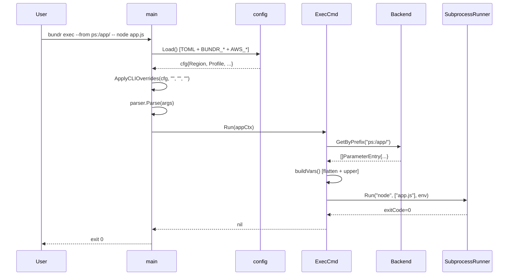
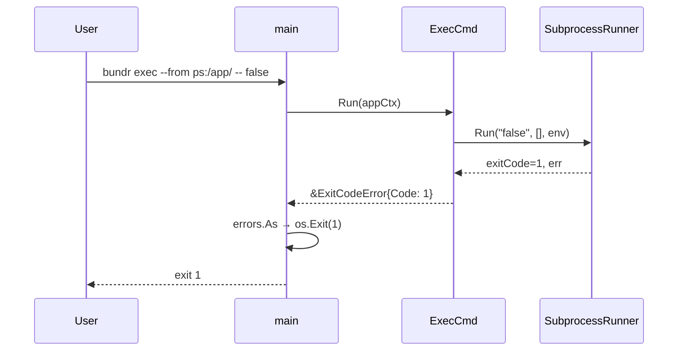
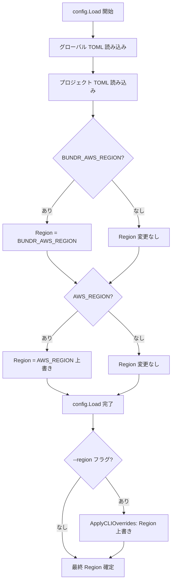
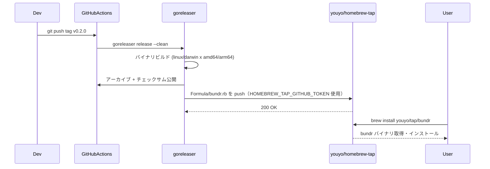

# M7: UX/DX 改善

## 概要

M6 で全コア機能が揃ったため、M7 ではユーザー体験と開発者体験の向上を目的とした「磨き」作業を行う。

主な変更点は以下の 5 件:

1. **Homebrew Tap 対応** — `brew install youyo/tap/bundr` でインストール可能にする
2. **ルートコマンドでヘルプ表示** — `bundr` 単体実行でヘルプを出す
3. **README 完全版作成** — 設定ファイル・環境変数・全コマンドを網羅した完全版 README
4. **`run` → `exec` リネーム** — `bundr run` を `bundr exec` に変更
5. **AWS 標準環境変数対応** — `AWS_REGION` / `AWS_PROFILE` をフォールバックとして参照する（`BUNDR_*` が優先）

---

## スコープ

### In-Scope

| # | 変更内容 | 対象ファイル |
|---|---------|------------|
| S1 | goreleaser に `brews` セクション追加 | `.goreleaser.yaml` |
| S2 | `youyo/homebrew-tap` Formula 自動更新 CI 設定 | `release.yml` |
| S3 | `bundr` 単体実行でヘルプ表示 | `main.go` |
| S4 | `cmd/run.go` → `cmd/exec.go` リネーム | `cmd/exec.go`（新規）, `cmd/run.go`（削除）|
| S5 | `RunCmd` → `ExecCmd`、`CLI.Run` → `CLI.Exec` | `cmd/exec.go`, `cmd/root.go` |
| S6 | `cmd/run_test.go` → `cmd/exec_test.go` リネーム | `cmd/exec_test.go`（新規）|
| S7 | `applyEnvOverrides` に `AWS_REGION` / `AWS_PROFILE` 追加 | `internal/config/config.go` |
| S8 | `CLI struct` の `env` タグを `AWS_REGION` / `AWS_PROFILE` に変更 | `cmd/root.go` |
| S9 | 環境変数テスト追加 | `internal/config/config_test.go` |
| S10 | README 完全版作成 | `README.md` |

### Out-of-Scope

- コア機能（get/put/export/ls/jsonize/cache）への機能追加
- sm: バックエンドのプレフィックスサポート
- Windows 対応

---

## アーキテクチャ検討

### S1/S2: Homebrew Tap 対応

#### goreleaser の brews セクション

goreleaser v2 では `brews` セクションに `tap` リポジトリを指定すると、Formula ファイルを自動生成して PR または直接プッシュできる。

```yaml
brews:
  - name: bundr
    homepage: https://github.com/youyo/bundr
    description: "AWS Parameter Store と Secrets Manager を統合する単一バイナリ Go CLI"
    license: MIT
    repository:
      owner: youyo
      name: homebrew-tap
      token: "{{ .Env.HOMEBREW_TAP_GITHUB_TOKEN }}"
    directory: Formula
    install: |
      bin.install "bundr"
    test: |
      system "#{bin}/bundr", "--help"
```

**前提条件**:
- `youyo/homebrew-tap` リポジトリが存在すること（なければ作成）
- GitHub Actions の Secrets に `HOMEBREW_TAP_GITHUB_TOKEN` を追加（`youyo/homebrew-tap` への push 権限を持つ PAT）
- `GITHUB_TOKEN` だけでは他リポジトリへの push 不可のため専用 PAT が必須

#### release.yml の更新

goreleaser job の env セクションに `HOMEBREW_TAP_GITHUB_TOKEN` を追加:

```yaml
env:
  GITHUB_TOKEN: ${{ secrets.GITHUB_TOKEN }}
  HOMEBREW_TAP_GITHUB_TOKEN: ${{ secrets.HOMEBREW_TAP_GITHUB_TOKEN }}
```

### S3: ルートコマンドでヘルプ表示

現状の `main.go` では `parser.Parse(os.Args[1:])` の後にすぐコマンドを実行する。引数なしで実行すると Kong はデフォルトコマンドを探すが、存在しない場合は `usage` を表示して exit code 1 で終了する。

Kong の `--help` フラグを引数なし実行時に自動的に追加する方法が最もシンプル:

```go
args := os.Args[1:]
if len(args) == 0 {
    args = []string{"--help"}
}
kctx, err := parser.Parse(args)
```

これにより `bundr` 単体実行で Kong 標準のヘルプが表示される。exit code は 0 になる（Kong の `--help` フラグは正常終了）。

### S4/S5/S6: `run` → `exec` リネーム

#### 変更箇所の全体像

```
cmd/run.go           → cmd/exec.go  （ファイル名変更）
  RunCmd             → ExecCmd      （struct 名変更）
  func (c *RunCmd) Run  → func (c *ExecCmd) Run  （レシーバー型変更）
  エラーメッセージ "run command failed" → "exec command failed"

cmd/root.go
  Run RunCmd         → Exec ExecCmd

cmd/run_test.go      → cmd/exec_test.go  （ファイル名変更）
  RunCmd             → ExecCmd
  setupRunCmd        → setupExecCmd
  newRunTestContext   → newExecTestContext
  TestRunCmd         → TestExecCmd
  TestRunCmd_Errors  → TestExecCmd_Errors
  TestRunCmd_EdgeCases → TestExecCmd_EdgeCases
  "run command failed" の文字列を "exec command failed" に更新
```

#### 注意点: `RunCmd.Run()` メソッド名の扱い

Kong では `Run(*Context)` がコマンドの実行エントリポイント。struct 名を `ExecCmd` に変更しても、メソッド名は `Run(*Context)` のまま維持する（Kong の規約）。

```go
type ExecCmd struct { ... }
func (c *ExecCmd) Run(appCtx *Context) error { ... }
```

### S7/S8/S9: AWS 標準環境変数対応

#### 現状の優先順位

```
CLI flags (--region/--profile)
  > BUNDR_AWS_REGION / BUNDR_AWS_PROFILE  ← applyEnvOverrides で読む
    > .bundr.toml
      > ~/.config/bundr/config.toml
```

#### 変更後の優先順位

```
CLI flags (--region/--profile)
  > BUNDR_AWS_REGION / BUNDR_AWS_PROFILE  ← 既存（bundr 固有設定として最優先）
    > AWS_REGION / AWS_PROFILE            ← 新規追加（標準 AWS 環境変数・フォールバック）
      > .bundr.toml
        > ~/.config/bundr/config.toml
```

#### `applyEnvOverrides` の変更方針

`BUNDR_*` は `AWS_*` より **後で** 適用する（後から適用したものが勝つ）ことで優先度を上げる:

```go
func applyEnvOverrides(cfg *Config) {
    // 1. 標準 AWS 環境変数（フォールバック）
    if v := os.Getenv("AWS_REGION"); v != "" {
        cfg.AWS.Region = v
    }
    if v := os.Getenv("AWS_PROFILE"); v != "" {
        cfg.AWS.Profile = v
    }
    // 2. BUNDR_* 環境変数（AWS_* より優先）
    if v := os.Getenv("BUNDR_AWS_REGION"); v != "" {
        cfg.AWS.Region = v
    }
    if v := os.Getenv("BUNDR_AWS_PROFILE"); v != "" {
        cfg.AWS.Profile = v
    }
    if v := os.Getenv("BUNDR_AWS_KMS_KEY_ID"); v != "" {
        cfg.AWS.KMSKeyID = v
    }
    // kms_key_id は BUNDR_KMS_KEY_ID のみ（AWS 標準には相当変数なし）
}
```

#### `CLI struct` の `env` タグ変更

Kong の `env` タグは単一の環境変数しか指定できない。`AWS_REGION` を直接 `env` タグに指定すると `BUNDR_*` が効かなくなる。

**設計判断**: Region と Profile の `env` タグは削除し、環境変数読み取りを完全に `applyEnvOverrides` に委譲する。
Kong の `env` タグは `applyEnvOverrides` より前（config.Load() 内）に適用されるため、CLI 構造体の `env` タグを残すと競合を起こす可能性がある。

現在の状態:
```go
Region   string `help:"AWS region (overrides config and env)" env:"BUNDR_AWS_REGION" optional:"" name:"region"`
Profile  string `help:"AWS profile (overrides config and env)" env:"BUNDR_AWS_PROFILE" optional:"" name:"profile"`
KMSKeyID string `help:"KMS key ID or ARN for encryption" env:"BUNDR_AWS_KMS_KEY_ID" optional:"" name:"kms-key-id"`
```

変更後:
```go
Region   string `help:"AWS region (overrides all other region settings)" optional:"" name:"region"`
Profile  string `help:"AWS profile (overrides all other profile settings)" optional:"" name:"profile"`
KMSKeyID string `help:"KMS key ID or ARN for encryption" env:"BUNDR_KMS_KEY_ID" optional:"" name:"kms-key-id"`
```

`env` タグを削除しても `applyEnvOverrides` が環境変数を読むため、動作に変化はない。CLI フラグとして `--region ap-northeast-1` は引き続き動作する。

---

## テスト設計書（TDD Red → Green → Refactor）

### テストケース: S7 AWS 標準環境変数対応

| ID | 分類 | テスト内容 | 期待結果 |
|----|------|-----------|---------|
| CFG-AWS-01 | 正常系 | `AWS_REGION=us-west-2` のみ設定 | `cfg.AWS.Region == "us-west-2"` |
| CFG-AWS-02 | 正常系 | `AWS_PROFILE=myprofile` のみ設定 | `cfg.AWS.Profile == "myprofile"` |
| CFG-AWS-03 | 正常系 | `AWS_REGION` と `BUNDR_AWS_REGION` 両方設定 | `BUNDR_AWS_REGION` が優先 |
| CFG-AWS-04 | 正常系 | `AWS_PROFILE` と `BUNDR_AWS_PROFILE` 両方設定 | `BUNDR_AWS_PROFILE` が優先 |
| CFG-AWS-05 | 正常系 | `BUNDR_AWS_REGION` のみ設定（後方互換） | `BUNDR_AWS_REGION` が適用される |
| CFG-AWS-06 | 正常系 | `AWS_REGION` が .bundr.toml の region より優先 | `AWS_REGION` が勝つ |
| CFG-AWS-07 | 境界値 | `AWS_REGION` が空文字 | .bundr.toml の値が使われる |
| CFG-AWS-08 | 境界値 | `BUNDR_AWS_KMS_KEY_ID` のみ（kms は変化なし） | kms_key_id が設定される |

### テストケース: S4/S5 exec リネーム

| ID | 分類 | テスト内容 | 期待結果 |
|----|------|-----------|---------|
| EXEC-01 | 正常系 | ExecCmd で単一 prefix から env 変数展開 | vars が正しく展開される |
| EXEC-02 | 正常系 | 複数 prefix で後者優先 | 後の prefix の値が勝つ |
| EXEC-03 | 正常系 | JSON store mode の flatten | ネストキーが展開される |
| EXEC-04 | 異常系 | command 未指定 | "no command specified" エラー |
| EXEC-05 | 異常系 | 子プロセスが非ゼロ終了 | ExitCodeError が返る |
| EXEC-06 | 異常系 | backend 生成失敗 | エラー伝搬 |

エラーメッセージが `"exec command failed"` を含むことを確認する（旧 `"run command failed"` から変更）。

### テストケース: S3 ルートコマンドヘルプ表示

統合テストとして `go run . 2>&1` の出力が "Usage:" を含むことを確認する。ただし `main.go` の単体テストは困難（`os.Exit` の扱い）なため、手動 smoke test の項目として記載する。

### TDD 実装順序

#### Step 1: S7 — 環境変数テスト (Red)

`internal/config/config_test.go` に `TestAWSStandardEnvVars` を追記。
テスト実行 → `AWS_REGION` / `AWS_PROFILE` を読まないため FAIL（Red）。

#### Step 2: S7 — `applyEnvOverrides` 実装 (Green)

`internal/config/config.go` の `applyEnvOverrides` に `AWS_REGION` / `AWS_PROFILE` の読み取りを追加。
テスト実行 → PASS（Green）。

#### Step 3: S7 — `cmd/root.go` env タグ更新 (Refactor)

`CLI struct` の `Region` / `Profile` から `env` タグを削除。
`go test ./...` が全 PASS のまま維持されることを確認。

#### Step 4: S4/S6 — ExecCmd テスト (Red)

`cmd/exec_test.go` を新規作成（run_test.go の内容をコピー＋リネーム）。
`go test ./cmd/...` がコンパイルエラーになることを確認（ExecCmd が未定義のため → Red）。

#### Step 5: S4/S5 — ExecCmd 実装 (Green)

`cmd/exec.go` を新規作成（run.go の内容をコピー＋リネーム）。
`cmd/root.go` の `CLI.Run RunCmd` を `CLI.Exec ExecCmd` に変更。
`go test ./cmd/...` で全テスト PASS を確認。
`cmd/run.go` と `cmd/run_test.go` を削除。

#### Step 6: S3 — ヘルプ表示 (Green)

`main.go` の `args` 処理を更新。手動 smoke test で確認。

#### Step 7: S1/S2 — goreleaser と release.yml 更新 (Green)

`.goreleaser.yaml` に `brews` セクション追加。
`release.yml` の goreleaser job に `HOMEBREW_TAP_GITHUB_TOKEN` env 追加。

#### Step 8: S10 — README 完全版 (Green)

`README.md` を完全版に書き換え。

---

## 実装手順（Step-by-step）

### Step 1: 環境変数テスト追加（Red）

**ファイル**: `internal/config/config_test.go`

既存の `TestLoadFromEnvVars` は `BUNDR_*` のみ検証しているため変更不要。
新規テスト関数 `TestAWSStandardEnvVars` を追加:

```go
func TestAWSStandardEnvVars(t *testing.T) {
    allRelatedEnvVars := []string{
        "AWS_REGION", "AWS_PROFILE",
        "BUNDR_AWS_REGION", "BUNDR_AWS_PROFILE", "BUNDR_AWS_KMS_KEY_ID",
    }

    tests := []struct {
        name        string
        setEnv      map[string]string
        wantRegion  string
        wantProfile string
    }{
        {
            name:       "cfg-aws-01: AWS_REGION のみ",
            setEnv:     map[string]string{"AWS_REGION": "us-west-2"},
            wantRegion: "us-west-2",
        },
        {
            name:        "cfg-aws-02: AWS_PROFILE のみ",
            setEnv:      map[string]string{"AWS_PROFILE": "myprofile"},
            wantProfile: "myprofile",
        },
        {
            name: "cfg-aws-03: BUNDR_AWS_REGION が AWS_REGION より優先",
            setEnv: map[string]string{
                "AWS_REGION":      "us-east-1",
                "BUNDR_AWS_REGION": "ap-northeast-1",
            },
            wantRegion: "ap-northeast-1",
        },
        {
            name: "cfg-aws-04: BUNDR_AWS_PROFILE が AWS_PROFILE より優先",
            setEnv: map[string]string{
                "AWS_PROFILE":      "aws-profile",
                "BUNDR_AWS_PROFILE": "bundr-profile",
            },
            wantProfile: "bundr-profile",
        },
        {
            name:       "cfg-aws-05: BUNDR_AWS_REGION のみ（後方互換）",
            setEnv:     map[string]string{"BUNDR_AWS_REGION": "eu-west-1"},
            wantRegion: "eu-west-1",
        },
        {
            name: "cfg-aws-07: AWS_REGION が空文字 → BUNDR_AWS_REGION を使用",
            setEnv: map[string]string{
                "AWS_REGION":      "",
                "BUNDR_AWS_REGION": "ap-northeast-1",
            },
            wantRegion: "ap-northeast-1",
        },
    }

    for _, tc := range tests {
        t.Run(tc.name, func(t *testing.T) {
            for _, k := range allRelatedEnvVars {
                t.Setenv(k, "")
            }
            for k, v := range tc.setEnv {
                t.Setenv(k, v)
            }
            cfg, err := Load()
            if err != nil {
                t.Fatalf("Load() failed: %v", err)
            }
            if tc.wantRegion != "" && cfg.AWS.Region != tc.wantRegion {
                t.Errorf("Region: want %q, got %q", tc.wantRegion, cfg.AWS.Region)
            }
            if tc.wantProfile != "" && cfg.AWS.Profile != tc.wantProfile {
                t.Errorf("Profile: want %q, got %q", tc.wantProfile, cfg.AWS.Profile)
            }
        })
    }
}
```

### Step 2: `applyEnvOverrides` 更新（Green）

**ファイル**: `internal/config/config.go`

```go
func applyEnvOverrides(cfg *Config) {
    // BUNDR_* 環境変数（後方互換）
    if v := os.Getenv("BUNDR_AWS_REGION"); v != "" {
        cfg.AWS.Region = v
    }
    if v := os.Getenv("BUNDR_AWS_PROFILE"); v != "" {
        cfg.AWS.Profile = v
    }
    if v := os.Getenv("BUNDR_AWS_KMS_KEY_ID"); v != "" {
        cfg.AWS.KMSKeyID = v
    }
    // 標準 AWS 環境変数（BUNDR_* より優先）
    if v := os.Getenv("AWS_REGION"); v != "" {
        cfg.AWS.Region = v
    }
    if v := os.Getenv("AWS_PROFILE"); v != "" {
        cfg.AWS.Profile = v
    }
}
```

テスト実行: `go test ./internal/config/...` で全テスト PASS を確認。

### Step 3: `cmd/root.go` の env タグ更新

変更前:
```go
Region   string `help:"AWS region (overrides config and env)" env:"BUNDR_AWS_REGION" optional:"" name:"region"`
Profile  string `help:"AWS profile (overrides config and env)" env:"BUNDR_AWS_PROFILE" optional:"" name:"profile"`
KMSKeyID string `help:"KMS key ID or ARN for encryption" env:"BUNDR_AWS_KMS_KEY_ID" optional:"" name:"kms-key-id"`
```

変更後:
```go
Region   string `help:"AWS region (overrides all other region settings)" optional:"" name:"region"`
Profile  string `help:"AWS profile (overrides all other profile settings)" optional:"" name:"profile"`
KMSKeyID string `help:"KMS key ID or ARN for encryption" env:"BUNDR_KMS_KEY_ID" optional:"" name:"kms-key-id"`
```

テスト実行: `go test ./...` で全テスト PASS のまま維持されることを確認。

### Step 4: `cmd/exec_test.go` 作成（Red）

`cmd/run_test.go` の内容をコピーして `cmd/exec_test.go` を作成し以下を変更:

1. `RunCmd` → `ExecCmd`（型名参照箇所）
2. `setupRunCmd` → `setupExecCmd`（ヘルパー関数名）
3. `newRunTestContext` → `newExecTestContext`（ヘルパー関数名）
4. `TestRunCmd` → `TestExecCmd`（テスト関数名）
5. `TestRunCmd_Errors` → `TestExecCmd_Errors`（テスト関数名）
6. `TestRunCmd_EdgeCases` → `TestExecCmd_EdgeCases`（テスト関数名）
7. エラーメッセージ中の `"run command failed"` → `"exec command failed"`

`go test ./cmd/...` がコンパイルエラー（ExecCmd が未定義）になることを確認（Red）。

### Step 5: `cmd/exec.go` 作成（Green）

`cmd/run.go` の内容をコピーして `cmd/exec.go` を作成し以下を変更:

1. `RunCmd` → `ExecCmd`（struct 名）
2. `func (c *RunCmd) Run` → `func (c *ExecCmd) Run`（レシーバー型、メソッド名は `Run` のまま）
3. エラーメッセージ `"run command failed"` → `"exec command failed"`

`cmd/root.go` を更新:

変更前:
```go
Run RunCmd `cmd:"" help:"Run a command with parameters as environment variables."`
```

変更後:
```go
Exec ExecCmd `cmd:"" help:"Execute a command with parameters as environment variables."`
```

`go test ./cmd/...` で全テスト PASS を確認（Green）。

その後 `cmd/run.go` と `cmd/run_test.go` を削除。`go test ./...` で全テスト PASS のままを確認。

### Step 6: ルートコマンドヘルプ表示（Green）

**ファイル**: `main.go`

変更前:
```go
kctx, err := parser.Parse(os.Args[1:])
```

変更後:
```go
// 引数なし実行時はヘルプを表示
args := os.Args[1:]
if len(args) == 0 {
    args = []string{"--help"}
}
kctx, err := parser.Parse(args)
```

手動確認: `go run . 2>&1` の出力が `Usage:` で始まることを確認（exit code 0）。

### Step 7: `.goreleaser.yaml` 更新

変更後の完全な `.goreleaser.yaml`:

```yaml
version: 2

builds:
  - id: bundr
    binary: bundr
    env:
      - CGO_ENABLED=0
    flags:
      - -trimpath
    ldflags:
      - -s -w
    goos: [linux, darwin]
    goarch: [amd64, arm64]

archives:
  - {}

checksum:
  algorithm: sha256

snapshot:
  version_template: "{{incpatch .Version}}-next"

release:
  prerelease: auto

brews:
  - name: bundr
    homepage: "https://github.com/youyo/bundr"
    description: "AWS Parameter Store と Secrets Manager を統合する単一バイナリ Go CLI"
    license: "MIT"
    repository:
      owner: youyo
      name: homebrew-tap
      token: "{{ .Env.HOMEBREW_TAP_GITHUB_TOKEN }}"
    directory: Formula
    install: |
      bin.install "bundr"
    test: |
      system "#{bin}/bundr", "--help"
```

### Step 8: `release.yml` 更新

goreleaser の正式リリース job のみに `HOMEBREW_TAP_GITHUB_TOKEN` を追加:

```yaml
- name: Run goreleaser (正式リリース)
  if: startsWith(github.ref, 'refs/tags/')
  uses: goreleaser/goreleaser-action@v6
  with:
    version: latest
    args: release --clean
  env:
    GITHUB_TOKEN: ${{ secrets.GITHUB_TOKEN }}
    HOMEBREW_TAP_GITHUB_TOKEN: ${{ secrets.HOMEBREW_TAP_GITHUB_TOKEN }}
```

snapshot ビルドには `HOMEBREW_TAP_GITHUB_TOKEN` は不要のため追加しない。

### Step 9: README 完全版作成

`README.md` を以下の構成で書き換える（設計のみ、実装者が本文を記述する）:

```
# bundr

## インストール
### Homebrew（推奨）
  brew install youyo/tap/bundr
### GitHub Releases からダウンロード
  (linux/darwin × amd64/arm64 の curl コマンド例)
### go install
  go install github.com/youyo/bundr@latest

## クイックスタート
  (典型的な 5ステップのユースケース例)

## Ref 構文
  (ps: / psa: / sm: の説明テーブル)

## コマンドリファレンス
### bundr put
### bundr get
### bundr export
### bundr ls
### bundr exec  (旧: run)
### bundr jsonize
### bundr completion
### bundr cache

## グローバルフラグ
  (テーブル: フラグ名 / 環境変数（標準） / 環境変数（後方互換） / 説明)

## 設定
### 設定優先順位
  1. CLI フラグ
  2. 環境変数（AWS_REGION, AWS_PROFILE）
  3. 後方互換環境変数（BUNDR_AWS_REGION 等）
  4. プロジェクト設定ファイル（.bundr.toml）
  5. グローバル設定ファイル（~/.config/bundr/config.toml）

### プロジェクト設定ファイル (.bundr.toml)
  (TOML サンプル)

### グローバル設定ファイル (~/.config/bundr/config.toml)
  (TOML サンプル)

### 環境変数一覧
  (テーブル: 変数名 / 説明 / 例)
  AWS_REGION, AWS_PROFILE, BUNDR_AWS_REGION, BUNDR_AWS_PROFILE,
  BUNDR_KMS_KEY_ID, BUNDR_AWS_KMS_KEY_ID（後方互換）

## AWS 認証設定
  (AWS SDK v2 の認証チェーン説明)
  (--profile フラグまたは AWS_PROFILE での指定例)

## シェル補完
  (bash/zsh/fish の eval コマンド例)

## タグスキーマ
  (cli=bundr / cli-store-mode / cli-schema タグの説明テーブル)
```

---

## リスク評価

| リスク | 影響度 | 発生確率 | 対策 |
|-------|--------|---------|------|
| `youyo/homebrew-tap` リポジトリが存在しない | 高 | 中 | 実装前にリポジトリを手動作成（Formula ディレクトリの自動作成を goreleaser に任せる） |
| `HOMEBREW_TAP_GITHUB_TOKEN` の PAT 権限不足 | 高 | 中 | `repo` スコープを持つ PAT を生成して Secrets に登録 |
| `run` → `exec` リネームで既存スクリプトが壊れる | 中 | 低 | v0.1.x はまだ広く使われていないため許容。リリースノートに Breaking Change 明記 |
| `AWS_REGION` を読むことで CI 環境の想定外リージョン取得 | 中 | 中 | `--region` CLI フラグが最優先のため明示指定で回避可能。README に注記 |
| Homebrew Formula の sha256 チェックサム不一致 | 低 | 低 | goreleaser が自動計算するため手動ミスなし |
| `--help` フラグ挿入で補完処理との干渉 | 低 | 低 | kongplete.Complete は `COMP_LINE` 環境変数が存在する場合のみ実行され、`args` 加工前に補完処理が完了するため問題なし |

---

## シーケンス図

### `bundr exec` コマンド実行フロー（正常系）



### `bundr exec` エラーケース（子プロセス非ゼロ終了）



### AWS 環境変数優先順位フロー



### Homebrew インストールフロー



---

## 5観点チェックリスト

### 観点1: 実装実現可能性

- [x] goreleaser v2 の `brews` セクションは公式ドキュメントで確認済み（`repository.token` で PAT 指定可能）
- [x] Kong の `--help` フラグ挿入は `parser.Parse(args)` 前に `args` スライスを加工するだけで実現可能
- [x] `run` → `exec` リネームは Go のパッケージ内リネームで、型エクスポートなしのため影響範囲は `cmd` パッケージ内と `main.go` のみ
- [x] `applyEnvOverrides` での `AWS_REGION` 追加は既存テスト（`TestLoadFromEnvVars` 等）が `BUNDR_*` 専用で書かれているため、既存テストへの影響は限定的
- [x] `CLI struct` の `env` タグ削除は Kong の挙動変更を伴うが、`applyEnvOverrides` が同等の機能を提供するため外部動作は等価

### 観点2: TDD テスト設計

- [x] S7 の環境変数テスト: `t.Setenv` を使い全関連環境変数をクリアしてからテストケース固有の設定を行うことで dry-run 可能
- [x] S4/S6 の ExecCmd テスト: run_test.go の構造をそのまま継承し、struct 名とエラーメッセージのみ変更すれば網羅性を維持できる
- [x] S3 のヘルプ表示テスト: `main.go` の単体テストは困難（`os.Exit` の扱い）なため手動 smoke test として記載
- [x] 既存テスト (`TestLoadFromEnvVars` 等) への副作用: `t.Setenv` でテスト後に自動クリアされるため問題なし
- [x] S7 で `AWS_REGION` が空文字の場合の境界値テスト (CFG-AWS-07) を明示的に設計
- [x] ExecCmd の全テストケース (EXEC-01〜06) が TDD ステップに対応付けられている

### 観点3: アーキテクチャ整合性

- [x] 設定優先順位が `CLI flags > BUNDR_* > AWS_* > .bundr.toml > config.toml` となり、bundr 固有設定が標準 AWS 環境変数より優先される直感的な設計
- [x] `applyEnvOverrides` 関数内で「後から適用したものが勝つ」実装にすることで、コードと設計が一致（AWS_* → BUNDR_* の順で適用）
- [x] `cmd/root.go` の `env` タグを削除しても `ApplyCLIOverrides` が最後に呼ばれるため CLI フラグ優先度は維持
- [x] ExecCmd は RunCmd と同一のインターフェース（`Run(*Context) error`）を維持するため Kong の dispatch 機構への影響なし
- [x] Homebrew Formula の goreleaser 自動生成は既存の `archives` セクションで生成されたアーカイブを参照するため、ビルドパイプラインへの変更は最小限

### 観点4: リスク評価と対策

- [x] `youyo/homebrew-tap` リポジトリ未作成リスク: 実装前に GitHub 上でリポジトリを手動作成する手順を実装チェックリストに明記
- [x] Breaking Change リスク (`run` → `exec`): v0.1.x の利用者向けにリリースノートに明記する項目を設計に含む
- [x] CI 環境での `AWS_REGION` 意図しない参照: CLI フラグが最優先のため明示指定で回避可能。README に注記
- [x] goreleaser Homebrew Token が snapshot 時に不要: 正式リリース時のみ Homebrew 更新が実行される設計（`if: startsWith(github.ref, 'refs/tags/')`）
- [x] Formula のインストールテスト `system "#{bin}/bundr", "--help"` が失敗するケース: S3 でヘルプ表示を確実に実装することで対策
- [x] `env` タグ削除後の Kong ヘルプ出力の変更: ヘルプから `(env BUNDR_AWS_REGION)` の表示が消えるため README の環境変数セクションで補完

### 観点5: シーケンス図の完全性

- [x] `bundr exec` の正常系フローにすべての依存コンポーネント（config, Backend, SubprocessRunner）が含まれている
- [x] `bundr exec` のエラーケース（子プロセス非ゼロ終了）のシーケンス図を別途記載
- [x] AWS 環境変数優先順位のフローチャートで `BUNDR_*` → `AWS_*` → CLI フラグの3段階が明示されている
- [x] Homebrew インストールフローで goreleaser → homebrew-tap の push フローが示されている
- [x] `ApplyCLIOverrides` が `config.Load()` の後に呼ばれる順序が main.go の実装と一致

---

## 実装前チェックリスト（着手時に確認）

1. GitHub に `youyo/homebrew-tap` リポジトリが存在するか確認（なければ作成）
2. GitHub Actions Secrets に `HOMEBREW_TAP_GITHUB_TOKEN` を追加（`youyo/homebrew-tap` への push 権限付き PAT、`repo` スコープ）
3. `go test ./...` が現状で全 PASS であることを確認
4. `cmd/run.go` / `cmd/run_test.go` のファイル削除は `cmd/exec.go` / `cmd/exec_test.go` のコンパイル確認後に行う

## リリースノート記載事項（v0.2.0）

```markdown
## Breaking Changes

- `bundr run` コマンドを `bundr exec` にリネームしました。
  既存のスクリプトで `bundr run` を使用している場合は `bundr exec` に更新してください。

## New Features

- **Homebrew 対応**: `brew install youyo/tap/bundr` でインストール可能になりました。
- **AWS 標準環境変数サポート**: `AWS_REGION` と `AWS_PROFILE` を参照するようになりました。
  `BUNDR_AWS_REGION` / `BUNDR_AWS_PROFILE` は後方互換として引き続き動作しますが、
  `AWS_REGION` / `AWS_PROFILE` の方が優先されます。
- **ルートコマンドのヘルプ表示**: `bundr` 単体実行でヘルプが表示されるようになりました。

## Documentation

- README を完全版に更新しました。設定ファイル・環境変数・全コマンドを網羅しています。
```

---

## 実装ファイル一覧

| ファイル | 操作 | 内容 |
|---------|------|------|
| `internal/config/config.go` | 更新 | `applyEnvOverrides` に `AWS_REGION` / `AWS_PROFILE` 追加 |
| `internal/config/config_test.go` | 更新 | `TestAWSStandardEnvVars` テスト追加 |
| `cmd/root.go` | 更新 | `CLI.Run RunCmd` → `CLI.Exec ExecCmd`、Region/Profile の `env` タグ削除 |
| `cmd/exec.go` | 新規作成 | `run.go` の内容をコピー後 `RunCmd` → `ExecCmd` にリネーム |
| `cmd/exec_test.go` | 新規作成 | `run_test.go` の内容をコピー後リネーム |
| `cmd/run.go` | 削除 | `exec.go` 移行完了後 |
| `cmd/run_test.go` | 削除 | `exec_test.go` 移行完了後 |
| `main.go` | 更新 | 引数ゼロ時に `--help` を挿入 |
| `.goreleaser.yaml` | 更新 | `brews` セクション追加 |
| `.github/workflows/release.yml` | 更新 | goreleaser 正式リリース job に `HOMEBREW_TAP_GITHUB_TOKEN` env 追加 |
| `README.md` | 全面更新 | 完全版 README（Homebrew、exec コマンド、環境変数一覧、設定ファイル説明） |
