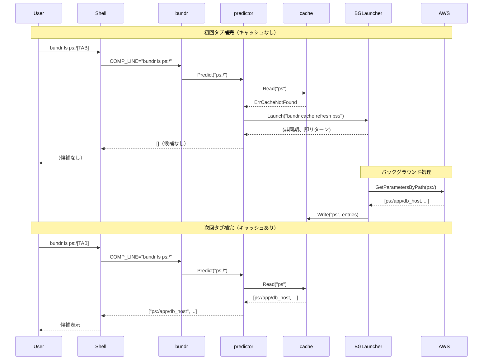

# M8: キャッシュ XDG 準拠 + 補完自動初期化

## コンテキスト

macOS で `bundr ls ps:/[TAB]` を実行したとき、2つの問題が判明した：

1. **キャッシュが `~/Library/Caches/bundr/` に保存される**
   `os.UserCacheDir()` が macOS では `~/Library/Caches` を返すため。
   ユーザーは Linux と同様の `~/.cache/bundr/` を期待しており、
   `ls ~/.cache/bundr/` で確認できないため混乱が生じる。

2. **初回は `bundr cache refresh ps:/` を手動実行しないと補完が動かない**
   `ErrCacheNotFound` 時にバックグラウンドリフレッシュが起動されないため。
   `eval "$(bundr completion zsh)"` を設定してもすぐには補完候補が出ない。

## スコープ

### 実装範囲
- `internal/cache/cache.go`: `NewFileStore()` を XDG 準拠のキャッシュパスに変更
- `cmd/predictor.go`: `ErrCacheNotFound` 時にもバックグラウンドリフレッシュを自動起動
- 既存テストの更新 + 新規テスト追加

### スコープ外
- キャッシュ移行ロジック（旧パス `~/Library/Caches/bundr/` からの自動移行）
- `bundr cache refresh` の引数形式変更

---

## 変更ファイル一覧

| ファイル | 変更内容 |
|---------|---------|
| `internal/cache/cache.go` | `xdgCacheDir()` ヘルパー追加、`NewFileStore()` で使用 |
| `internal/cache/cache_test.go` | `XDG_CACHE_HOME` テスト追加 |
| `cmd/predictor.go` | `ErrCacheNotFound` 分岐に BG 起動を追加（2箇所） |
| `cmd/predictor_test.go` | キャッシュなし時の BG 起動テスト追加 |

---

## 実装手順

### Step 1: `xdgCacheDir()` を `internal/cache/cache.go` に追加

**変更前（50-55行目）:**
```go
func NewFileStore() (*FileStore, error) {
    cacheDir, err := os.UserCacheDir()
    if err != nil {
        return nil, fmt.Errorf("get user cache dir: %w", err)
    }
    return &FileStore{baseDir: filepath.Join(cacheDir, "bundr")}, nil
}
```

**変更後:**
```go
// xdgCacheDir は XDG Base Directory Specification に従ってキャッシュディレクトリを返す。
// $XDG_CACHE_HOME が絶対パスで設定されていればそれを使用し、
// 未設定または相対パスの場合は $HOME/.cache を返す。
// これにより macOS でも Linux と同様に ~/.cache/bundr/ が使われる。
func xdgCacheDir() (string, error) {
    if d := os.Getenv("XDG_CACHE_HOME"); d != "" && filepath.IsAbs(d) {
        return d, nil
    }
    home, err := os.UserHomeDir()
    if err != nil {
        return "", fmt.Errorf("get home dir: %w", err)
    }
    return filepath.Join(home, ".cache"), nil
}

func NewFileStore() (*FileStore, error) {
    cacheDir, err := xdgCacheDir()
    if err != nil {
        return nil, fmt.Errorf("get user cache dir: %w", err)
    }
    return &FileStore{baseDir: filepath.Join(cacheDir, "bundr")}, nil
}
```

**依存**: なし
**テスト先行 (Red)**: `XDG_CACHE_HOME=/tmp/xdg bundr cache refresh ps:/` 後に `/tmp/xdg/bundr/ps.json` が生成されることを確認するテスト

---

### Step 2: `newRefPredictor` で `ErrCacheNotFound` 時に BG 起動を追加

**変更前（50-52行目）:**
```go
if err == cache.ErrCacheNotFound {
    // キャッシュなし（初回）→ 空リストを返す（BG 更新は別途）
    return []string{}
}
```

**変更後:**
```go
if err == cache.ErrCacheNotFound {
    // キャッシュなし（初回）→ 次回補完のために BG でキャッシュ作成
    _ = bgLauncher.Launch(os.Args[0], "cache", "refresh", prefix)
    return []string{}
}
```

**注意**: スロットリングは既存の `LastRefreshedAt` ロジックで担保。
キャッシュなし時は `LastRefreshedAt` が zero time → 必ず起動条件を満たす（正しい動作）。

---

### Step 3: `newPrefixPredictor` で `ErrCacheNotFound` 時に BG 起動を追加

**変更前（119-120行目）:**
```go
if err == cache.ErrCacheNotFound {
    return []string{}
}
```

**変更後:**
```go
if err == cache.ErrCacheNotFound {
    // キャッシュなし（初回）→ 次回補完のために BG でキャッシュ作成
    _ = bgLauncher.Launch(os.Args[0], "cache", "refresh", prefix)
    return []string{}
}
```

（`prefix == ""` の分岐 86-88行目も同様に変更）

**変更前:**
```go
if err == cache.ErrCacheNotFound {
    continue
}
```

**変更後:**
```go
if err == cache.ErrCacheNotFound {
    _ = bgLauncher.Launch(os.Args[0], "cache", "refresh", backendType+":/")
    continue
}
```

---

## テスト設計書

### Step 1 のテスト (`internal/cache/cache_test.go`)

| ID | シナリオ | 設定 | 期待値 |
|----|---------|------|--------|
| T1 | XDG_CACHE_HOME 使用 | `XDG_CACHE_HOME=/tmp/xdg` | `/tmp/xdg/bundr/` を使用 |
| T2 | XDG_CACHE_HOME 未設定 | 未設定 | `~/.cache/bundr/` を使用 |
| T3 | XDG_CACHE_HOME が相対パス | `XDG_CACHE_HOME=relative/path` | `~/.cache/bundr/` を使用（無視） |

実装: `t.Setenv("XDG_CACHE_HOME", ...)` でテスト分離。`NewFileStore()` の baseDir を確認。

### Step 2/3 のテスト (`cmd/predictor_test.go`)

既存テストに `ErrCacheNotFound` 時のケースを追加：

| ID | シナリオ | MockStore | 期待動作 |
|----|---------|-----------|---------|
| T4 | refPredictor: キャッシュなし | `ErrCacheNotFound` | 空リスト返し + BG起動1回 |
| T5 | prefixPredictor: キャッシュなし | `ErrCacheNotFound` | 空リスト返し + BG起動1回 |
| T6 | prefixPredictor prefix="": psなし/psaあり | ps=NotFound, psa=entries | psa の候補のみ返す + ps の BG起動 |

実装: `MockBGLauncher` の `launches` スライスを検証して起動回数・引数を確認。

---

## アーキテクチャ検討

### XDG 仕様の適用範囲

XDG Base Directory Specification では：
- `XDG_CACHE_HOME` が絶対パスで設定されていればそれを使う
- 未設定の場合は `$HOME/.cache` を使う

`os.UserCacheDir()` は macOS では `~/Library/Caches`、Linux では `~/.cache` を返すため、
クロスプラットフォーム一貫性を保つには独自実装が必要。

### BG 起動のスロットリング

キャッシュなし時の BG 起動：
- 初回タブ補完 → BG 起動（`LastRefreshedAt` = zero time → 条件満たす）
- BG 完了後（約 1-3 秒）、キャッシュ生成
- 次回タブ補完 → キャッシュあり + `LastRefreshedAt` が現在時刻 → 10秒以内はBG起動スキップ

タブ連打時の並列起動リスク：
- 複数の `bundr cache refresh` が並列実行される可能性あり
- ファイルロック（`.lock` ファイル）があるため競合は防げる
- 最後に書き込んだプロセスの内容が有効になる
- AWS API コールが数回増えるが許容範囲

---

## リスク評価

| リスク | 重大度 | 対策 |
|--------|--------|------|
| 既存キャッシュ（`~/Library/Caches/bundr/`）の無効化 | 低 | 古いキャッシュは無視され次回 BG 起動で自動再生成される |
| タブ連打時の並列 BG 起動 | 低 | ファイルロックで競合防止。API コストは軽微 |
| `XDG_CACHE_HOME` が相対パスの場合の挙動 | 低 | `filepath.IsAbs()` チェックで除外、`~/.cache` にフォールバック |

---

## シーケンス図



---

## 検証手順

```bash
# 1. ビルド
go build -o bundr ./...

# 2. テスト全体
go test ./...

# 3. XDG 動作確認（新パス）
ls ~/.cache/bundr/            # ここに生成されることを確認

# 4. 初回補完の自動起動確認
# キャッシュを削除して自動生成されることを確認
rm -rf ~/.cache/bundr/
# zsh で 1 回タブ補完（候補なし）
# 数秒待つ（BG が AWS にアクセスしてキャッシュ生成）
ls ~/.cache/bundr/            # ps.json が生成されていれば OK
# もう一度タブ補完（候補が出ればOK）
```

---

## チェックリスト

### 観点1: 実装実現可能性
- [x] 手順の抜け漏れなし（xdgCacheDir → NewFileStore → predictor BG起動）
- [x] 各ステップが具体的
- [x] 依存関係明示（Step 1 → Step 2/3）
- [x] 変更ファイル網羅
- [x] 影響範囲特定（既存キャッシュの無効化のみ）

### 観点2: TDDテスト設計
- [x] 正常系（XDG設定あり/なし）
- [x] 異常系（相対パス）
- [x] 境界値（ErrCacheNotFound 時の起動有無）
- [x] 入出力具体的
- [x] Red→Green→Refactor 順序
- [x] MockBGLauncher で外部依存隔離

### 観点3: アーキテクチャ整合性
- [x] 既存パターン踏襲（`xdgCacheDir` は `newRefPredictor` と同スタイル）
- [x] `NoopStore` を変更しない（フォールバックはそのまま）
- [x] `NewFileStoreWithDir` はテスト用途のまま（変更なし）

### 観点4: リスク評価
- [x] 全リスク特定済み
- [x] フェイルセーフ（キャッシュ生成失敗は次回補完で再試行）
- [x] ロールバック可能（変更は独立、git revert 可）

### 観点5: シーケンス図
- [x] 正常フロー（初回 + 次回）
- [x] エラーフロー（ErrCacheNotFound → BG起動）
- [x] 非同期処理の明示
