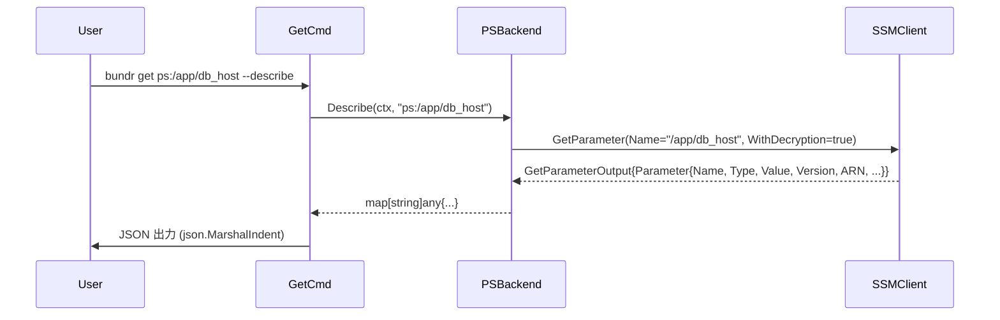
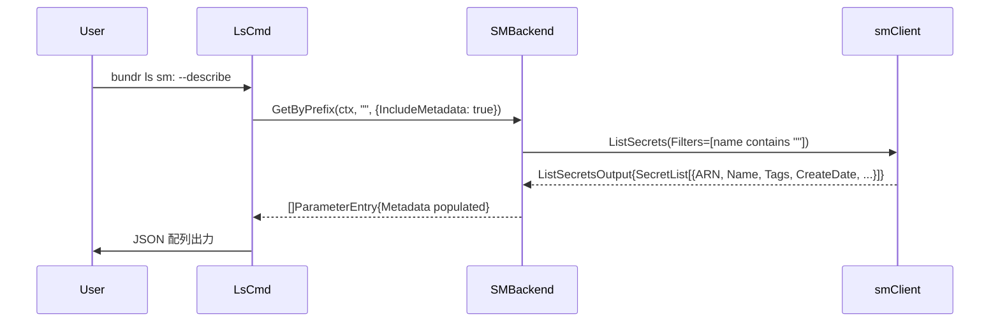

# --describe フラグ: ls / get コマンドへの詳細情報表示

## コンテキスト

現在の `get` は値のみ、`ls` はパス一覧のみを出力する。AWS が管理する追加メタデータ（バージョン、ARN、作成日時、型など）を確認するには `aws cli` を別途呼び出す必要があり、運用上の手間になっている。

`--describe` フラグを追加して、API 生レスポンスを JSON で確認できるようにする。
`aws ssm get-parameter` / `aws secretsmanager describe-secret` 相当の情報を、`bundr` 単体で取得可能にする。

---

## スコープ

### 実装範囲
- `bundr get <ref> --describe` — 単一エントリの詳細 JSON 出力（値を含む）
- `bundr ls <prefix> --describe` — 一覧の各エントリの詳細 JSON 配列出力（値は含まない）
- PS (ps:/psa:) と SM (sm:) の両対応

### スコープ外
- `--format` フラグや Table 形式の出力（将来検討）
- `put` / `exec` / `jsonize` / `cache` への `--describe` 追加

---

## 出力フォーマット

### `get --describe` (PS)

```json
{
  "Name": "/app/db_host",
  "Type": "SecureString",
  "Value": "localhost",
  "Version": 3,
  "ARN": "arn:aws:ssm:ap-northeast-1:123456789:parameter/app/db_host",
  "LastModifiedDate": "2025-03-01T10:00:00Z",
  "DataType": "text"
}
```

### `get --describe` (SM)

```json
{
  "ARN": "arn:aws:secretsmanager:ap-northeast-1:123456789:secret:myapp/db-abc123",
  "Name": "myapp/db",
  "VersionId": "abc-123-xyz",
  "VersionStages": ["AWSCURRENT"],
  "Value": "mysecret",
  "CreatedDate": "2025-01-01T00:00:00Z",
  "LastAccessedDate": "2025-03-01T00:00:00Z",
  "LastRotatedDate": null
}
```

### `ls --describe` (PS / SM)

JSON 配列として出力。値 (Value) は含まない。`"ref"` フィールドを先頭に追加。

```json
[
  {
    "ref": "ps:/app/db_host",
    "Name": "/app/db_host",
    "Type": "SecureString",
    "Version": 3,
    "ARN": "arn:aws:ssm:...",
    "LastModifiedDate": "2025-03-01T10:00:00Z",
    "DataType": "text"
  },
  {
    "ref": "ps:/app/db_port",
    "Name": "/app/db_port",
    "Type": "String",
    "Version": 1,
    "ARN": "arn:aws:ssm:...",
    "LastModifiedDate": "2025-02-01T00:00:00Z",
    "DataType": "text"
  }
]
```

---

## アーキテクチャ設計

### Backend インターフェース拡張

```go
// internal/backend/interface.go

// 新規メソッドを追加
type Backend interface {
    Put(ctx, ref, opts) error
    Get(ctx, ref, opts) (string, error)
    GetByPrefix(ctx, prefix, opts) ([]ParameterEntry, error)
    Describe(ctx context.Context, ref string) (map[string]any, error)  // NEW
}

// ParameterEntry に Metadata フィールドを追加
type ParameterEntry struct {
    Path      string
    Value     string
    StoreMode string
    Metadata  map[string]any  // nil = 未取得, NEW
}

// GetByPrefixOptions に IncludeMetadata フラグを追加
type GetByPrefixOptions struct {
    Recursive       bool
    SkipTagFetch    bool
    IncludeMetadata bool  // NEW: ls --describe 用
}
```

### `Describe` の実装戦略

各バックエンドで AWS SDK の型からフィールドを手動選択して `map[string]any` を構築する。
json 中間変換（`json.Marshal` → `json.Unmarshal`）を使うと nil ポインタの扱いが不明確になるため、
必要フィールドを明示的にコピーする方式を採用する。

**PS の Describe**:
- `GetParameter(WithDecryption=true)` を呼ぶ（既存の SSMClient インターフェースで対応済み）
- `ssm.Parameter` の各フィールドを手動で map に格納
- フィールド: `Name`, `Type`, `Value`, `Version`, `ARN`, `LastModifiedDate`, `DataType`

**SM の Describe**:
- `GetSecretValue` + `DescribeSecret` を呼ぶ（両方とも既存の smClient インターフェースで対応済み）
- 両方の結果をマージして map に格納
- GetSecretValue から: `ARN`, `Name`, `VersionId`, `VersionStages`, `Value`（SecretString）
- DescribeSecret から: `CreatedDate`, `LastAccessedDate`, `LastRotatedDate`

**GetByPrefix での IncludeMetadata 対応**:
- PS: `GetParametersByPath` の `ssm.Parameter` から Value 以外のフィールドを `ParameterEntry.Metadata` に格納
- SM: `ListSecrets` の `SecretListEntry` から主要フィールドを `ParameterEntry.Metadata` に格納

---

## 変更対象ファイル

| ファイル | 変更内容 |
|----------|----------|
| `internal/backend/interface.go` | `Backend` に `Describe` 追加、`ParameterEntry.Metadata` 追加、`GetByPrefixOptions.IncludeMetadata` 追加 |
| `internal/backend/ps.go` | `PSBackend.Describe()` 実装、`GetByPrefix` の `IncludeMetadata` 対応 |
| `internal/backend/sm.go` | `SMBackend.Describe()` 実装、`GetByPrefix` の `IncludeMetadata` 対応 |
| `internal/backend/mock.go` | `MockBackend.Describe()` 実装追加 |
| `cmd/get.go` | `Describe bool` フラグ追加、`--describe` 時の出力切り替え |
| `cmd/ls.go` | `Describe bool` フラグ追加、`--describe` 時の出力切り替え |
| `internal/backend/ps_test.go` | `Describe` / `IncludeMetadata` のテスト追加（mockSSMClient 拡張） |
| `internal/backend/sm_test.go` | `Describe` / `IncludeMetadata` のテスト追加（mockSMClient 拡張） |
| `cmd/get_test.go` | `--describe` フラグのテスト追加 |
| `cmd/ls_test.go` | `--describe` フラグのテスト追加 |

---

## テスト設計書

### 正常系

| ID | テスト名 | 入力 | 期待出力 |
|----|----------|------|----------|
| PS-D-01 | PSBackend.Describe (SecureString) | `ps:/app/db_host` | `map["Name"="/app/db_host", "Type"="SecureString", "Value"="localhost", "Version"=3, ...]` |
| PS-D-02 | PSBackend.Describe (String) | `ps:/app/db_port` | `map["Type"="String", ...]` |
| SM-D-01 | SMBackend.Describe | `sm:myapp/db` | `map["ARN"=..., "Name"="myapp/db", "Value"=..., ...]` |
| PS-GB-D-01 | PSBackend.GetByPrefix (IncludeMetadata=true) | `ps:/app/` | `[]ParameterEntry` の各エントリに `Metadata` が格納 |
| SM-GB-D-01 | SMBackend.GetByPrefix (IncludeMetadata=true) | `sm:myapp` | 同上 |
| GET-D-01 | get --describe (PS) | `bundr get ps:/app/db_host --describe` | 有効な JSON が出力される |
| GET-D-02 | get --describe (SM) | `bundr get sm:myapp/db --describe` | 有効な JSON が出力される |
| LS-D-01 | ls --describe (PS) | `bundr ls ps:/app/ --describe` | 有効な JSON 配列が出力される |
| LS-D-02 | ls --describe (SM) | `bundr ls sm: --describe` | 有効な JSON 配列が出力される |

### 異常系

| ID | テスト名 | 入力 | 期待動作 |
|----|----------|------|----------|
| PS-D-ERR-01 | Describe: 存在しない ref | `ps:/nonexistent` | エラーを返す |
| SM-D-ERR-01 | Describe: 存在しない secret | `sm:nonexistent` | エラーを返す |

### エッジケース

| ID | テスト名 | 入力 | 期待動作 |
|----|----------|------|----------|
| LS-D-EDGE-01 | ls --describe: 0件のプレフィックス | `bundr ls ps:/empty/ --describe` | `[]` (空配列) を出力 |
| GET-D-EDGE-01 | --describe と --raw の組み合わせ | `bundr get ps:/key --describe --raw` | `--describe` が優先。JSON が出力される |

---

## 実装手順 (TDD: Red → Green → Refactor)

### Step 1: インターフェース変更 (interface.go)

ファイル: `internal/backend/interface.go`

- `Backend` インターフェースに `Describe(ctx context.Context, ref string) (map[string]any, error)` を追加
- `ParameterEntry` 構造体に `Metadata map[string]any` を追加
- `GetByPrefixOptions` 構造体に `IncludeMetadata bool` を追加
- 依存: なし

### Step 2: MockBackend への Describe 追加 (mock.go)

ファイル: `internal/backend/mock.go`

- `MockBackend.Describe()` を追加
- `mockEntry.Metadata map[string]any` フィールドを追加
- `Describe` は `mockEntry.Tags` を map に変換して返す（シンプルな実装）
- `DescribeCalls []string` を追加（call tracking）
- 依存: Step 1

### Step 3: PS Backend テスト (Red) と実装 (ps.go)

ファイル: `internal/backend/ps_test.go`, `internal/backend/ps.go`

**テスト追加 (Red)**:
- `TestPSBackendDescribe_SecureString`: SecureString の場合に Version, Type, ARN, LastModifiedDate が返ること
- `TestPSBackendDescribe_NotFound`: 存在しないパスの場合にエラーが返ること
- `TestPSBackendGetByPrefix_IncludeMetadata`: IncludeMetadata=true 時に各エントリの Metadata が格納されること

**mockSSMClient 拡張**:
- `getParameterFn` を `GetParameterOutput` で `ssm.Parameter` の全フィールド（ARN, Version, Type, LastModifiedDate, DataType）を返すよう拡張
- 新テスト向けの `listTagsForResourceFn` はそのまま流用

**ps.go 実装 (Green)**:
- `PSBackend.Describe()` を実装:
  ```go
  func (b *PSBackend) Describe(ctx context.Context, ref string) (map[string]any, error) {
      // ParseRef → GetParameter (WithDecryption=true)
      // result.Parameter の各フィールドを map に格納
      // aws.ToString / aws.ToInt64 でポインタ解除
  }
  ```
- `PSBackend.GetByPrefix()` の `IncludeMetadata=true` 分岐を追加:
  - `ssm.Parameter` から `Type`, `Version`, `ARN`, `LastModifiedDate`, `DataType` を抽出
  - `ParameterEntry.Metadata` に格納（Value は含まない）

### Step 4: SM Backend テスト (Red) と実装 (sm.go)

ファイル: `internal/backend/sm_test.go`, `internal/backend/sm.go`

**テスト追加 (Red)**:
- `TestSMBackendDescribe`: ARN, Name, VersionId, Value, CreatedDate が返ること
- `TestSMBackendDescribe_NotFound`: 存在しないシークレットの場合にエラーが返ること
- `TestSMBackendGetByPrefix_IncludeMetadata`: IncludeMetadata=true 時に各エントリの Metadata が格納されること

**mockSMClient 拡張**:
- `GetSecretValueOutput` に `ARN`, `Name`, `VersionId` フィールドを追加
- `DescribeSecretOutput` に `CreateDate`, `LastAccessedDate`, `LastRotatedDate` フィールドを追加

**sm.go 実装 (Green)**:
- `SMBackend.Describe()` を実装:
  ```go
  func (b *SMBackend) Describe(ctx context.Context, ref string) (map[string]any, error) {
      // GetSecretValue → map に格納（ARN, Name, VersionId, VersionStages, Value）
      // DescribeSecret → map に追加（CreatedDate, LastAccessedDate, LastRotatedDate）
  }
  ```
- `SMBackend.GetByPrefix()` の `IncludeMetadata=true` 分岐を追加:
  - `SecretListEntry` から ARN, Name, Description, CreatedDate 等を抽出
  - `ParameterEntry.Metadata` に格納

### Step 5: cmd/get.go の --describe 実装

ファイル: `cmd/get_test.go`, `cmd/get.go`

**テスト追加 (Red)**:
- `TestGetCmd_Describe_PS`: `--describe` で有効な JSON が出力されること（MockBackend 使用）
- `TestGetCmd_Describe_SM`: SM の場合も同様

**MockBackend.Describe 拡張** (cmd テスト向け):
- `cmd/get_test.go` で MockBackend に Describe の結果を設定できるよう拡張

**get.go 実装 (Green)**:
```go
type GetCmd struct {
    Ref      string `arg:"" predictor:"ref" help:"..."`
    Raw      bool   `help:"Force raw output"`
    JSON     bool   `name:"json" help:"Force JSON decode"`
    Describe bool   `name:"describe" help:"Show metadata as JSON instead of value"`  // NEW
}

func (c *GetCmd) Run(appCtx *Context) error {
    if c.Describe {
        meta, err := b.Describe(ctx, c.Ref)
        // json.MarshalIndent して出力
        return nil
    }
    // 既存の Get 処理
}
```

### Step 6: cmd/ls.go の --describe 実装

ファイル: `cmd/ls_test.go`, `cmd/ls.go`

**テスト追加 (Red)**:
- `TestLsCmd_Describe_PS`: `--describe` で有効な JSON 配列が出力されること
- `TestLsCmd_Describe_Empty`: 0件の場合に `[]` が出力されること

**ls.go 実装 (Green)**:
```go
type LsCmd struct {
    From      string `arg:"" required:"" predictor:"prefix" help:"..."`
    Recursive bool   `name:"recursive" help:"..."`
    Describe  bool   `name:"describe" help:"Show metadata as JSON array instead of refs"` // NEW
    out       io.Writer
}

func (c *LsCmd) Run(appCtx *Context) error {
    if c.Describe {
        entries, err := b.GetByPrefix(ctx, ref.Path, backend.GetByPrefixOptions{
            Recursive:       c.Recursive,
            SkipTagFetch:    false,   // メタデータ取得のためタグも必要
            IncludeMetadata: true,    // NEW
        })
        // 各エントリを ref + Metadata で JSON 配列構築
        // json.MarshalIndent して出力
        return nil
    }
    // 既存の処理（SkipTagFetch: true のまま）
}
```

**注意**: `ls --describe` では `SkipTagFetch: false` + `IncludeMetadata: true` の組み合わせ。既存のキャッシュ書き込み処理 (`CacheStore.Write`) は `--describe` 時もそのまま実行する（キャッシュはパス一覧のみ、メタデータは書かない）。

### Step 7: リファクタリング (Refactor)

- `map[string]any` の構築ロジックで共通化できる部分がある場合は抽出
- 出力用のヘルパー関数 `printJSON(w io.Writer, v any) error` を `cmd/` に追加（重複コード排除）

---

## シーケンス図

### `get --describe` (PS)



### `ls --describe` (SM)



---

## リスク評価

| リスク | 重大度 | 対策 |
|--------|--------|------|
| AWS SDK の型に nil ポインタが多い | 中 | `aws.ToString()` / `aws.ToInt64()` 等の SDK ヘルパーを一貫して使用。nil ポインタは `nil` としてそのまま map に格納（JSON では `null` になる） |
| SM の Describe で API 呼び出し 2回 (GetSecretValue + DescribeSecret) | 低 | `get --describe` は単一エントリの操作なので許容範囲 |
| ls --describe での SkipTagFetch=false による API コスト増 | 中 | PS は GetParametersByPath のみ（N 個でも 1〜2 API）。SM は ListSecrets のみ。既存の `ls` より最大 N 回追加（PS タグ取得）が増えるが、`--describe` は意図的な詳細取得なので許容範囲 |
| `get --describe --raw` の競合 | 低 | `--describe` フラグが優先。メタデータ JSON を出力し `--raw` は無視する（ドキュメント化） |

---

## 検証方法

### ユニットテスト
```bash
go test ./internal/backend/... -run TestPSBackendDescribe -v
go test ./internal/backend/... -run TestSMBackendDescribe -v
go test ./cmd/... -run TestGetCmd_Describe -v
go test ./cmd/... -run TestLsCmd_Describe -v

# 全テスト
go test ./...
```

### ビルド確認
```bash
go build -o bundr ./...
```

### 手動確認（実 AWS 環境）
```bash
# get --describe
./bundr get ps:/myapp/db_host --describe
./bundr get sm:myapp/db --describe

# ls --describe
./bundr ls ps:/myapp/ --describe
./bundr ls sm: --describe | jq '.[0].ARN'

# 既存コマンドとの互換性確認
./bundr get ps:/myapp/db_host       # 値のみ（変更なし）
./bundr ls ps:/myapp/               # パス一覧（変更なし）
```

---

## チェックリスト (27項目)

### 観点1: 実装実現可能性（5項目）
- [x] 手順の抜け漏れがないか（Step 1〜7 で端から端まで一貫）
- [x] 各ステップが十分に具体的か（インターフェース変更からテストまで詳細化済み）
- [x] 依存関係が明示されているか（interface.go → mock → ps/sm → cmd の順序）
- [x] 変更対象ファイルが網羅されているか（10ファイル明記）
- [x] 影響範囲が正確に特定されているか（既存テストへの影響: MockBackend が Backend interface を実装するため Describe 追加で全実装必要）

### 観点2: TDD テスト設計（6項目）
- [x] 正常系テストケースが網羅されているか（PS-D-01, SM-D-01 等 9件）
- [x] 異常系テストケースが定義されているか（PS-D-ERR-01, SM-D-ERR-01）
- [x] エッジケースが考慮されているか（0件配列, --describe と --raw の競合）
- [x] 入出力が具体的に記述されているか（JSON フォーマット明示）
- [x] Red→Green→Refactor の順序が守られているか（各 Step に明示）
- [x] モック/スタブの設計が適切か（mockSSMClient / mockSMClient / MockBackend の拡張方針明示）

### 観点3: アーキテクチャ整合性（5項目）
- [x] 既存の命名規則に従っているか（Backend インターフェースのメソッド命名パターン準拠）
- [x] 設計パターンが一貫しているか（BackendFactory パターン、MockBackend パターン維持）
- [x] モジュール分割が適切か（Backend 実装は internal/backend、cmd 层は出力のみ）
- [x] 依存方向が正しいか（cmd → backend、backend は AWS SDK のみ依存）
- [x] 類似機能との統一性があるか（GetOptions/GetByPrefixOptions の拡張パターン踏襲）

### 観点4: リスク評価と対策（6項目）
- [x] リスクが適切に特定されているか（nil ポインタ、API コスト、フラグ競合）
- [x] 対策が具体的か（aws.ToString() ヘルパー使用、許容判断含む）
- [x] フェイルセーフが考慮されているか（エラー時は既存の挙動と同様に error 返却）
- [x] パフォーマンスへの影響が評価されているか（`ls --describe` での SkipTagFetch=false の影響評価済み）
- [x] セキュリティ観点が含まれているか（`get --describe` は既存の Get と同様に認証が必要）
- [x] ロールバック計画があるか（Backend インターフェース変更は後方非互換だがバイナリのみなので既存呼び出し元への影響なし）

### 観点5: シーケンス図（5項目）
- [x] 正常フローが記述されているか（PS/SM 両方）
- [x] エラーフローが記述されているか（Not Found ケースのテスト設計に含む）
- [x] ユーザー・システム・外部 API 間の相互作用が明確か（シーケンス図に明示）
- [x] タイミング・同期的な処理の制御が明記されているか（同期 API 呼び出し、ページネーションなし）
- [x] リトライ・タイムアウト等の例外ハンドリングが含まれているか（既存の AWS SDK デフォルトリトライ設定に委譲）
