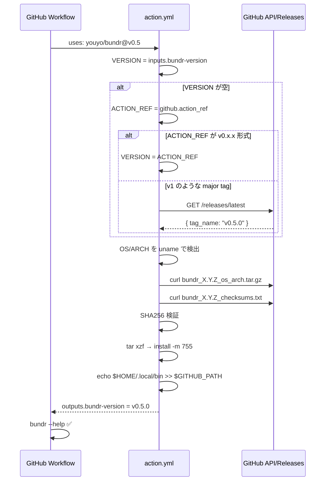

# GitHub Actions インストールサポート

## Context

bundr を ecspresso / lambroll のように GitHub Actions ワークフローからワンライナーでインストールできるようにしたい。
`action.yml` をリポジトリルートに置くことで `uses: youyo/bundr@v0.5.1` の形式で使えるようになる。
`curl | bash` 形式の `scripts/install.sh` も合わせて提供する。

**タグ戦略について（重要）:**

> `uses: youyo/bundr@{タグ}` の `{タグ}` は、アクションのバージョンではなく **bundr バイナリのバージョンそのもの**。
> アクション専用のバージョン番号は存在しない。同一リポジトリなので goreleaser が作るタグを共用する。
>
> ```yaml
> uses: youyo/bundr@v0.5.1    # バージョン完全固定
> uses: youyo/bundr@v0.5      # v0.5.x 系の最新を常に追従（フローティング）
> uses: youyo/bundr@v0        # v0.x.x 系の最新を常に追従（フローティング）
> ```
>
> `v0.5` や `v0` はフローティングタグ（goreleaser では作らない）。
> リリース後に CI が自動更新する（後述の `update-floating-tags` job）。

goreleaser は設定済みで正常動作済み。リリースアーカイブの命名規則は `bundr_{version}_{os}_{arch}.tar.gz`（全て小文字）。
現在 README には誤った大文字命名 (`bundr_Darwin_arm64.tar.gz`) が記載されており、これも合わせて修正する。

---

## スコープ

### 実装範囲
- `action.yml` — composite action（new、**root 必須**: GitHub Actions の仕様）
- `scripts/install.sh` — curl パイプインストールスクリプト（new）
- `.goreleaser.yaml` — archives に `name_template` を明示追加（modify）
- `.github/workflows/test-action.yml` — 全プラットフォーム結合テスト（new）
- `README.md` / `README.ja.md` — GitHub Actions セクション追加 + アーカイブ名の大文字→小文字修正（modify）

### スコープ外
- 別リポジトリ `youyo/setup-bundr` の作成（同一リポジトリの ecspresso スタイルで十分）
- Windows 対応（syscall.Flock 依存のため対象外）
- Node.js ベースの JavaScript action（composite action で十分）

---

## テスト設計書

### 正常系ケース

| ID | 入力 | 期待出力 |
|----|------|---------|
| T01 | `uses: youyo/bundr@v0`（bundr-version 省略、フローティングタグ） | v0 最新バージョンがインストール、PATH に追加 |
| T02 | `bundr-version: v0.5.0`（明示指定） | 指定バージョンがインストール |
| T03 | ubuntu-latest (amd64) | `linux_amd64` アーカイブ取得・実行成功 |
| T04 | ubuntu-24.04-arm (arm64) | `linux_arm64` アーカイブ取得・実行成功 |
| T05 | macos-latest (arm64) | `darwin_arm64` アーカイブ取得・実行成功 |
| T06 | macos-13 (amd64) | `darwin_amd64` アーカイブ取得・実行成功 |
| T07 | install.sh latest | `~/.local/bin/bundr` にインストール |
| T08 | install.sh `v0.5.0` 引数 | 指定バージョンがインストール |
| T09 | `INSTALL_DIR=/tmp/test` install.sh | カスタムディレクトリにインストール |

### 異常系ケース

| ID | 入力 | 期待エラー |
|----|------|-----------|
| E01 | 存在しないバージョン指定 | curl が 404 で失敗、ステップが exit 1 |
| E02 | Windows ランナー | action.yml は linux/darwin のみ、README に明記 |
| E03 | SHA256 不一致（改ざん） | チェックサム検証失敗で exit 1 |

---

## 実装手順

### Step 1: .goreleaser.yaml 修正
- `archives` に `name_template` を明示追加（動作変更なし、ドキュメント目的）

```yaml
archives:
  - name_template: "{{ .ProjectName }}_{{ .Version }}_{{ .Os }}_{{ .Arch }}"
```

### Step 2: README.md / README.ja.md のアーカイブ名修正
- `bundr_Darwin_arm64.tar.gz` → `bundr_0.5.0_darwin_arm64.tar.gz` 形式に修正
- `curl -L .../latest/download/bundr_Darwin_...` を正しい命名に修正
- GitHub Actions / install.sh セクションを追加

**現在の誤り（両 README）:**
```
bundr_Darwin_arm64.tar.gz  # ❌ 大文字、バージョンなし
bundr_Darwin_amd64.tar.gz
bundr_Linux_amd64.tar.gz
bundr_Linux_arm64.tar.gz
```

**修正後（正しい命名・latest リダイレクト活用）:**
```bash
# latest の場合は /latest/download/ リダイレクトを使用
curl -sSfL https://github.com/youyo/bundr/releases/latest/download/bundr_$(uname -s | tr '[:upper:]' '[:lower:]')_$(uname -m | sed 's/x86_64/amd64/;s/aarch64/arm64/').tar.gz | tar xz
```

または各プラットフォーム向け個別コマンドは:
```bash
bundr_0.5.0_darwin_arm64.tar.gz  # ✅ 小文字
bundr_0.5.0_darwin_amd64.tar.gz
bundr_0.5.0_linux_amd64.tar.gz
bundr_0.5.0_linux_arm64.tar.gz
```

### Step 3: scripts/install.sh 作成

```bash
#!/usr/bin/env bash
# Usage:
#   curl -sSfL https://raw.githubusercontent.com/youyo/bundr/main/scripts/install.sh | bash
#   curl -sSfL https://raw.githubusercontent.com/youyo/bundr/main/scripts/install.sh | bash -s -- v0.5.0
#   INSTALL_DIR=/usr/local/bin sudo bash scripts/install.sh

set -euo pipefail

REPO="youyo/bundr"
INSTALL_DIR="${INSTALL_DIR:-${HOME}/.local/bin}"

# バージョン解決
VERSION="${1:-}"
if [ -z "${VERSION}" ]; then
  VERSION=$(curl -sSfL -H "Accept: application/vnd.github+json" \
    "https://api.github.com/repos/${REPO}/releases/latest" \
    | grep '"tag_name"' | sed 's/.*"tag_name": *"\([^"]*\)".*/\1/')
fi
VERSION_NUM="${VERSION#v}"

# OS/ARCH 検出
OS=$(uname -s | tr '[:upper:]' '[:lower:]')
ARCH=$(uname -m)
case "${ARCH}" in
  x86_64)        ARCH="amd64" ;;
  aarch64|arm64) ARCH="arm64" ;;
  *) echo "Unsupported arch: ${ARCH}" >&2; exit 1 ;;
esac
case "${OS}" in
  linux|darwin) ;;
  *) echo "Unsupported OS: ${OS}" >&2; exit 1 ;;
esac

BASE_URL="https://github.com/${REPO}/releases/download/${VERSION}"
ARCHIVE="bundr_${VERSION_NUM}_${OS}_${ARCH}.tar.gz"
CHECKSUM_FILE="bundr_${VERSION_NUM}_checksums.txt"

TMPDIR=$(mktemp -d)
trap "rm -rf ${TMPDIR}" EXIT

echo "Downloading bundr ${VERSION} (${OS}/${ARCH})..."
curl -sSfL "${BASE_URL}/${ARCHIVE}"       -o "${TMPDIR}/${ARCHIVE}"
curl -sSfL "${BASE_URL}/${CHECKSUM_FILE}" -o "${TMPDIR}/${CHECKSUM_FILE}"

# SHA256 検証
cd "${TMPDIR}"
if command -v sha256sum >/dev/null 2>&1; then
  sha256sum --ignore-missing -c "${CHECKSUM_FILE}"
elif command -v shasum >/dev/null 2>&1; then
  shasum -a 256 --ignore-missing -c "${CHECKSUM_FILE}"
else
  echo "WARNING: sha256sum/shasum not found, skipping verification" >&2
fi

# インストール
tar xzf "${ARCHIVE}"
mkdir -p "${INSTALL_DIR}"
install -m 755 bundr "${INSTALL_DIR}/bundr"

echo "bundr ${VERSION} installed to ${INSTALL_DIR}/bundr"
if ! echo "${PATH}" | grep -q "${INSTALL_DIR}"; then
  echo "Add to PATH: export PATH=\"${INSTALL_DIR}:\${PATH}\""
fi
```

### Step 4: action.yml 作成

```yaml
name: Setup bundr
description: Install bundr CLI - unified AWS Parameter Store and Secrets Manager interface
author: youyo

inputs:
  bundr-version:
    description: 'bundr version to install (e.g. v0.5.0). Defaults to the action ref version.'
    required: false
    default: ''

outputs:
  bundr-version:
    description: 'The version of bundr that was installed'
    value: ${{ steps.install.outputs.bundr-version }}

runs:
  using: composite
  steps:
    - name: Install bundr
      id: install
      shell: bash
      run: |
        set -euo pipefail

        VERSION="${{ inputs.bundr-version }}"
        if [ -z "${VERSION}" ]; then
          VERSION="${{ github.action_ref }}"
        fi

        # フローティングタグ（v0, v0.5）か完全 semver（v0.5.1）かを判別
        # 完全 semver: v + 数字 + . + 数字 + . + 数字
        if [[ "${VERSION}" =~ ^v[0-9]+\.[0-9]+\.[0-9]+$ ]]; then
          : # 完全 semver: そのまま使用
        else
          # フローティングタグ (v0, v0.5) / ブランチ名 → latest release を取得
          VERSION=$(curl -sSfL \
            -H "Authorization: Bearer ${{ github.token }}" \
            -H "Accept: application/vnd.github+json" \
            "https://api.github.com/repos/youyo/bundr/releases/latest" \
            | grep '"tag_name"' | sed 's/.*"tag_name": *"\([^"]*\)".*/\1/')
        fi

        VERSION_NUM="${VERSION#v}"
        OS=$(uname -s | tr '[:upper:]' '[:lower:]')
        ARCH=$(uname -m)
        case "${ARCH}" in
          x86_64)        ARCH="amd64" ;;
          aarch64|arm64) ARCH="arm64" ;;
          *) echo "Unsupported arch: ${ARCH}" >&2; exit 1 ;;
        esac

        BASE_URL="https://github.com/youyo/bundr/releases/download/${VERSION}"
        ARCHIVE="bundr_${VERSION_NUM}_${OS}_${ARCH}.tar.gz"
        CHECKSUM_FILE="bundr_${VERSION_NUM}_checksums.txt"

        TMPDIR=$(mktemp -d)
        trap "rm -rf ${TMPDIR}" EXIT

        echo "Installing bundr ${VERSION} (${OS}/${ARCH})..."
        curl -sSfL "${BASE_URL}/${ARCHIVE}"       -o "${TMPDIR}/${ARCHIVE}"
        curl -sSfL "${BASE_URL}/${CHECKSUM_FILE}" -o "${TMPDIR}/${CHECKSUM_FILE}"

        cd "${TMPDIR}"
        if command -v sha256sum >/dev/null 2>&1; then
          sha256sum --ignore-missing -c "${CHECKSUM_FILE}"
        elif command -v shasum >/dev/null 2>&1; then
          shasum -a 256 --ignore-missing -c "${CHECKSUM_FILE}"
        fi

        tar xzf "${ARCHIVE}"
        mkdir -p "${HOME}/.local/bin"
        install -m 755 bundr "${HOME}/.local/bin/bundr"
        echo "${HOME}/.local/bin" >> "${GITHUB_PATH}"

        echo "bundr-version=${VERSION}" >> "${GITHUB_OUTPUT}"
        echo "bundr ${VERSION} installed successfully"
```

### Step 5: .github/workflows/test-action.yml 作成

```yaml
name: Test Action

on:
  push:
    branches: [main]
  pull_request:
  workflow_dispatch:

jobs:
  test-action:
    name: Test action (${{ matrix.os }})
    runs-on: ${{ matrix.os }}
    strategy:
      fail-fast: false
      matrix:
        os: [ubuntu-latest, ubuntu-24.04-arm, macos-latest, macos-13]
    steps:
      - uses: actions/checkout@v4
      - name: Setup bundr (default)
        uses: ./
        id: setup
      - name: Verify
        run: |
          bundr --help
          echo "version: ${{ steps.setup.outputs.bundr-version }}"
          test -n "${{ steps.setup.outputs.bundr-version }}"

  test-specific-version:
    runs-on: ubuntu-latest
    steps:
      - uses: actions/checkout@v4
      - uses: ./
        with:
          bundr-version: 'v0.4.8'
      - run: bundr --help

  test-install-sh:
    name: Test install.sh (${{ matrix.os }})
    runs-on: ${{ matrix.os }}
    strategy:
      matrix:
        os: [ubuntu-latest, macos-latest]
    steps:
      - uses: actions/checkout@v4
      - name: Latest
        run: |
          bash scripts/install.sh
          ~/.local/bin/bundr --help
      - name: Specific version
        run: |
          bash scripts/install.sh v0.4.8
          ~/.local/bin/bundr --help
      - name: Custom INSTALL_DIR
        run: |
          INSTALL_DIR=/tmp/bundr-test bash scripts/install.sh
          /tmp/bundr-test/bundr --help
```

### Step 6: README.md / README.ja.md に GitHub Actions セクション追加

追加するセクション（Install 直下）:

```markdown
### GitHub Actions

```yaml
steps:
  - uses: youyo/bundr@v0.5
```

特定バージョンを指定する場合:
```yaml
steps:
  - uses: youyo/bundr@v0.5.0
    with:
      bundr-version: v0.5.0
```

### Script install (Linux/macOS)

```bash
# Latest
curl -sSfL https://raw.githubusercontent.com/youyo/bundr/main/scripts/install.sh | bash

# Specific version
curl -sSfL https://raw.githubusercontent.com/youyo/bundr/main/scripts/install.sh | bash -s -- v0.5.0
```
```

---

## アーキテクチャ: インストールフロー



---

## リスク評価

| リスク | 重大度 | 対策 |
|--------|--------|------|
| README の大文字アーカイブ名（既存バグ） | High | Step 2 で先に修正（scripts/install.sh/action.yml の前提） |
| `github.action_ref` が major tag (`v1`) の場合の latest 解決 | Medium | `[[ $ref =~ ^v[0-9] ]]` で判別し、major tag は API フォールバック |
| Self-hosted ランナーで `/usr/local/bin` 書き込み不可 | Medium | `$HOME/.local/bin` デフォルト + `$GITHUB_PATH` で PATH 追加 |
| `jq` 非依存 | Low | `grep + sed` で JSON からタグ名を抽出（全ランナーで動作） |
| SHA256 ツール差異（linux: sha256sum, macOS: shasum） | Low | 両方に対応済み。どちらもなければ WARNING で継続 |

---

## チェックリスト

### 観点1: 実装実現可能性
- [x] 手順の抜け漏れなし（.goreleaser → README修正 → scripts/install.sh → action.yml → テスト）
- [x] 各ステップが具体的（コード全文を含む）
- [x] ファイル変更リスト完全（5ファイル）
- [x] 影響範囲特定済み（既存 workflows への影響なし）

### 観点2: TDDテスト設計
- [x] 正常系: 4 OS × latest + 1 specific version
- [x] 異常系: 存在しないバージョン、SHA256 失敗
- [x] テストワークフロー設計済み（test-action.yml）
- N/A: 単体テスト（shell スクリプトのため結合テストで代替）

### 観点3: アーキテクチャ整合性
- [x] goreleaser 命名規則と一致（小文字 OS/ARCH）
- [x] ecspresso/lambroll と同じ同一リポジトリパターン
- [x] 既存ワークフロー（test/lint/release）への変更なし

### 観点4: リスク評価
- [x] 既存 README バグの修正計画あり
- [x] Self-hosted ランナー対応（$HOME/.local/bin）
- [x] API レートリミット対策（GITHUB_TOKEN ヘッダー使用）

### 観点5: シーケンス図
- [x] Mermaid シーケンス図（正常フロー）
- [x] バージョン解決の分岐条件を図示

---

## フローティングタグ管理

GitHub Actions では `uses: youyo/bundr@v0.5` や `uses: youyo/bundr@v0` のように
major/minor のフローティングタグも使えると便利。

`v0.5.1` をリリースした際に `v0`、`v0.5`、`v0.5.1` の3つを自動更新する。

### release.yml への追記（goreleaser job の後）

```yaml
  update-floating-tags:
    name: Update floating version tags
    needs: goreleaser
    runs-on: ubuntu-latest
    if: startsWith(github.ref, 'refs/tags/v') && !contains(github.ref, '-')
    permissions:
      contents: write
    steps:
      - uses: actions/checkout@v4
        with:
          fetch-depth: 0
      - name: Update v{major} and v{major}.{minor} tags
        run: |
          TAG="${GITHUB_REF#refs/tags/}"
          # v0.5.1 → MAJOR=v0, MINOR=v0.5
          MAJOR=$(echo "${TAG}" | grep -oP '^v\d+')
          MINOR=$(echo "${TAG}" | grep -oP '^v\d+\.\d+')

          git config user.name  "github-actions[bot]"
          git config user.email "github-actions[bot]@users.noreply.github.com"

          git tag -f "${MAJOR}" "${GITHUB_SHA}"
          git tag -f "${MINOR}" "${GITHUB_SHA}"
          git push -f origin "${MAJOR}" "${MINOR}"

          echo "Updated tags: ${MAJOR}, ${MINOR} → ${TAG} (${GITHUB_SHA})"
```

### タグ戦略まとめ

| タグ | 意味 | 更新タイミング |
|------|------|--------------|
| `v0.5.1` | 不変の具体的バージョン | goreleaser が自動作成 |
| `v0.5` | v0.5.x 系の最新 | 上記 job が自動更新 |
| `v0` | v0.x.x 系の最新 | 上記 job が自動更新 |

**利用例:**
```yaml
uses: youyo/bundr@v0        # v0 系の最新（大きな破壊的変更に追従しない）
uses: youyo/bundr@v0.5      # v0.5 系の最新（パッチのみ追従）
uses: youyo/bundr@v0.5.1    # バージョン完全固定
```

### prerelease 除外

`!contains(github.ref, '-')` により `v0.6.0-rc.1` 等のプレリリースタグでは
フローティングタグを更新しない。

---

## 実装後の確認手順

1. `goreleaser release --snapshot --clean` でアーカイブ名を確認
2. PR を作成し `test-action.yml` が全 matrix (4 OS) で PASS することを確認
3. タグ `v0.5.1` をプッシュして正式リリース + `v0`/`v0.5` フローティングタグ自動更新を確認
4. 別リポジトリから `uses: youyo/bundr@v0.5`、`uses: youyo/bundr@v0` を試して動作確認
