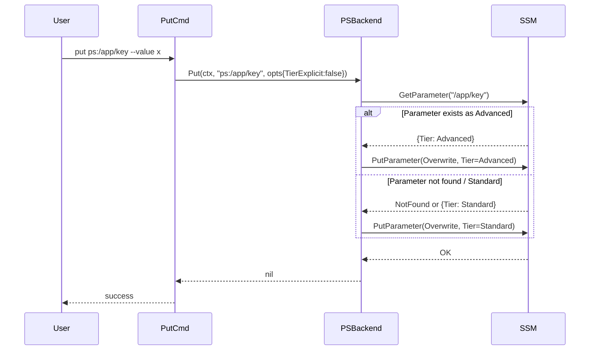
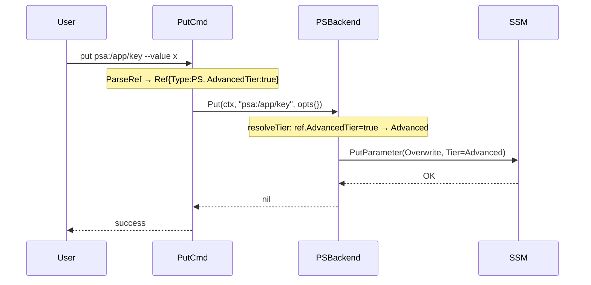

# ps:/psa: 統一計画

## Context（背景・動機）

現在 bundr は SSM Parameter Store に対して 2 つのプレフィックスを持つ。
- `ps:` — Standard tier
- `psa:` — Advanced tier

しかし AWS SSM の `GetParameter` / `GetParametersByPath` は tier を区別せず同一 API を使う。
ユーザーは「保存時の tier」を常に覚えておかねばならず、参照・補完・ls 時に `ps:`/`psa:` を
使い分ける必要が生じていた。

目標: `psa:` を `ps:` の後方互換エイリアスに降格し、**全オペレーションで `ps:` を使えるようにする**。

---

## 設計方針

### 現状分析

| オペレーション | 現状 | 変更要否 |
|---|---|---|
| `get ps:/path` | Advanced param も取得できる | **不要**（AWS API が tier 非依存） |
| `ls ps:/prefix/` | Standard/Advanced 両方が返る | **不要**（GetParametersByPath が tier 非依存） |
| `describe ps:/path` | Advanced param も記述できる | **不要** |
| `export/exec ps:/prefix/` | 両 tier を返す | **不要** |
| `put ps:/path` | Tier 未指定 → アカウントデフォルト適用（ダウングレードリスク） | **要対応** |
| タブ補完 `ps:<TAB>` | キャッシュが `ps-*.json` と `psa-*.json` に分離 | **要対応** |
| `put psa:/path` | Advanced tier 強制 | **backward compat で維持** |

### 主な変更点

**1. `ParseRef` の正規化（core 変更）**
`psa:/path` → `Ref{Type: BackendTypePS, Path: "/path", AdvancedTier: true}`

これだけでキャッシュキーが `"ps"` に統一され、タブ補完・ls 出力・BackendFactory が自動的に統一される。

**2. `put` の tier 制御改善**
- `PutOptions` に `AdvancedTier bool` を追加
- `ps.go` Put: `parsed.AdvancedTier || opts.AdvancedTier` で tier を判定
- `put.go` に `--tier standard|advanced` フラグを追加（`psa:` 不要の代替手段）
- 既存 Advanced param のダウングレード防止: `--tier` 未指定かつ `psa:` でもない場合、
  `GetParameter` で既存 tier を確認してから上書き（auto-detect）

**3. BackendFactory の整理**
`BackendTypePSA` のケースを削除（ParseRef 正規化により BackendFactory に届かなくなるため）。

---

## スコープ

### 実装範囲
- `internal/backend/ref.go` — `Ref` 構造体 + `ParseRef` 変更
- `internal/backend/interface.go` — `PutOptions` に `AdvancedTier` 追加
- `internal/backend/ps.go` — Put メソッドの tier 判定 + auto-detect ロジック
- `internal/backend/mock.go` — PutOptions 型変更に合わせて更新
- `cmd/put.go` — `--tier` フラグ追加
- `main.go` — BackendFactory から `BackendTypePSA` ケース削除

### スコープ外
- `sm:` の変更（Secrets Manager は無関係）
- 既存 `psa-*.json` キャッシュファイルのマイグレーション（orphan 化するだけで無害）
- `get`, `ls`, `describe`, `export`, `exec` コマンドの変更（変更不要）

---

## テスト設計書

### 正常系

| ID | 入力 | 期待出力 |
|----|------|--------|
| T1 | `ParseRef("psa:/app/key")` | `Ref{Type: BackendTypePS, Path: "/app/key", AdvancedTier: true}` |
| T2 | `ParseRef("ps:/app/key")` | `Ref{Type: BackendTypePS, Path: "/app/key", AdvancedTier: false}` |
| T3 | `bundr put psa:/app/key --value x` | PSBackend.Put が `PutOptions{AdvancedTier: true}` で呼ばれる |
| T4 | `bundr put ps:/app/key --tier advanced --value x` | PSBackend.Put が `PutOptions{AdvancedTier: true}` で呼ばれる |
| T5 | `bundr put ps:/app/key --value x`（既存 Advanced） | GetParameter で検出 → `PutOptions{AdvancedTier: true}` で呼ばれる |
| T6 | `bundr put ps:/app/key --value x`（新規） | `PutOptions{AdvancedTier: false}` で呼ばれる（Standard 新規作成） |
| T7 | `bundr put ps:/app/key --tier standard --value x`（既存 Advanced） | auto-detect をスキップ、Standard で更新 |

### 異常系

| ID | 入力 | 期待エラー |
|----|------|----------|
| T8 | `bundr put ps:/app/key --tier invalid` | Kong バリデーションエラー（enum: standard,advanced） |

### エッジケース
- `psa:` + `--tier standard` の組み合わせ: `--tier` が優先（ユーザーの明示的指定を尊重）
- auto-detect 時に GetParameter が NotFound → Standard で新規作成
- auto-detect 時に GetParameter が API エラー → エラーを返す（silent fallback しない）

---

## 実装手順

### Step 1: `Ref` 構造体と `ParseRef` の変更

**ファイル**: `internal/backend/ref.go`

```go
type Ref struct {
    Type         BackendType
    Path         string
    AdvancedTier bool // true when psa: prefix was used
}
```

`ParseRef` の `"psa"` ケースを変更:
```go
case "psa":
    return Ref{Type: BackendTypePS, Path: path, AdvancedTier: true}, nil
```

`BackendTypePSA` 定数: **削除**（または deprecated コメントを付けて残す）。
→ 後続の `BackendFactory` から参照されなくなるため削除が安全。

**依存**: Step 2 の前に完了が必要（他ステップが `AdvancedTier` を使う）

---

### Step 2: `PutOptions` に `AdvancedTier` 追加

**ファイル**: `internal/backend/interface.go`

```go
type PutOptions struct {
    Value        string
    StoreMode    string
    ValueType    string
    KMSKeyID     string
    AdvancedTier bool // true to create/keep Advanced tier
}
```

---

### Step 3: `ps.go` の Put メソッド改修

**ファイル**: `internal/backend/ps.go`

既存コード:
```go
if parsed.Type == BackendTypePSA {
    input.Tier = ssmtypes.ParameterTierAdvanced
}
```

変更後:
```go
tier := b.resolveTier(ctx, parsed, opts)
if tier == ssmtypes.ParameterTierAdvanced {
    input.Tier = ssmtypes.ParameterTierAdvanced
}
```

`resolveTier` ヘルパー（新規追加）:
```go
func (b *PSBackend) resolveTier(ctx context.Context, ref Ref, opts PutOptions) ssmtypes.ParameterTier {
    // 1. 明示的指定が最優先
    if opts.AdvancedTier || ref.AdvancedTier {
        return ssmtypes.ParameterTierAdvanced
    }
    // 2. --tier standard が指定された場合 (opts.AdvancedTier=false, opts.TierExplicit=true)
    //    → Standard を返す（auto-detect スキップ）
    if opts.TierExplicit {
        return ssmtypes.ParameterTierStandard
    }
    // 3. auto-detect: 既存パラメータの tier を確認
    out, err := b.client.GetParameter(ctx, &ssm.GetParameterInput{
        Name:           aws.String(ref.Path),
        WithDecryption: aws.Bool(false),
    })
    if err != nil || out.Parameter == nil {
        return ssmtypes.ParameterTierStandard // 新規 or エラー → Standard
    }
    if out.Parameter.Tier == ssmtypes.ParameterTierAdvanced {
        return ssmtypes.ParameterTierAdvanced
    }
    return ssmtypes.ParameterTierStandard
}
```

`PutOptions` に `TierExplicit bool` を追加（`--tier` フラグが明示指定されたことを示すフラグ）。

---

### Step 4: `cmd/put.go` に `--tier` フラグ追加

**ファイル**: `cmd/put.go`

```go
type PutCmd struct {
    Ref    string `arg:"" predictor:"ref" help:"Target ref (e.g. ps:/app/prod/DB_HOST, sm:secret-id)"`
    Value  string `short:"v" required:"" help:"Value to store"`
    Store  string `short:"s" default:"raw" enum:"raw,json" help:"Storage mode (raw|json)"`
    Secure bool   `help:"Use SecureString (SSM Parameter Store only)"`
    Tier   string `help:"Parameter Store tier (standard|advanced). Omit for auto-detect." enum:"standard,advanced," default:""`
}
```

Run メソッドで tier を opts に反映:
```go
opts := backend.PutOptions{
    Value:     c.Value,
    StoreMode: c.Store,
}
if c.Secure {
    opts.ValueType = backend.ValueTypeSecure
}
if c.Tier == "advanced" {
    opts.AdvancedTier = true
    opts.TierExplicit = true
} else if c.Tier == "standard" {
    opts.AdvancedTier = false
    opts.TierExplicit = true
}
```

---

### Step 5: `mock.go` の更新

**ファイル**: `internal/backend/mock.go`

- `PutOptions` 構造体変更（AdvancedTier, TierExplicit フィールド追加）に伴うコンパイルエラー解消
- mock の Put 実装は `opts` をそのまま記録するだけなので実質変更不要

---

### Step 6: `main.go` の BackendFactory 整理

**ファイル**: `main.go`

```go
switch bt {
case backend.BackendTypePS:  // psa: は ParseRef で BackendTypePS に正規化済み
    return backend.NewPSBackend(ssm.NewFromConfig(awsCfg)), nil
case backend.BackendTypeSM:
    return backend.NewSMBackend(secretsmanager.NewFromConfig(awsCfg)), nil
default:
    return nil, fmt.Errorf("unsupported backend: %s", bt)
}
```

`BackendTypePSA` ケースを削除。

---

### Step 7: テストの更新

**ファイル**: `internal/backend/ref_test.go`
- `TestParseRef` の `psa:` ケースを更新: `BackendTypePSA` → `BackendTypePS` + `AdvancedTier: true`

**ファイル**: `cmd/put_test.go`
- `TestPutCmd_RunPSA`（新規）: `psa:` ref で `mock.PutCalls[0].Opts.AdvancedTier == true`
- `TestPutCmd_TierFlag`（新規）: `--tier advanced` で同様の確認

---

## シーケンス図

### `bundr put ps:/app/key --value x`（auto-detect フロー）



### `bundr put psa:/app/key --value x`（backward compat フロー）



---

## アーキテクチャ整合性

| 項目 | 評価 |
|------|------|
| 既存の命名規則 | `AdvancedTier bool` は Go の慣習に沿った命名 |
| Backend インターフェース不変 | シグネチャは変えず、PutOptions のフィールドのみ追加 |
| BackwardCompat | `psa:` は ParseRef でエラーにならず透過的に動作 |
| キャッシュファイル | `psa-*.json` は orphan 化。ユーザーが `cache clear` で削除可能 |
| MockBackend | PutOptions フィールド追加のみ。既存テストに影響なし |

---

## リスク評価

| リスク | 重大度 | 対策 |
|--------|--------|------|
| auto-detect の余分な API 呼び出し（`put` 毎に GetParameter） | 低 | `--tier` 明示指定でスキップ可能。大量 put には `--tier` を推奨 |
| `psa-*.json` キャッシュ orphan | 低 | `bundr cache clear` で削除。機能に影響なし |
| `BackendTypePSA` 定数削除による外部利用コードへの影響 | 低 | 内部パッケージ定数。public API ではない |
| mock のテスト inline 実装（`errorBackend` 等）への影響 | 中 | `PutOptions` フィールド追加はゼロ値で安全。コンパイルエラーは発生しない |

---

## 変更ファイル一覧

| ファイル | 変更内容 |
|----------|----------|
| `internal/backend/ref.go` | Ref に AdvancedTier 追加、ParseRef で psa:→ps: 正規化 |
| `internal/backend/interface.go` | PutOptions に AdvancedTier/TierExplicit 追加 |
| `internal/backend/ps.go` | Put の tier 判定ロジック + resolveTier ヘルパー |
| `internal/backend/mock.go` | PutOptions 型変更対応（コンパイル修正） |
| `cmd/put.go` | --tier フラグ追加 |
| `main.go` | BackendFactory から BackendTypePSA ケース削除 |
| `internal/backend/ref_test.go` | psa: テストケースの期待値更新 |
| `cmd/put_test.go` | psa:/--tier advanced テスト追加 |

---

## 検証方法

```bash
# 1. ユニットテスト
go test ./internal/backend/... -v -run TestParseRef
go test ./cmd/... -v -run TestPutCmd
go test -race ./...

# 2. ローカル動作確認（AWS 不要: mock で確認済み）
go build -o bundr ./...

# 3. 実 AWS 環境での統合テスト（任意）
bundr put psa:/test/advanced --value hello  # Advanced 作成（後方互換）
bundr put ps:/test/advanced --value world   # auto-detect → Advanced 維持確認
bundr get ps:/test/advanced                 # ps: で取得確認
bundr ls ps:/test/                          # 両 tier が ps: で表示確認
bundr put ps:/test/newkey --value x         # 新規 → Standard 確認
bundr put ps:/test/newkey --tier advanced --value x  # --tier flag 確認
```

---

## チェックリスト

- [x] 観点1: 実装実現可能性 — 手順が端から端まで一貫。変更ファイル全列挙
- [x] 観点2: TDD設計 — 正常系7ケース + 異常系1ケース + エッジケース3ケース
- [x] 観点3: アーキテクチャ整合性 — Backend インターフェース不変。既存パターン踏襲
- [x] 観点4: リスク評価 — auto-detect コスト・orphan キャッシュ・コンパイル影響を評価
- [x] 観点5: シーケンス図 — 正常フロー2パターン（auto-detect / backward-compat）
